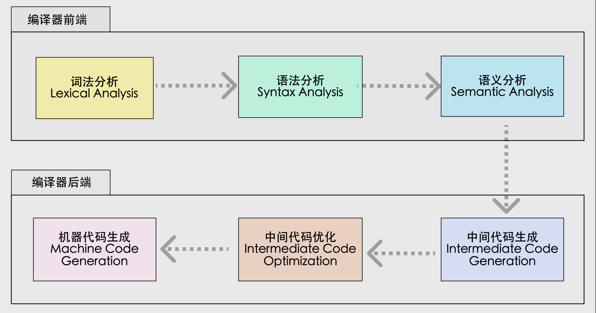
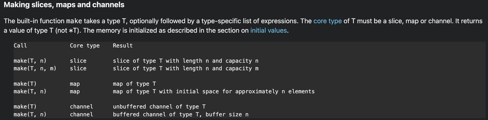

[TOC]

## 编译原理基础

### 编译过程



词法分析：

语法分析：生成抽象语法树 AST

语义分析：在抽象语法树 AST 上做类型检查

中间代码生成：

中间代码优化：

- SSA（Single Static Assignment）静态赋值语句：
  - Static：每个变量只能赋值一次（或许叫常量更合适）
  - Single：每个表达式只能做一个简单的运算，对于复杂的表达式 `a*b + c*d` 要拆分成：`t0=a*b; t1=c*d; t2=t0+t1` 三个简单表达式。

机器码生成：生成汇编代码

相关工具：

语法分析工具：https://astexplorer.net/

中间代码（SSA）生成：通过https://golang.design/gossa?id=6acdea5f-6563-11ec-b3e4-0242ac160010 （这里已经准备了一个例子）或`GOSSAFUNC=funcname go build x.go`命令

机器码生成：https://godbolt.org/z/5Tnenzq7M（这里已经准备了一个例子）

### 链接过程

代码：

```go
package main

func main() {
	println("hi, go")
}

```

#### 编译后产生目标文件：

编译命令：`go tool compile -S x.go`

```text
"".main STEXT size=86 args=0x0 locals=0x18 funcid=0x0
	0x0000 00000 (x.go:3)	TEXT	"".main(SB), ABIInternal, $24-0
	0x0000 00000 (x.go:3)	MOVQ	(TLS), CX
	0x0009 00009 (x.go:3)	CMPQ	SP, 16(CX)
	0x000d 00013 (x.go:3)	PCDATA	$0, $-2
	0x000d 00013 (x.go:3)	JLS	79
	0x000f 00015 (x.go:3)	PCDATA	$0, $-1
	0x000f 00015 (x.go:3)	SUBQ	$24, SP
	0x0013 00019 (x.go:3)	MOVQ	BP, 16(SP)
	0x0018 00024 (x.go:3)	LEAQ	16(SP), BP
```

编译生成`.o`目标文件，未进行链接，汇编代码中main函数还没有包相关信息，指令从起点0x0000开始偏移。

#### 链接后产生可执行文件：

使用go build x.go完成编译，然后通过`go tool objdump ./x | grep "x.go"`查看编译并链接后的汇编代码

```text
TEXT main.main(SB) /x.go
  x.go:3		0x45ec60		64488b0c25f8ffffff	MOVQ FS:0xfffffff8, CX			
  x.go:3		0x45ec69		483b6110		CMPQ 0x10(CX), SP			
  x.go:3		0x45ec6d		7640			JBE 0x45ecaf				
  x.go:3		0x45ec6f		4883ec18		SUBQ $0x18, SP				
  x.go:3		0x45ec73		48896c2410		MOVQ BP, 0x10(SP)			
  x.go:3		0x45ec78		488d6c2410		LEAQ 0x10(SP), BP			
  x.go:4		0x45ec7d		0f1f00			NOPL 0(AX)				
  x.go:4		0x45ec80		e8db05fdff		CALL runtime.printlock(SB)		
  x.go:4		0x45ec85		488d0574620100		LEAQ 0x16274(IP), AX			
  x.go:4		0x45ec8c		48890424		MOVQ AX, 0(SP)				
  x.go:4		0x45ec90		48c744240807000000	MOVQ $0x7, 0x8(SP)			
  x.go:4		0x45ec99		e8e20ffdff		CALL runtime.printstring(SB)		
  x.go:4		0x45ec9e		6690			NOPW					
  x.go:4		0x45eca0		e83b06fdff		CALL runtime.printunlock(SB)		
  x.go:5		0x45eca5		488b6c2410		MOVQ 0x10(SP), BP			
  x.go:5		0x45ecaa		4883c418		ADDQ $0x18, SP				
  x.go:5		0x45ecae		c3			RET					
  x.go:3		0x45ecaf		e8acafffff		CALL runtime.morestack_noctxt(SB)	
  x.go:3		0x45ecb4		ebaa			JMP main.main(SB)
```

**main函数由包信息，并且指令偏移起点非0x0000**

### go compile和go tool objdump的区别

go compile是完成编译产生`.o`文件

objdump是把可执行文件反汇编得到汇编代码

#### 通过调试工具查看编译链接后的汇编代码

[dlv 调试工具文档](https://github.com/go-delve/delve/tree/master/Documentation/cli)

`readelf -h ./x`查看入口地址

`dlv exec ./x`开始调试

`b *0x45cd80`

使用 `c（continue）`从一个断点到下一个断点

使用`si`到`JMP`目标位置

使用`disass`反汇编

### 如何找到 make 实现代码

通过官方 spec 查询怎么使用 https://golang.org/ref/spec



```go
package main

func main() {
	// make slice
	// 空间开的比较大，是为了让这个 slice 分配在堆上，栈上的 slice 结果不太一样
	var sl = make([]int, 100000)
	println(sl)

	// make channel
	var ch = make(chan int, 5)
	println(ch)

	// make map
	var m = make(map[int]int, 22)
	println(m)
}

// go build make.go && go tool objdump ./make | grep -E "make.go:6|make.go:10|make.go:14"
```

```
	make.go:6             0x1053f78               488d0541400000          LEAQ type.*+16000(SB), AX               
  make.go:6             0x1053f7f               bba0860100              MOVL $0x186a0, BX                       
  make.go:6             0x1053f84               4889d9                  MOVQ BX, CX                             
  make.go:6             0x1053f87               e8b4b2feff              CALL runtime.makeslice(SB)              
  make.go:6             0x1053f8c               4889442428              MOVQ AX, 0x28(SP)                       
  make.go:10            0x1053fb2               488d05873e0000          LEAQ type.*+15616(SB), AX               
  make.go:10            0x1053fb9               bb05000000              MOVL $0x5, BX                           
  make.go:10            0x1053fbe               6690                    NOPW                                    
  make.go:10            0x1053fc0               e8bbf4faff              CALL runtime.makechan(SB)               
  make.go:10            0x1053fc5               4889442420              MOVQ AX, 0x20(SP)                       
  make.go:14            0x1053fe5               440f117c2430            MOVUPS X15, 0x30(SP)                    
  make.go:14            0x1053feb               440f117c2440            MOVUPS X15, 0x40(SP)                    
  make.go:14            0x1053ff1               440f117c2450            MOVUPS X15, 0x50(SP)                    
  make.go:14            0x1053ff7               488d05c2580000          LEAQ type.*+22400(SB), AX               
  make.go:14            0x1053ffe               bb16000000              MOVL $0x16, BX                          
  make.go:14            0x1054003               488d4c2430              LEAQ 0x30(SP), CX                       
  make.go:14            0x1054008               e87377fbff              CALL runtime.makemap(SB)                
  make.go:14            0x105400d               4889442418              MOVQ AX, 0x18(SP)         
```

从汇编代码中，可以看见分别由 `runtime.makeslice`、`runtime.makechan`、`runtime.makemap` 实现。

## 语法实现分析

通过工具查看汇编代码结合goland或者dlv进行调试分析


## 函数调用规约


## 参考

[走进Golang之编译器原理](https://xiaomi-info.github.io/2019/11/13/golang-compiler-principle/)

