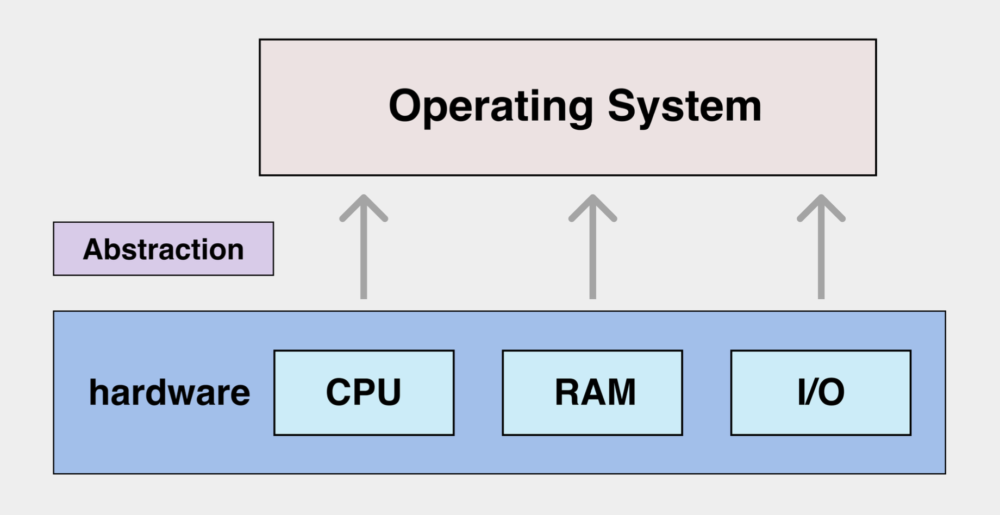
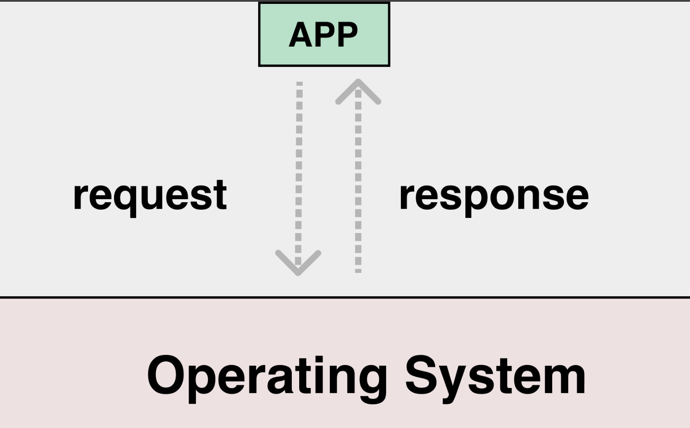
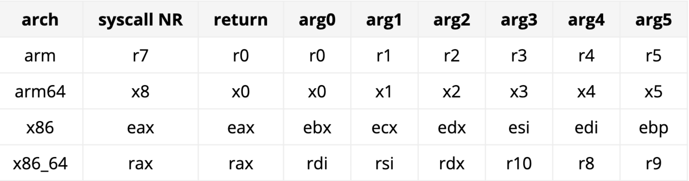
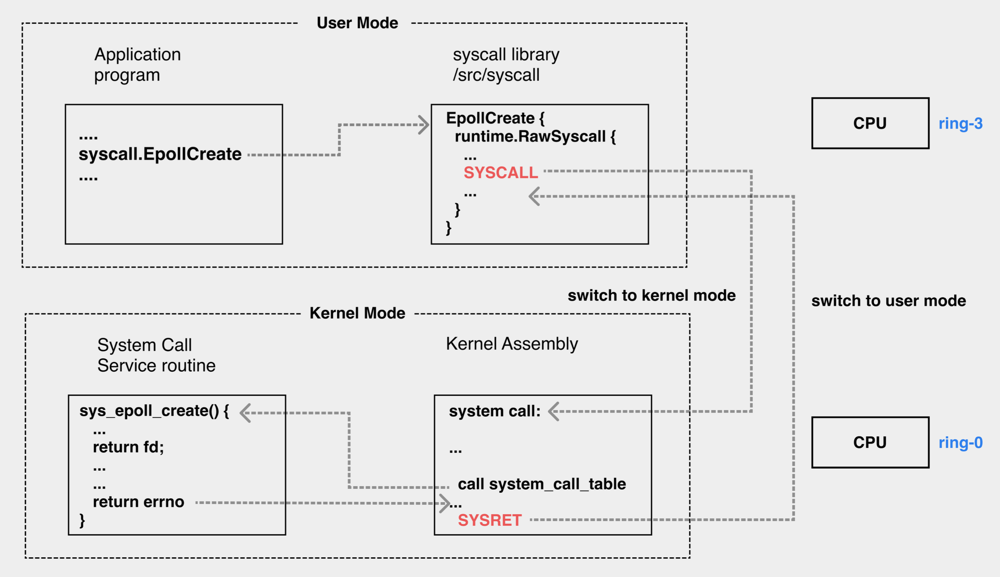
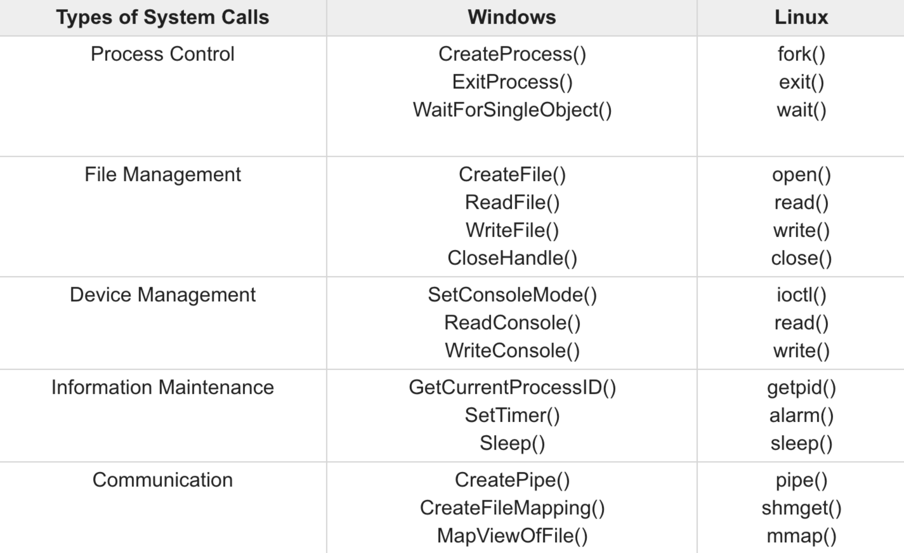
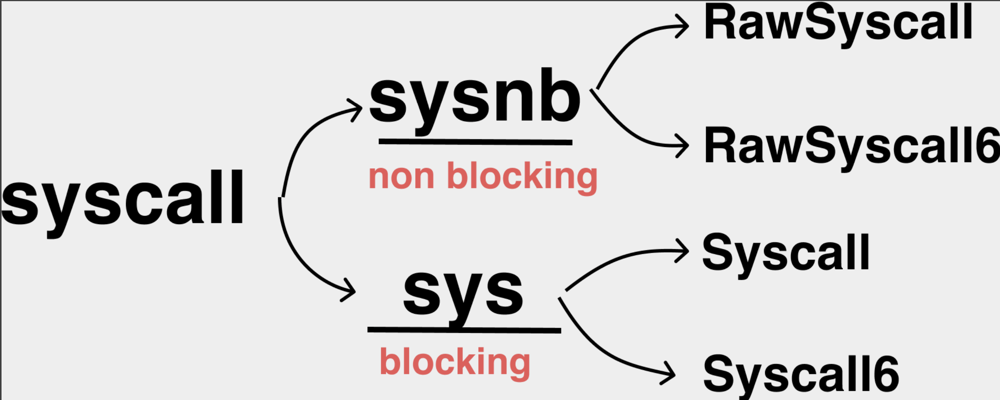
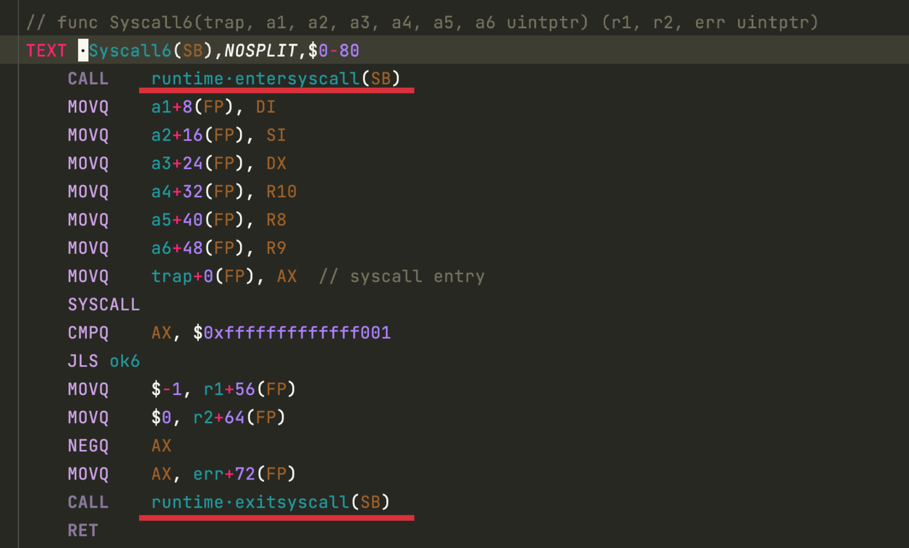

# 编程语言与操作系统的桥梁

[TOC]

## 什么是系统调用

### 什么是操作系统

操作系统是资源的管理器，其管理的资源均进行了抽象



磁盘抽象：文件夹。

内存抽象：虚拟内存。

CPU抽象：时间片。

### 分级保护域

CPU 为操作系统提供了特殊的安全支持，操作系统运行在 ring0 模式下，应用运行在 ring3 模式下（权限被严格限制）

### 系统调用

是操作系统内核为应用提供的 API

是内核为应用提供的服务

是操作系统为上层的应用程序提供了一个“标准库”



如上图，系统调用都是同步的。

对于应用程序来说，系统调用可以实现超出自己能力以外的事情。

#### 调用规约

系统调用有自己的一套调用规约，需要使用寄存器。



#### 处理流程

以创建 epoll 为例




## 常见系统调用



### 获取应用进程 pid

Os.GetPid()   -->  syscall: getpid()

### 打印日志

println("hello world")  -->  syscall: write(2, "hello world", 11) 其中2表示模式为stderr，11是stelen


## 观察系统调用

Linux 操作系统使用 `strace` 工具

MacOS 操作系统使用 `dtruss` 工具

```shell
cd ./stracedemo && go build demo.go && strace ./demo

------------- log -------------- 
execve("./demo", ["./demo"], 0x7ffc915e1340 /* 25 vars */) = 0
arch_prctl(ARCH_SET_FS, 0x4b8bd0)       = 0
sched_getaffinity(0, 8192, [0, 1, 2, 3]) = 8
openat(AT_FDCWD, "/sys/kernel/mm/transparent_hugepage/hpage_pmd_size", O_RDONLY) = 3
read(3, "2097152\n", 20)                = 8
close(3)                                = 0
mmap(NULL, 262144, PROT_READ|PROT_WRITE, MAP_PRIVATE|MAP_ANONYMOUS, -1, 0) = 0x7f09da631000
mmap(NULL, 131072, PROT_NONE, MAP_PRIVATE|MAP_ANONYMOUS, -1, 0) = 0x7f09da611000
mmap(NULL, 1048576, PROT_NONE, MAP_PRIVATE|MAP_ANONYMOUS, -1, 0) = 0x7f09da511000
mmap(NULL, 8388608, PROT_NONE, MAP_PRIVATE|MAP_ANONYMOUS, -1, 0) = 0x7f09d9d11000
mmap(NULL, 67108864, PROT_NONE, MAP_PRIVATE|MAP_ANONYMOUS, -1, 0) = 0x7f09d5d11000
mmap(NULL, 536870912, PROT_NONE, MAP_PRIVATE|MAP_ANONYMOUS, -1, 0) = 0x7f09b5d11000
mmap(0xc000000000, 67108864, PROT_NONE, MAP_PRIVATE|MAP_ANONYMOUS, -1, 0) = 0xc000000000
mmap(NULL, 33554432, PROT_READ|PROT_WRITE, MAP_PRIVATE|MAP_ANONYMOUS, -1, 0) = 0x7f09b3d11000
mmap(NULL, 2165776, PROT_READ|PROT_WRITE, MAP_PRIVATE|MAP_ANONYMOUS, -1, 0) = 0x7f09b3b00000
mmap(0xc000000000, 4194304, PROT_READ|PROT_WRITE, MAP_PRIVATE|MAP_FIXED|MAP_ANONYMOUS, -1, 0) = 0xc000000000
mmap(0x7f09da611000, 131072, PROT_READ|PROT_WRITE, MAP_PRIVATE|MAP_FIXED|MAP_ANONYMOUS, -1, 0) = 0x7f09da611000
mmap(0x7f09da591000, 4096, PROT_READ|PROT_WRITE, MAP_PRIVATE|MAP_FIXED|MAP_ANONYMOUS, -1, 0) = 0x7f09da591000
mmap(0x7f09da117000, 4096, PROT_READ|PROT_WRITE, MAP_PRIVATE|MAP_FIXED|MAP_ANONYMOUS, -1, 0) = 0x7f09da117000
mmap(0x7f09d7d41000, 4096, PROT_READ|PROT_WRITE, MAP_PRIVATE|MAP_FIXED|MAP_ANONYMOUS, -1, 0) = 0x7f09d7d41000
mmap(0x7f09c5e91000, 4096, PROT_READ|PROT_WRITE, MAP_PRIVATE|MAP_FIXED|MAP_ANONYMOUS, -1, 0) = 0x7f09c5e91000
mmap(NULL, 1048576, PROT_READ|PROT_WRITE, MAP_PRIVATE|MAP_ANONYMOUS, -1, 0) = 0x7f09b3a00000
mmap(NULL, 65536, PROT_READ|PROT_WRITE, MAP_PRIVATE|MAP_ANONYMOUS, -1, 0) = 0x7f09b39f0000
mmap(NULL, 65536, PROT_READ|PROT_WRITE, MAP_PRIVATE|MAP_ANONYMOUS, -1, 0) = 0x7f09b39e0000
clock_gettime(CLOCK_MONOTONIC, {tv_sec=233, tv_nsec=695038578}) = 0
clock_gettime(CLOCK_MONOTONIC, {tv_sec=233, tv_nsec=695153686}) = 0
clock_gettime(CLOCK_MONOTONIC, {tv_sec=233, tv_nsec=695361020}) = 0
clock_gettime(CLOCK_MONOTONIC, {tv_sec=233, tv_nsec=695590737}) = 0
clock_gettime(CLOCK_MONOTONIC, {tv_sec=233, tv_nsec=695871413}) = 0
clock_gettime(CLOCK_MONOTONIC, {tv_sec=233, tv_nsec=695957445}) = 0
clock_gettime(CLOCK_MONOTONIC, {tv_sec=233, tv_nsec=696132006}) = 0
clock_gettime(CLOCK_MONOTONIC, {tv_sec=233, tv_nsec=696180867}) = 0
clock_gettime(CLOCK_MONOTONIC, {tv_sec=233, tv_nsec=696386802}) = 0
clock_gettime(CLOCK_MONOTONIC, {tv_sec=233, tv_nsec=696600532}) = 0
clock_gettime(CLOCK_MONOTONIC, {tv_sec=233, tv_nsec=696669577}) = 0
clock_gettime(CLOCK_MONOTONIC, {tv_sec=233, tv_nsec=697045077}) = 0
clock_gettime(CLOCK_MONOTONIC, {tv_sec=233, tv_nsec=697132907}) = 0
clock_gettime(CLOCK_MONOTONIC, {tv_sec=233, tv_nsec=697359926}) = 0
rt_sigprocmask(SIG_SETMASK, NULL, [], 8) = 0
clock_gettime(CLOCK_MONOTONIC, {tv_sec=233, tv_nsec=697910587}) = 0
clock_gettime(CLOCK_MONOTONIC, {tv_sec=233, tv_nsec=698072058}) = 0
sigaltstack(NULL, {ss_sp=NULL, ss_flags=SS_DISABLE, ss_size=0}) = 0
sigaltstack({ss_sp=0xc000004000, ss_flags=0, ss_size=32768}, NULL) = 0
rt_sigprocmask(SIG_SETMASK, [], NULL, 8) = 0
gettid()                                = 1472
rt_sigaction(SIGHUP, NULL, {sa_handler=SIG_DFL, sa_mask=[], sa_flags=0}, 8) = 0
rt_sigaction(SIGHUP, {sa_handler=0x453d60, sa_mask=~[], sa_flags=SA_RESTORER|SA_ONSTACK|SA_RESTART|SA_SIGINFO, sa_restorer=0x453ea0}, NULL, 8) = 0
rt_sigaction(SIGINT, NULL, {sa_handler=SIG_DFL, sa_mask=[], sa_flags=0}, 8) = 0
rt_sigaction(SIGINT, {sa_handler=0x453d60, sa_mask=~[], sa_flags=SA_RESTORER|SA_ONSTACK|SA_RESTART|SA_SIGINFO, sa_restorer=0x453ea0}, NULL, 8) = 0
rt_sigaction(SIGQUIT, NULL, {sa_handler=SIG_DFL, sa_mask=[], sa_flags=0}, 8) = 0
rt_sigaction(SIGQUIT, {sa_handler=0x453d60, sa_mask=~[], sa_flags=SA_RESTORER|SA_ONSTACK|SA_RESTART|SA_SIGINFO, sa_restorer=0x453ea0}, NULL, 8) = 0
rt_sigaction(SIGILL, NULL, {sa_handler=SIG_DFL, sa_mask=[], sa_flags=0}, 8) = 0
rt_sigaction(SIGILL, {sa_handler=0x453d60, sa_mask=~[], sa_flags=SA_RESTORER|SA_ONSTACK|SA_RESTART|SA_SIGINFO, sa_restorer=0x453ea0}, NULL, 8) = 0
rt_sigaction(SIGTRAP, NULL, {sa_handler=SIG_DFL, sa_mask=[], sa_flags=0}, 8) = 0
rt_sigaction(SIGTRAP, {sa_handler=0x453d60, sa_mask=~[], sa_flags=SA_RESTORER|SA_ONSTACK|SA_RESTART|SA_SIGINFO, sa_restorer=0x453ea0}, NULL, 8) = 0
rt_sigaction(SIGABRT, NULL, {sa_handler=SIG_DFL, sa_mask=[], sa_flags=0}, 8) = 0
rt_sigaction(SIGABRT, {sa_handler=0x453d60, sa_mask=~[], sa_flags=SA_RESTORER|SA_ONSTACK|SA_RESTART|SA_SIGINFO, sa_restorer=0x453ea0}, NULL, 8) = 0
rt_sigaction(SIGBUS, NULL, {sa_handler=SIG_DFL, sa_mask=[], sa_flags=0}, 8) = 0
rt_sigaction(SIGBUS, {sa_handler=0x453d60, sa_mask=~[], sa_flags=SA_RESTORER|SA_ONSTACK|SA_RESTART|SA_SIGINFO, sa_restorer=0x453ea0}, NULL, 8) = 0
rt_sigaction(SIGFPE, NULL, {sa_handler=SIG_DFL, sa_mask=[], sa_flags=0}, 8) = 0
rt_sigaction(SIGFPE, {sa_handler=0x453d60, sa_mask=~[], sa_flags=SA_RESTORER|SA_ONSTACK|SA_RESTART|SA_SIGINFO, sa_restorer=0x453ea0}, NULL, 8) = 0
rt_sigaction(SIGUSR1, NULL, {sa_handler=SIG_DFL, sa_mask=[], sa_flags=0}, 8) = 0
rt_sigaction(SIGUSR1, {sa_handler=0x453d60, sa_mask=~[], sa_flags=SA_RESTORER|SA_ONSTACK|SA_RESTART|SA_SIGINFO, sa_restorer=0x453ea0}, NULL, 8) = 0
rt_sigaction(SIGSEGV, NULL, {sa_handler=SIG_DFL, sa_mask=[], sa_flags=0}, 8) = 0
rt_sigaction(SIGSEGV, {sa_handler=0x453d60, sa_mask=~[], sa_flags=SA_RESTORER|SA_ONSTACK|SA_RESTART|SA_SIGINFO, sa_restorer=0x453ea0}, NULL, 8) = 0
rt_sigaction(SIGUSR2, NULL, {sa_handler=SIG_DFL, sa_mask=[], sa_flags=0}, 8) = 0
rt_sigaction(SIGUSR2, {sa_handler=0x453d60, sa_mask=~[], sa_flags=SA_RESTORER|SA_ONSTACK|SA_RESTART|SA_SIGINFO, sa_restorer=0x453ea0}, NULL, 8) = 0
rt_sigaction(SIGPIPE, NULL, {sa_handler=SIG_DFL, sa_mask=[], sa_flags=0}, 8) = 0
rt_sigaction(SIGPIPE, {sa_handler=0x453d60, sa_mask=~[], sa_flags=SA_RESTORER|SA_ONSTACK|SA_RESTART|SA_SIGINFO, sa_restorer=0x453ea0}, NULL, 8) = 0
rt_sigaction(SIGALRM, NULL, {sa_handler=SIG_DFL, sa_mask=[], sa_flags=0}, 8) = 0
rt_sigaction(SIGALRM, {sa_handler=0x453d60, sa_mask=~[], sa_flags=SA_RESTORER|SA_ONSTACK|SA_RESTART|SA_SIGINFO, sa_restorer=0x453ea0}, NULL, 8) = 0
rt_sigaction(SIGTERM, NULL, {sa_handler=SIG_DFL, sa_mask=[], sa_flags=0}, 8) = 0
rt_sigaction(SIGTERM, {sa_handler=0x453d60, sa_mask=~[], sa_flags=SA_RESTORER|SA_ONSTACK|SA_RESTART|SA_SIGINFO, sa_restorer=0x453ea0}, NULL, 8) = 0
rt_sigaction(SIGSTKFLT, NULL, {sa_handler=SIG_DFL, sa_mask=[], sa_flags=0}, 8) = 0
rt_sigaction(SIGSTKFLT, {sa_handler=0x453d60, sa_mask=~[], sa_flags=SA_RESTORER|SA_ONSTACK|SA_RESTART|SA_SIGINFO, sa_restorer=0x453ea0}, NULL, 8) = 0
rt_sigaction(SIGCHLD, NULL, {sa_handler=SIG_DFL, sa_mask=[], sa_flags=0}, 8) = 0
rt_sigaction(SIGCHLD, {sa_handler=0x453d60, sa_mask=~[], sa_flags=SA_RESTORER|SA_ONSTACK|SA_RESTART|SA_SIGINFO, sa_restorer=0x453ea0}, NULL, 8) = 0
rt_sigaction(SIGURG, NULL, {sa_handler=SIG_DFL, sa_mask=[], sa_flags=0}, 8) = 0
rt_sigaction(SIGURG, {sa_handler=0x453d60, sa_mask=~[], sa_flags=SA_RESTORER|SA_ONSTACK|SA_RESTART|SA_SIGINFO, sa_restorer=0x453ea0}, NULL, 8) = 0
rt_sigaction(SIGXCPU, NULL, {sa_handler=SIG_DFL, sa_mask=[], sa_flags=0}, 8) = 0
rt_sigaction(SIGXCPU, {sa_handler=0x453d60, sa_mask=~[], sa_flags=SA_RESTORER|SA_ONSTACK|SA_RESTART|SA_SIGINFO, sa_restorer=0x453ea0}, NULL, 8) = 0
rt_sigaction(SIGXFSZ, NULL, {sa_handler=SIG_DFL, sa_mask=[], sa_flags=0}, 8) = 0
rt_sigaction(SIGXFSZ, {sa_handler=0x453d60, sa_mask=~[], sa_flags=SA_RESTORER|SA_ONSTACK|SA_RESTART|SA_SIGINFO, sa_restorer=0x453ea0}, NULL, 8) = 0
rt_sigaction(SIGVTALRM, NULL, {sa_handler=SIG_DFL, sa_mask=[], sa_flags=0}, 8) = 0
rt_sigaction(SIGVTALRM, {sa_handler=0x453d60, sa_mask=~[], sa_flags=SA_RESTORER|SA_ONSTACK|SA_RESTART|SA_SIGINFO, sa_restorer=0x453ea0}, NULL, 8) = 0
rt_sigaction(SIGPROF, NULL, {sa_handler=SIG_DFL, sa_mask=[], sa_flags=0}, 8) = 0
rt_sigaction(SIGPROF, {sa_handler=0x453d60, sa_mask=~[], sa_flags=SA_RESTORER|SA_ONSTACK|SA_RESTART|SA_SIGINFO, sa_restorer=0x453ea0}, NULL, 8) = 0
rt_sigaction(SIGWINCH, NULL, {sa_handler=SIG_DFL, sa_mask=[], sa_flags=0}, 8) = 0
rt_sigaction(SIGWINCH, {sa_handler=0x453d60, sa_mask=~[], sa_flags=SA_RESTORER|SA_ONSTACK|SA_RESTART|SA_SIGINFO, sa_restorer=0x453ea0}, NULL, 8) = 0
rt_sigaction(SIGIO, NULL, {sa_handler=SIG_DFL, sa_mask=[], sa_flags=0}, 8) = 0
rt_sigaction(SIGIO, {sa_handler=0x453d60, sa_mask=~[], sa_flags=SA_RESTORER|SA_ONSTACK|SA_RESTART|SA_SIGINFO, sa_restorer=0x453ea0}, NULL, 8) = 0
rt_sigaction(SIGPWR, NULL, {sa_handler=SIG_DFL, sa_mask=[], sa_flags=0}, 8) = 0
rt_sigaction(SIGPWR, {sa_handler=0x453d60, sa_mask=~[], sa_flags=SA_RESTORER|SA_ONSTACK|SA_RESTART|SA_SIGINFO, sa_restorer=0x453ea0}, NULL, 8) = 0
rt_sigaction(SIGSYS, NULL, {sa_handler=SIG_DFL, sa_mask=[], sa_flags=0}, 8) = 0
rt_sigaction(SIGSYS, {sa_handler=0x453d60, sa_mask=~[], sa_flags=SA_RESTORER|SA_ONSTACK|SA_RESTART|SA_SIGINFO, sa_restorer=0x453ea0}, NULL, 8) = 0
rt_sigaction(SIGRTMIN, NULL, {sa_handler=SIG_DFL, sa_mask=[], sa_flags=0}, 8) = 0
rt_sigaction(SIGRT_1, NULL, {sa_handler=SIG_DFL, sa_mask=[], sa_flags=0}, 8) = 0
rt_sigaction(SIGRT_1, {sa_handler=0x453d60, sa_mask=~[], sa_flags=SA_RESTORER|SA_ONSTACK|SA_RESTART|SA_SIGINFO, sa_restorer=0x453ea0}, NULL, 8) = 0
rt_sigaction(SIGRT_2, NULL, {sa_handler=SIG_DFL, sa_mask=[], sa_flags=0}, 8) = 0
rt_sigaction(SIGRT_3, NULL, {sa_handler=SIG_DFL, sa_mask=[], sa_flags=0}, 8) = 0
rt_sigaction(SIGRT_3, {sa_handler=0x453d60, sa_mask=~[], sa_flags=SA_RESTORER|SA_ONSTACK|SA_RESTART|SA_SIGINFO, sa_restorer=0x453ea0}, NULL, 8) = 0
rt_sigaction(SIGRT_4, NULL, {sa_handler=SIG_DFL, sa_mask=[], sa_flags=0}, 8) = 0
rt_sigaction(SIGRT_4, {sa_handler=0x453d60, sa_mask=~[], sa_flags=SA_RESTORER|SA_ONSTACK|SA_RESTART|SA_SIGINFO, sa_restorer=0x453ea0}, NULL, 8) = 0
rt_sigaction(SIGRT_5, NULL, {sa_handler=SIG_DFL, sa_mask=[], sa_flags=0}, 8) = 0
rt_sigaction(SIGRT_5, {sa_handler=0x453d60, sa_mask=~[], sa_flags=SA_RESTORER|SA_ONSTACK|SA_RESTART|SA_SIGINFO, sa_restorer=0x453ea0}, NULL, 8) = 0
rt_sigaction(SIGRT_6, NULL, {sa_handler=SIG_DFL, sa_mask=[], sa_flags=0}, 8) = 0
rt_sigaction(SIGRT_6, {sa_handler=0x453d60, sa_mask=~[], sa_flags=SA_RESTORER|SA_ONSTACK|SA_RESTART|SA_SIGINFO, sa_restorer=0x453ea0}, NULL, 8) = 0
rt_sigaction(SIGRT_7, NULL, {sa_handler=SIG_DFL, sa_mask=[], sa_flags=0}, 8) = 0
rt_sigaction(SIGRT_7, {sa_handler=0x453d60, sa_mask=~[], sa_flags=SA_RESTORER|SA_ONSTACK|SA_RESTART|SA_SIGINFO, sa_restorer=0x453ea0}, NULL, 8) = 0
rt_sigaction(SIGRT_8, NULL, {sa_handler=SIG_DFL, sa_mask=[], sa_flags=0}, 8) = 0
rt_sigaction(SIGRT_8, {sa_handler=0x453d60, sa_mask=~[], sa_flags=SA_RESTORER|SA_ONSTACK|SA_RESTART|SA_SIGINFO, sa_restorer=0x453ea0}, NULL, 8) = 0
rt_sigaction(SIGRT_9, NULL, {sa_handler=SIG_DFL, sa_mask=[], sa_flags=0}, 8) = 0
rt_sigaction(SIGRT_9, {sa_handler=0x453d60, sa_mask=~[], sa_flags=SA_RESTORER|SA_ONSTACK|SA_RESTART|SA_SIGINFO, sa_restorer=0x453ea0}, NULL, 8) = 0
rt_sigaction(SIGRT_10, NULL, {sa_handler=SIG_DFL, sa_mask=[], sa_flags=0}, 8) = 0
rt_sigaction(SIGRT_10, {sa_handler=0x453d60, sa_mask=~[], sa_flags=SA_RESTORER|SA_ONSTACK|SA_RESTART|SA_SIGINFO, sa_restorer=0x453ea0}, NULL, 8) = 0
rt_sigaction(SIGRT_11, NULL, {sa_handler=SIG_DFL, sa_mask=[], sa_flags=0}, 8) = 0
rt_sigaction(SIGRT_11, {sa_handler=0x453d60, sa_mask=~[], sa_flags=SA_RESTORER|SA_ONSTACK|SA_RESTART|SA_SIGINFO, sa_restorer=0x453ea0}, NULL, 8) = 0
rt_sigaction(SIGRT_12, NULL, {sa_handler=SIG_DFL, sa_mask=[], sa_flags=0}, 8) = 0
rt_sigaction(SIGRT_12, {sa_handler=0x453d60, sa_mask=~[], sa_flags=SA_RESTORER|SA_ONSTACK|SA_RESTART|SA_SIGINFO, sa_restorer=0x453ea0}, NULL, 8) = 0
rt_sigaction(SIGRT_13, NULL, {sa_handler=SIG_DFL, sa_mask=[], sa_flags=0}, 8) = 0
rt_sigaction(SIGRT_13, {sa_handler=0x453d60, sa_mask=~[], sa_flags=SA_RESTORER|SA_ONSTACK|SA_RESTART|SA_SIGINFO, sa_restorer=0x453ea0}, NULL, 8) = 0
rt_sigaction(SIGRT_14, NULL, {sa_handler=SIG_DFL, sa_mask=[], sa_flags=0}, 8) = 0
rt_sigaction(SIGRT_14, {sa_handler=0x453d60, sa_mask=~[], sa_flags=SA_RESTORER|SA_ONSTACK|SA_RESTART|SA_SIGINFO, sa_restorer=0x453ea0}, NULL, 8) = 0
rt_sigaction(SIGRT_15, NULL, {sa_handler=SIG_DFL, sa_mask=[], sa_flags=0}, 8) = 0
rt_sigaction(SIGRT_15, {sa_handler=0x453d60, sa_mask=~[], sa_flags=SA_RESTORER|SA_ONSTACK|SA_RESTART|SA_SIGINFO, sa_restorer=0x453ea0}, NULL, 8) = 0
rt_sigaction(SIGRT_16, NULL, {sa_handler=SIG_DFL, sa_mask=[], sa_flags=0}, 8) = 0
rt_sigaction(SIGRT_16, {sa_handler=0x453d60, sa_mask=~[], sa_flags=SA_RESTORER|SA_ONSTACK|SA_RESTART|SA_SIGINFO, sa_restorer=0x453ea0}, NULL, 8) = 0
rt_sigaction(SIGRT_17, NULL, {sa_handler=SIG_DFL, sa_mask=[], sa_flags=0}, 8) = 0
rt_sigaction(SIGRT_17, {sa_handler=0x453d60, sa_mask=~[], sa_flags=SA_RESTORER|SA_ONSTACK|SA_RESTART|SA_SIGINFO, sa_restorer=0x453ea0}, NULL, 8) = 0
rt_sigaction(SIGRT_18, NULL, {sa_handler=SIG_DFL, sa_mask=[], sa_flags=0}, 8) = 0
rt_sigaction(SIGRT_18, {sa_handler=0x453d60, sa_mask=~[], sa_flags=SA_RESTORER|SA_ONSTACK|SA_RESTART|SA_SIGINFO, sa_restorer=0x453ea0}, NULL, 8) = 0
rt_sigaction(SIGRT_19, NULL, {sa_handler=SIG_DFL, sa_mask=[], sa_flags=0}, 8) = 0
rt_sigaction(SIGRT_19, {sa_handler=0x453d60, sa_mask=~[], sa_flags=SA_RESTORER|SA_ONSTACK|SA_RESTART|SA_SIGINFO, sa_restorer=0x453ea0}, NULL, 8) = 0
rt_sigaction(SIGRT_20, NULL, {sa_handler=SIG_DFL, sa_mask=[], sa_flags=0}, 8) = 0
rt_sigaction(SIGRT_20, {sa_handler=0x453d60, sa_mask=~[], sa_flags=SA_RESTORER|SA_ONSTACK|SA_RESTART|SA_SIGINFO, sa_restorer=0x453ea0}, NULL, 8) = 0
rt_sigaction(SIGRT_21, NULL, {sa_handler=SIG_DFL, sa_mask=[], sa_flags=0}, 8) = 0
rt_sigaction(SIGRT_21, {sa_handler=0x453d60, sa_mask=~[], sa_flags=SA_RESTORER|SA_ONSTACK|SA_RESTART|SA_SIGINFO, sa_restorer=0x453ea0}, NULL, 8) = 0
rt_sigaction(SIGRT_22, NULL, {sa_handler=SIG_DFL, sa_mask=[], sa_flags=0}, 8) = 0
rt_sigaction(SIGRT_22, {sa_handler=0x453d60, sa_mask=~[], sa_flags=SA_RESTORER|SA_ONSTACK|SA_RESTART|SA_SIGINFO, sa_restorer=0x453ea0}, NULL, 8) = 0
rt_sigaction(SIGRT_23, NULL, {sa_handler=SIG_DFL, sa_mask=[], sa_flags=0}, 8) = 0
rt_sigaction(SIGRT_23, {sa_handler=0x453d60, sa_mask=~[], sa_flags=SA_RESTORER|SA_ONSTACK|SA_RESTART|SA_SIGINFO, sa_restorer=0x453ea0}, NULL, 8) = 0
rt_sigaction(SIGRT_24, NULL, {sa_handler=SIG_DFL, sa_mask=[], sa_flags=0}, 8) = 0
rt_sigaction(SIGRT_24, {sa_handler=0x453d60, sa_mask=~[], sa_flags=SA_RESTORER|SA_ONSTACK|SA_RESTART|SA_SIGINFO, sa_restorer=0x453ea0}, NULL, 8) = 0
rt_sigaction(SIGRT_25, NULL, {sa_handler=SIG_DFL, sa_mask=[], sa_flags=0}, 8) = 0
rt_sigaction(SIGRT_25, {sa_handler=0x453d60, sa_mask=~[], sa_flags=SA_RESTORER|SA_ONSTACK|SA_RESTART|SA_SIGINFO, sa_restorer=0x453ea0}, NULL, 8) = 0
rt_sigaction(SIGRT_26, NULL, {sa_handler=SIG_DFL, sa_mask=[], sa_flags=0}, 8) = 0
rt_sigaction(SIGRT_26, {sa_handler=0x453d60, sa_mask=~[], sa_flags=SA_RESTORER|SA_ONSTACK|SA_RESTART|SA_SIGINFO, sa_restorer=0x453ea0}, NULL, 8) = 0
rt_sigaction(SIGRT_27, NULL, {sa_handler=SIG_DFL, sa_mask=[], sa_flags=0}, 8) = 0
rt_sigaction(SIGRT_27, {sa_handler=0x453d60, sa_mask=~[], sa_flags=SA_RESTORER|SA_ONSTACK|SA_RESTART|SA_SIGINFO, sa_restorer=0x453ea0}, NULL, 8) = 0
rt_sigaction(SIGRT_28, NULL, {sa_handler=SIG_DFL, sa_mask=[], sa_flags=0}, 8) = 0
rt_sigaction(SIGRT_28, {sa_handler=0x453d60, sa_mask=~[], sa_flags=SA_RESTORER|SA_ONSTACK|SA_RESTART|SA_SIGINFO, sa_restorer=0x453ea0}, NULL, 8) = 0
rt_sigaction(SIGRT_29, NULL, {sa_handler=SIG_DFL, sa_mask=[], sa_flags=0}, 8) = 0
rt_sigaction(SIGRT_29, {sa_handler=0x453d60, sa_mask=~[], sa_flags=SA_RESTORER|SA_ONSTACK|SA_RESTART|SA_SIGINFO, sa_restorer=0x453ea0}, NULL, 8) = 0
rt_sigaction(SIGRT_30, NULL, {sa_handler=SIG_DFL, sa_mask=[], sa_flags=0}, 8) = 0
rt_sigaction(SIGRT_30, {sa_handler=0x453d60, sa_mask=~[], sa_flags=SA_RESTORER|SA_ONSTACK|SA_RESTART|SA_SIGINFO, sa_restorer=0x453ea0}, NULL, 8) = 0
rt_sigaction(SIGRT_31, NULL, {sa_handler=SIG_DFL, sa_mask=[], sa_flags=0}, 8) = 0
rt_sigaction(SIGRT_31, {sa_handler=0x453d60, sa_mask=~[], sa_flags=SA_RESTORER|SA_ONSTACK|SA_RESTART|SA_SIGINFO, sa_restorer=0x453ea0}, NULL, 8) = 0
rt_sigaction(SIGRT_32, NULL, {sa_handler=SIG_DFL, sa_mask=[], sa_flags=0}, 8) = 0
rt_sigaction(SIGRT_32, {sa_handler=0x453d60, sa_mask=~[], sa_flags=SA_RESTORER|SA_ONSTACK|SA_RESTART|SA_SIGINFO, sa_restorer=0x453ea0}, NULL, 8) = 0
rt_sigprocmask(SIG_SETMASK, ~[], [], 8) = 0
clone(child_stack=0xc000048000, flags=CLONE_VM|CLONE_FS|CLONE_FILES|CLONE_SIGHAND|CLONE_THREAD|CLONE_SYSVSEM|CLONE_SETTLS, tls=0xc000038090) = 1473
rt_sigprocmask(SIG_SETMASK, [], NULL, 8) = 0
clock_gettime(CLOCK_MONOTONIC, {tv_sec=233, tv_nsec=714760450}) = 0
--- SIGURG {si_signo=SIGURG, si_code=SI_TKILL, si_pid=1472, si_uid=0} ---
rt_sigreturn({mask=[]})                 = 0
rt_sigprocmask(SIG_SETMASK, ~[], [], 8) = 0
clone(child_stack=0xc00004a000, flags=CLONE_VM|CLONE_FS|CLONE_FILES|CLONE_SIGHAND|CLONE_THREAD|CLONE_SYSVSEM|CLONE_SETTLS, tls=0xc000038490) = 1474
rt_sigprocmask(SIG_SETMASK, [], NULL, 8) = 0
futex(0xc000038548, FUTEX_WAKE_PRIVATE, 1) = 1
rt_sigprocmask(SIG_SETMASK, ~[], [], 8) = 0
clone(child_stack=0xc000044000, flags=CLONE_VM|CLONE_FS|CLONE_FILES|CLONE_SIGHAND|CLONE_THREAD|CLONE_SYSVSEM|CLONE_SETTLS, tls=0xc000038890) = 1476
rt_sigprocmask(SIG_SETMASK, [], NULL, 8) = 0
write(2, "hello world\n", 12hello world
)           = 12
exit_group(0)                           = ?
+++ exited with 0 +++
```

可以设置 `-f` 查看日志是哪个 `pid` 产生的

可以设置 `-c`查看程序生命周期内的系统调用统计


## Go 语言中的系统调用

### 阻塞和非阻塞系统调用

在 go 中区分了阻塞和非阻塞的系统调用。



Syscall6 表示系统调用参数为6个，很多系统接口也有类似的命名法，如 wait4，accept4


阻塞的系统调用需要修改 P 的状态，从`running` 修改为 `syscall`，这样在 sysmon 中才能发现这个 P 已经在 syscall 状态阻塞了。



在 go 中通过 `runtime.entersyscall` 修改状态为 `syscall`。

对于 rawsyscall 是不会调用 `runtime.entersyscall` 的，因此不会阻塞，也就不会被 sysmon 监控。


### VDSO 优化

内核负责，自动映射值到用户空间，无需从用户态切换到内核态
