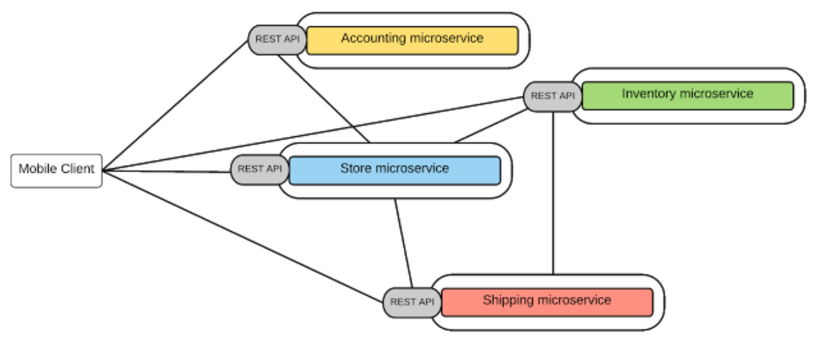
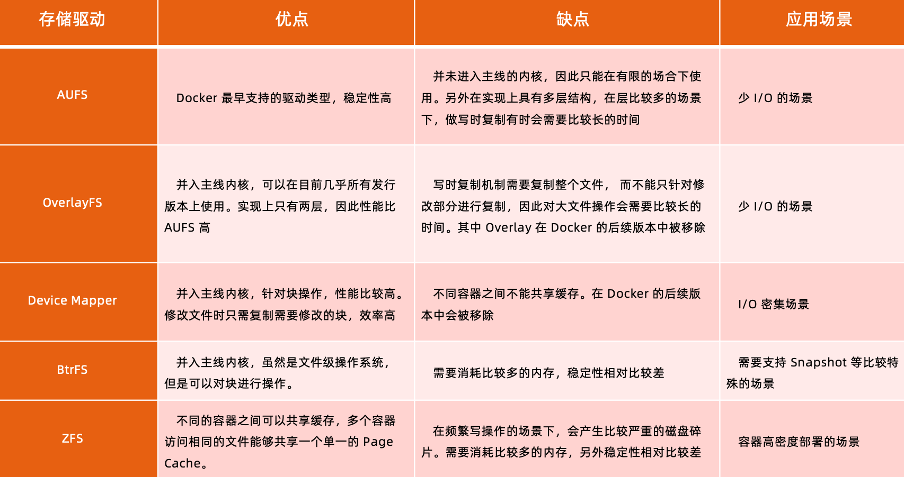

## 从系统架构谈起

### 传统分层架构与微服务架构

简单系统采用分层架构比较合适，复杂系统采用微服务架构比较合适。简单系统可能会随着业务发展迭代演进变得复杂。

### 微服务改造

#### 分离微服务方法建议

- 审视并发现可以分离的业务逻辑
- 寻找天生隔离的代码模块，可以借助于静态代码分析工具
- 不同并发规模，不同内存需求的模块都可以分离出不同的微服务，此方法可提高资源利用率，节省成本

#### 一些常用的可微服务化的模块: 

- 用户和账户管理
- 授权和会话管理
- 系统配置
- 通知和通讯服务
- 照片，多媒体，元数据等

#### 分解原则

- 基于微服务的大小
- 基于微服务的职责（工作范围）
- 基于微服务的能力

### 微服务间通讯

#### 点对点

- 多用于系统内部多模块之间通讯;
- 有大量的重复模块如认证授权;
- 缺少统一规范，如监控，审计等功能;
- 后期维护成本高，服务和服务的依赖关系错综复杂难以管理。

#### API网关

- 基于一个轻量级的 message gateway
- 新 API 通过注册至 Gateway 实现
- 整合实现 Common function （如：认证授权、审计日志等）

## Docker

- 基于 Linux 内核的 Cgroup，Namespace，以及 Union FS 等技术，对进程进行封装隔离，属于操作系统层面的虚拟化技术，由于隔离的进程独立于宿主和其它的隔离的进程，因此也称其为容器。
- 最初实现是基于 LXC，从 0.7 以后开始去除 LXC，转而使用自行开发的 Libcontainer，从 1.11 开始，则 进一步演进为使用 runC 和 Containerd。
- Docker 在容器的基础上，进行了进一步的封装，从文件系统、网络互联到进程隔离等等，极大的简化了容 器的创建和维护，使得 Docker 技术比虚拟机技术更为轻便、快捷。

### 使用Docker的好处

- 更高效的资源利用
- 更快速的启动时间
- 一致的运行环境（打包好的image就像一个箱子，它可以在不同的地方打开，而里面的内容是一样的）
- 持续交付和部署
- 更轻松地迁移、维护以及扩展

### 虚拟机和容器运行态的对比

### 性能对比

## 容器

### 容器标准（OCI）

**OCI 全称是Open Container Initiative**

#### 两个规范

规范1：Runtime Specification 文件系统包如何解压至硬盘，共运行时运行

规范2：Image Specification 如何通过构建系统打包，生成镜像清单（Manifest）、文件系统序列化文件、镜像配置。

### 容器主要特性

- 安全性
- 隔离性（基于namespace）
- 便携性
- 可配额（基于CGroup）

### namespace

Linux Namespace 是一种 Linux Kernel 提供的资源隔离方案

- 系统可以以进程分配不同的 Namespace
- 并保证不同的 Namespace 资源独立分配、进程彼此隔离，即不同的 Namespace 下的进程互不干扰

### cgroups

CGroups（Control Groups）是Linux下用于对一个或一组进程进行资源控制和监控的机制

- 可以对如 CPU 使用时间、内存、磁盘I/O 等进程所需资源进行限制
- 不同资源的具体管理工作由相应的 CGroup 子系统来实现
- 不同类型的资源限制，只要将限制策略在不同的子系统上进行关联
- CGroup 在不同的系统资源管理子系统中以层级树的方式来组织管理：每个 CGroup 都可以包含其他的子 CGroup。子 CGroup 能使用的资源除了受本 CGroup 配置的资源参数限制，还受到父 CGroup 设置的资源限制

#### 可配额/可度量 的资源

### CPU 子系统

cpu.shares：可出让的能获得 CPU 使用时间的相对值

cpu.cfs_period_us：配置时间周期长度，单位为 us （微秒）

cpu.cfs_quota_us：配置当前cgroup在 cfs_period_us 时间内最多能使用的 CPU 时间数，单位 us （微秒）

cpu.stat：cgroup 内的进程使用的 CPU 时间统计

nr_periods：经过 cpu.cfs_period_us 的时间周期数量

nr_throttled：在经过的周期内，有多少次因为进程在指定的时间周期内用光了配额时间而受到限制

throttled_time：cgroup 中的进程被限制使用 CPU 的总用时，单位是 ns （纳秒）

### Linux 调度器

内核默认提供了5个调度器，Linux 内核使用 struct sched_class 来对调度器进行抽象：

- stop 调度器，stop_sched_class：优先级最高的调度类，可以抢占其他所有进程，不能被其他进程抢占
- deadline 调度器，dl_sched_class：使用红黑树，把进程按照绝对截止期限进行排序，选择最小进程调度运行
- RT 调度器，rt_sched_class：实时调度器，为每个优先级维护一个队列
- CFS 调度器，cfs_sched_class：完全公平调度器，采用完全公平调度算法，引入虚拟运行时间概念
- IDLE-Task 调度器，idle_sched_class：空闲调度器，每个 CPU 都会有一个 idle 线程，当没有其他进程可以调度时，调度运行 idle 线程

### CFS 调度器

CFS 调度全称是 Completely Fair Scheduler，即完全公平调度器

- 维护为任务提供处理器时间方面的平衡
- 通过虚拟运行时间（vruntime）来实现平衡，维护提供给某个任务的时间量；vruntime = 实际运行时间*1024 / 进程权重，进程权重越大真是运行的时间则越长

#### vruntime

CFS 调度器维护以虚拟运行时间作为顺序的红黑树来调度进程。

#### CFS 进程调度

1. 在时钟周期开始时，调度器调用`__schedule()`函数来开始调度的运行
2. `__schedule()`函数调用`pick_next_task()`让进程调度器从就绪队列`vruntime`消耗最小的进程，也就是红黑树最左边的节点
3. 通过`context_switch()`切换到新的地址空间，保证被调度到进程运行
4. 在时钟周期结束时，调度器通过`entity_tick()`函数来更新进程负载、进程状态以及`vruntime`
5. 最后，比较当前进程的`vruntime`和就绪队列红黑树中最左边（vruntime最小的）的进程比较vruntime，如果小于，则继续执行当前进程，如果大于则将最左边的节点置换出来调度，然后出发红黑树再平衡

### Memory 子系统

- memory.usage_in_bytes：cgroup 下进程使用的内存，包含 cgroup 及其 cgroup 下的进程使用的内存。
- memory.max_usage_in_bytes：cgroup 下进程使用内存的最大值，包含子 cgroup 的内存使用量。
- memory.limit_in_bytes：设置 Cgroup 下进程最多能使用的内存。如果设置为 -1，表示对该 cgroup 的内存使用不做限制。
- memory.soft_limit_in_bytes：这个限制并不会阻止进程使用超过限额的内存，只是在系统内存足够时，会优先回收超过限额的内存，使之向限定值靠拢。
- memory.oom_control：设置是否在 Cgroup 中使用 OOM(Out of Memory)Killer，默认为使用。当属于该 cgroup 的进程使用的内存超过最大的限定值时， 会立刻被 OOM Killer 处理。

### cgroup driver

#### systemd

- 当操作系统使用 systemd 作为 init system 时，初始化进程生成一个根 cgroup 目录结构并作为 cgroup 管理器
- Systemd 与 cgroup 紧密结合，并且为每个 systemd unit 分配 cgroup

#### cgroupfs

- docker 默认用 cgroupfs 作为 cgroup 驱动

在 systemd 作为 init system 的系统中，默认并存着两套 groupdriver，这会使得系统中 docker 和 ku belet 管理的进程被 cgroupfs 驱动管，而 systemd 拉起的服务由 systemd 驱动管，让 cgroup 管理混乱且容易在资源紧缺时引发问题。**因此 kubelet 会默认 --cgroup-driver=systemd，若运行时 cgroup 不一致时，kubelet 会报错。**

## 文件系统

### Union FS

- 将不同目录挂载到同一虚拟文件系统下的文件系统
- 支持为每一个成员目录设定 `readonly`、`readwrite`、`whiteout-able` 权限
- 文件系统分层，对 `readonly` 权限的 branch 可以逻辑上进行修改（增量地，不影响`readonly` 部分的）
- 通常 Union FS 有两个用途，一方面可以将多个 disk 挂到同一个目录下，另一个更常用的就是将一个`readonly`的 branch 和一个 `writeable` 的 branch 联合在一起

### 容器镜像

### Docker 的文件系统

典型的 Linux 文件系统组成：

- bootfs（boot file system）
  - Bootloader 引导加载 kernel
  - Kernel 当 kernel 被加载到内存中后 umount bootfs

- rootfs（root file system）
  - /dev，/proc，/bin，/etc 等标准目录和文件

**对于不同的 linux 发行版，bootfs 基本是一致的，但 rootfs 会有差别**

### Docker 启动

Linux 在启动后，首先将 rootfs 设置为 `readonly`，进行一系列检查，然后将其切换为 `readwrite` 供用户使用。

Docker 是：

- 初始化将 rootfs 以 readonly 方式加载并检查，接着利用 union mount 的方式将一个 readwrite 文件系统挂载在 readonly 的 rootfs 之上
- 并且允许再次将下层的 FS（file system）设定为 readonly 并且向上叠加
- 这样一组 readonly 和一个 writeable 的结构构成一个 container 的运行时态，每一个 FS 在 Docker 中被称作一个 FS 层

### 写操作

由于镜像具有共享特性，所以对容器可写层的操作需要依赖存储驱动提供的`写时复制`和`用时分配`机制，以此来支持对容器可写层的修改，进而提高对存储和内存资源的利用率。

- 写时复制（Copy-on-Write）
  - 一个镜像可以被多个容器使用，但是不需要在内存和磁盘上做多个拷贝
  - 在需要对镜像提供的文件进行修改时，该文件会从镜像的文件系统被复制到容器的可写层的文件系统进行修改，而镜像里面的文件不会改变
  - 不同容器对文件的修改都相互独立、互不影响

- 用时分配
  - 按需分配空间，而非提前分配，即当一个文件被创建出来后，才会分配空间

### 容器存储驱动

目前主流使用 OverlayFS

#### OverlayFS 

OverlayFS 也是一种与 AUFS 类似的联合文件系统，同样属于文件级的存储驱动，包含了最初的 Overlay 和更稳定的 OverlayFS2

Overlay 只有两层：

- lower层：代表镜像层
- upper层：代码容器可写层

## Docker 引擎架构

