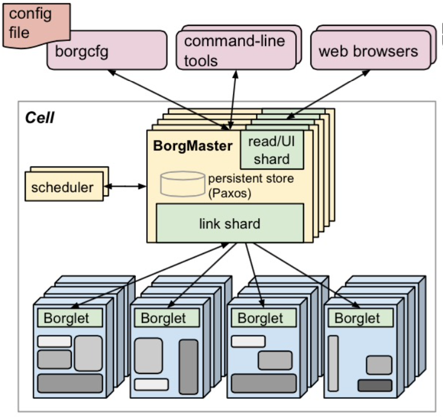

# Kubernetes 架构基础

## Borg

### 简介

#### 特性

- 物理资源利用率高
- 服务器共享，在进程级别做隔离
- 应用高可用，故障恢复时间短
- 调度策略灵活
- 应用接入和使用方便，提供了完备的 job 描述语言，服务发现，实时状态监控和诊断工具

#### 优势

- 对外隐藏底层资源管理和调度、故障处理等
- 实现应用的高可靠和高可用
- 足够弹性，支持应用跑在成千上万的机器上

### 基本概念

#### workload

- prod：在线任务，长期运行、对延时敏感、面向终端用户等
- non-prod：离线任务，也称为批处理任务（Batch），比如一些分布式计算服务等

#### cell

- 一个 cell 上跑一个集群管理系统 Borg
- 通过定义 cell 可以让 Borg 对服务器资源进行统一抽象，作为用户就无需知道自己的应用跑在哪台机器上，也不用关系资源分配、程序安装、依赖管理、健康检查及故障恢复等

#### job 和 task

- 用户以 job 的形式提交应用部署请求。一个 job 包含一个或多个相同的 task，每个 task 运行相同的应用程序，task 数量就是应用的副本数
- 每个 job 可以定义属性、元信息和优先级

#### naming

通过 BNS （Borg Name Service）实现

### Borg 架构

#### Borgmaster 主进程

- 处理客户端 RPC 请求，比如创建 job，查询 job 等
- 维护西戎组件和服务的状态，比如服务器、Task 等
- 负责与 Borglet 通信

#### Scheduler 进程

- 调度策略
  - worst fit 
  - best fit
  - hybrid

- 调度优化
  - Score caching：当前服务器或者任务的状态未发生变更或者变更很少，直接采用缓存数据，避免重复计算。
  - Equivalence classes：调度同一 job 下多个相同的 task 只需计算一次。
  - Relaxed randomization：引入一些随机性，即每次随机选择一些机器，只要符合需求的服务器数量达到一定值时，就可以停止计算，无需每次对 cell 中所有服务器进行 feasibility cheating

#### Borglet

是部署在所以服务器上的 Agent，负责接收 Borgmaster 进程的指令

### 应用高可用

- 被抢占的 non-pord 任务放回 pending queue，等待重新调度
- 多副本应用跨故障域部署
- 支持幂等性，允许客户端重复操作
- 当服务器状态变为不可用时，要控制重新调度任务的速率
- 记录详细的内部信息，便于故障排查和分析
- 无论何种原因都不能杀掉正在允许的服务（Task）

### Borg 系统自身高可用

- Borgmaster 组件多副本设计
- 采用一些简单的和底层（low-level）的工具来部署 Borg 系统示例，避免引入过多的外部依赖
- 每个 cell 的 borg 均独立部署，避免不同 borg 系统相互影响

### 资源利用率

- 通过将在线任务（prod）和离线任务（non-prod）混合部署，空闲时执行离线任务提升资源利用率。繁忙时，在线任务通过抢占的方式保证优先得到执行，合理地利用资源。

### 隔离性

#### 安全性隔离

- 早期采用 Chroot jail，后期版本基于 Namespace

#### 性能隔离

- 采用基于 Cgroup 的容器技术实现
- 在线任务（prod）是延时敏感型的，优先级高，而离线任务（non-prod）优先级底
- Borg 通过不同优先级之间的抢占式调度来优先保障在线任务的性能，牺牲离线任务
- Borg 将资源类型分成可压榨的（如CPU，资源耗尽不会终止进程）和不可压榨（如内存，资源耗尽进程会被终止）两类

