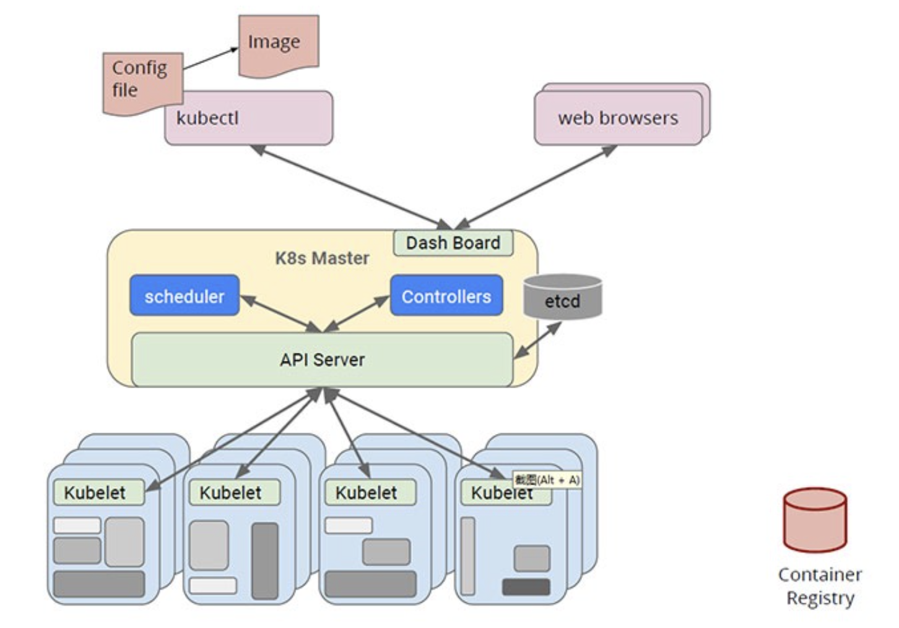
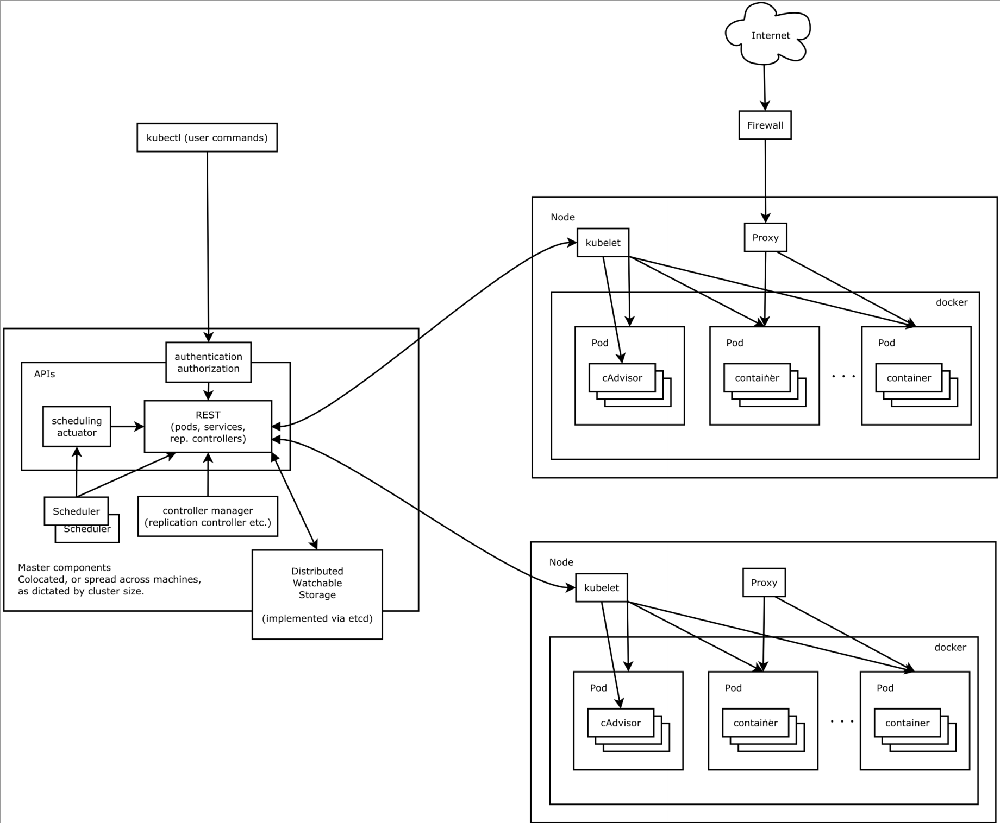
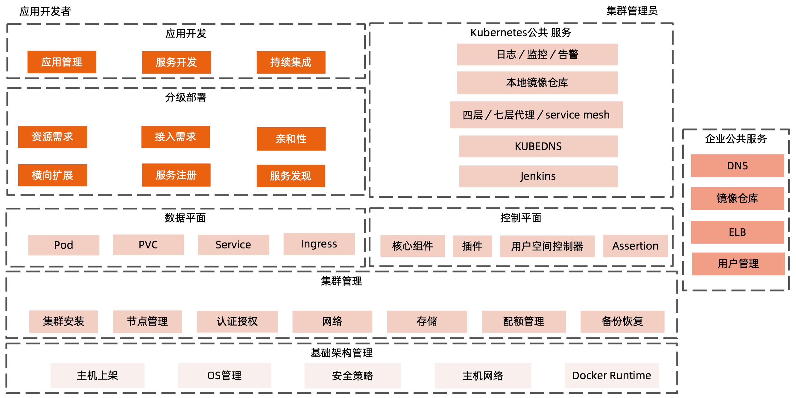
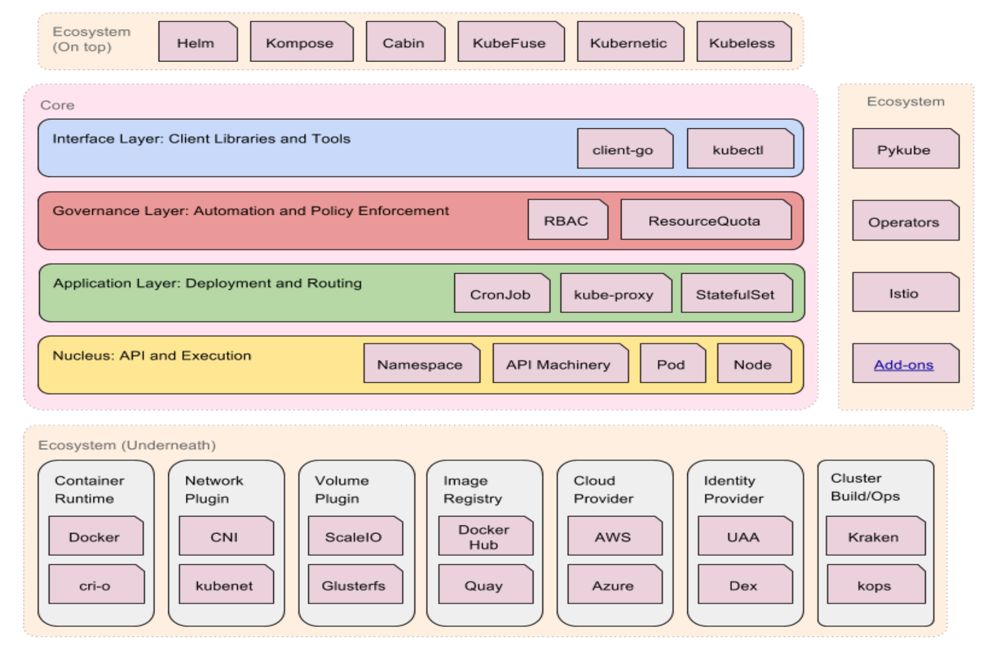

# Kubernetes 架构基础

## Borg

### 简介

#### 特性

- 物理资源利用率高
- 服务器共享，在进程级别做隔离
- 应用高可用，故障恢复时间短
- 调度策略灵活
- 应用接入和使用方便，提供了完备的 job 描述语言，服务发现，实时状态监控和诊断工具

#### 优势

- 对外隐藏底层资源管理和调度、故障处理等
- 实现应用的高可靠和高可用
- 足够弹性，支持应用跑在成千上万的机器上

### 基本概念

#### workload

- prod：在线任务，长期运行、对延时敏感、面向终端用户等
- non-prod：离线任务，也称为批处理任务（Batch），比如一些分布式计算服务等

#### cell

- 一个 cell 上跑一个集群管理系统 Borg
- 通过定义 cell 可以让 Borg 对服务器资源进行统一抽象，作为用户就无需知道自己的应用跑在哪台机器上，也不用关系资源分配、程序安装、依赖管理、健康检查及故障恢复等

#### job 和 task

- 用户以 job 的形式提交应用部署请求。一个 job 包含一个或多个相同的 task，每个 task 运行相同的应用程序，task 数量就是应用的副本数
- 每个 job 可以定义属性、元信息和优先级

#### naming

通过 BNS （Borg Name Service）实现

### Borg 架构

#### Borgmaster 主进程

- 处理客户端 RPC 请求，比如创建 job，查询 job 等
- 维护西戎组件和服务的状态，比如服务器、Task 等
- 负责与 Borglet 通信

#### Scheduler 进程

- 调度策略
  - worst fit 
  - best fit
  - hybrid

- 调度优化
  - Score caching：当前服务器或者任务的状态未发生变更或者变更很少，直接采用缓存数据，避免重复计算。
  - Equivalence classes：调度同一 job 下多个相同的 task 只需计算一次。
  - Relaxed randomization：引入一些随机性，即每次随机选择一些机器，只要符合需求的服务器数量达到一定值时，就可以停止计算，无需每次对 cell 中所有服务器进行 feasibility cheating

#### Borglet

是部署在所以服务器上的 Agent，负责接收 Borgmaster 进程的指令

### 应用高可用

- 被抢占的 non-pord 任务放回 pending queue，等待重新调度
- 多副本应用跨故障域部署
- 支持幂等性，允许客户端重复操作
- 当服务器状态变为不可用时，要控制重新调度任务的速率
- 记录详细的内部信息，便于故障排查和分析
- 无论何种原因都不能杀掉正在允许的服务（Task）

### Borg 系统自身高可用

- Borgmaster 组件多副本设计
- 采用一些简单的和底层（low-level）的工具来部署 Borg 系统示例，避免引入过多的外部依赖
- 每个 cell 的 borg 均独立部署，避免不同 borg 系统相互影响

### 资源利用率

- 通过将在线任务（prod）和离线任务（non-prod）混合部署，空闲时执行离线任务提升资源利用率。繁忙时，在线任务通过抢占的方式保证优先得到执行，合理地利用资源。

### 隔离性

#### 安全性隔离

- 早期采用 Chroot jail，后期版本基于 Namespace

#### 性能隔离

- 采用基于 Cgroup 的容器技术实现
- 在线任务（prod）是延时敏感型的，优先级高，而离线任务（non-prod）优先级底
- Borg 通过不同优先级之间的抢占式调度来优先保障在线任务的性能，牺牲离线任务
- Borg 将资源类型分成可压榨的（如CPU，资源耗尽不会终止进程）和不可压榨（如内存，资源耗尽进程会被终止）两类

## Kubernetes

### 主要功能

- 基于容器的应用部署、维护和滚动升级
- 负载均衡和服务发现
- 跨机器和跨地区的集群调度
- 自动伸缩
- 无状态服务和有状态服务
- 插件机制保证扩展性

### 命令式和声明式

#### 命令式

命令式系统是写出解决某个问题、完成某个任务或者达到某个目标的明确步骤。此方法明确写出系统应该执行某命令，并且期待系统返回期望结果。

比如在Linux系统中执行 `ls` 命令就会列出当前目录下的文件，执行 `pwd` 命令就会列出当前目录所在位置。

比如电视遥控器，可以马上调整到喜欢的频道。

适用于立即响应的场景，简单的系统。

#### 声明式

声明式系统指程序代码描述系统应该做什么而不是怎么做。仅限于描述要达到什么目的，如何达到目的交给系统。

比如通过空调调节温度，如果当前温度是30度，设置空调温度为25度，当前温度并不会立即变为25度。

### 声明式系统

Kubernetes 的所有管理能力构建在对象抽象的基础上，核心对象包括：

- Node：计算节点的抽象，用来描述计算节点的资源抽象、健康状态等
- Namespace：资源隔离的基本单位，可以简单理解为文件系统中的目录结构
- Pod：用来描述应用实例，包括镜像地址、资源需求等。Kubernetes 中最核心的对象，也是打通应用和基础架构的秘密武器
- Service：服务如何将应用发布成服务，本质上是负载均衡和域名服务的声明

### 架构

- kubelet 上报节点信息，处理 pod 创建请求等
- api-server 服务网关，路由请求，做认证鉴权等
- scheduler 调度器，资源调度，计算 pod 建在哪些节点上合适
- controllers 控制器集合，包括了许多的控制器，比如在某个节点故障时，会通过控制器将该节点上的 pod 杀掉，并在其他节点上创建新的实例

### 主要组件

#### Kubernetes 的主节点

- API 服务器（api-server）：是控制面板中唯一带有用户可访问 API 以及用户可交互的组件。API 服务器会暴露一个 RESTful 的 Kubernetes API 并使用 JSON 格式的清单文件。
- 集群的数据存储（cluster-data-store）：使用 etcd 作为数据存储。etcd 是一个强大的、稳定的、高可用的键值存储。
- 控制管理器（controller-manager）：运行着所有处理集群日常任务的控制器。如：节点控制器、副本控制器、端点控制器以及服务账户等，
- 调度器（scheduler）：监控新建的 pods（一组或一个容器）并将器分配给节点。

#### Kubernetes 的工作节点

- kubelet：负责调度到对应节点的 Pod 的生命周期管理，执行任务并将 Pod 状态报告给主节点的渠道，通过容器运行时（拉取镜像、启动和停止容器等）来运行这些容器。它还会定期执行被请求的容器的健康探测程序。
- kube-proxy：负责节点的网络，在主机上维护网络规则并执行连接转发。还负责对正在服务的 pods 进行负载均衡。

## Kubernetes 生态系统

## Kubernetes 设计理念

### 高可用

- 基于 replica-set，stateful-set 的应用高可用
- Kubernetes 组件本身高可用

### 安全

- 基于 TLS 提供服务
- 基于 Namespace 的隔离
- Taints，network-policy 等
- 不同级别账号及认证

### 可扩展性

- 基于 CRD 的扩展
- 插件化的生态系统

### 可移植性

- 多种 host-OS 选择
- 多种基础架构的选择
- 多云和混合云

## 分层架构

- 核心层：Kubernetes 最核心的功能，对外提供 API 构建高层的应用，对内提供插件式应用执行环境。
- 应用层：部署（无状态应用、有状态应用、批处理任务、集群应用等）和路由（服务发现、DNS 解析等）
- 管理层：系统度量（如基础设施、容器和网络的度量）、自动化（如自动扩展、动态 provision 等）、策略管理（RBAC、Quota、PSP、NetworkPolicy）
- 接口层：Kubectl 命令行工具、客户端 SDK 以及集群联邦。
- 生态系统：在接口层之上的庞大容器集群管理调度的生态系统，可以划分为两个范畴：
  - Kubernetes 外部：日志、监控、配置管理、CI、CD、Workflow、FaaS、OTS 应用、ChatOps 等
  - Kubernetes 内部：CRI、CNI、CVI、镜像仓库、Cloud-Provider、集群自身的配置和管理等。
