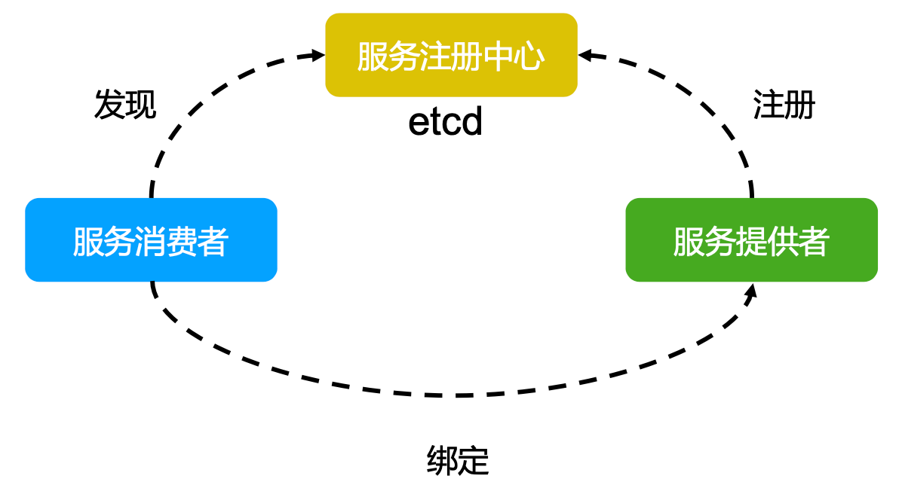
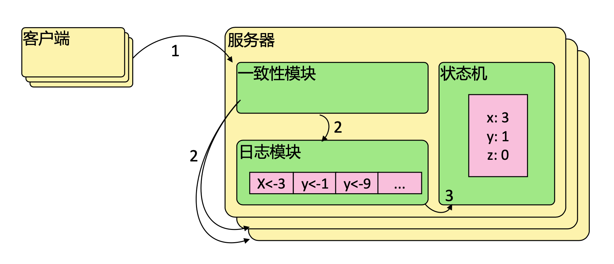
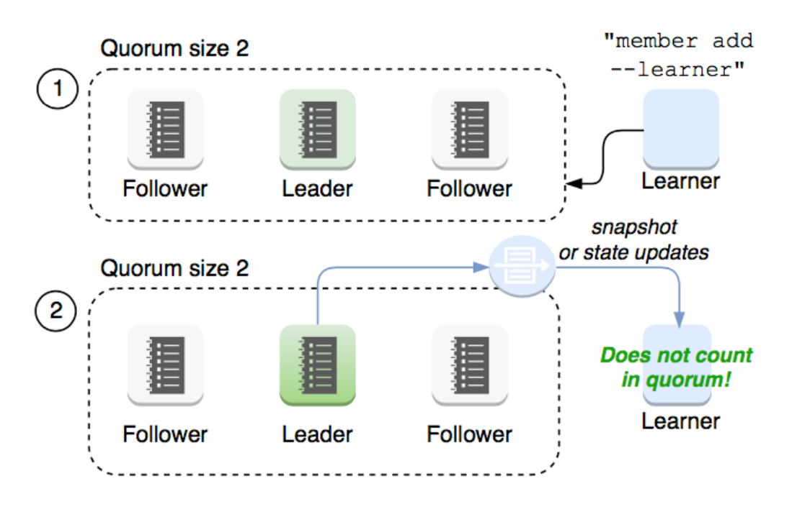

# etcd 

基于 raft 协议开发的分布式 key-value 存储，可用于服务发现、共享配置以及一致性保障（如数据库选主、分布式锁等）

- 键值对存储：将数据存储在分层组织的目录中，如同在标准文件系统中
- 检测变更：通过 watch 检测 key 所对应的 value 变更
- 可靠：使用 raft 算法保证一致性
- 简单：curl 可访问用户的 API
- 安全：可选的 SSL 客户端证书认证

### 主要功能

- 基本的 key-value 存储
- 监听机制
- key 的过期及续约机制，用于服务发现
- 原子 `Compare And Swap` 和 `Compare And Delete`，用于分布式锁和 leader 选举

### 使用场景

- 可用于键值对存储，应用程序可以读取和写入 `etcd` 中的数据
- `etcd` 比较多的应用场景是用于服务注册与发现
- 基于监听机制的分布式异步系统

### 键值对存储

etcd 是一个`键值存储`的组件

- 采用 `key-value` 型数据存储，一般情况下比关系型数据库快
- 支持动态存储（内存）以及静态存储（磁盘）
- 分布式存储，可集成为多节点集群
- 存储方式，类似于目录结构

### 服务注册与发现

- 服务注册：服务提供者注册服务地址到服务注册中心
- 心跳保活：服务定期上报心跳
- 健康检查：服务注册中心定期检查服务状态，不可用时及时剔除
- 服务发现：服务消费者通过服务注册中心获取可用服务实例地址

### 消息发布和订阅

以使用 etcd 作为服务远程配置为例，在应用启动时，服务主动从 etcd 拉取一次配置信息，后续更新则通过 watcher 监听：

- etcd 服务作为消息中心
- 用户修改配置，发布消息
- 服务 watcher 订阅到数据变更，做出响应

## Raft 协议

Raft 协议基于 `quorum` 机制，即大多数同意原则，任何的变更都需要超过半数的成员确认

### 相关资料

理解分布式共识协议 Raft http://thesecretlivesofdata.com/raft/

https://raft.github.io/raft.pdf

https://raft.github.io/

https://github.com/maemual/raft-zh_cn/blob/master/raft-zh_cn.md

### 理解

#### 集群选主

**集群个数建议是素数个，避免出现多个候选节点拉票得票数一样的情况**

**集群个数尽量不是偶数个，选主成功的几率更大**

跟随者：

- 响应来自候选人和领导人的请求
- 如果在超过选举超时时间的情况之前没有收到**当前领导人**（即该领导人的任期需与这个跟随者的当前任期相同）的心跳/附加日志，或者是给某个候选人投了票，就自己变成候选人

候选人：

- 在转变成候选人后就立即开始选举过程
  - 自增当前的任期号（currentTerm）
  - 给自己投票
  - 重置选举超时计时器
  - 发送请求投票的 RPC 给其他所有服务器
- 如果接收到大多数服务器的选票，那么就变成领导人
- 如果接收到来自新的领导人的附加日志（AppendEntries）RPC，则转变成跟随者
- 如果选举过程超时，则再次发起一轮选举

领导人：

- 一旦成为领导人：发送空的附加日志（AppendEntries）RPC（心跳）给其他所有的服务器；在一定的空余时间之后不停的重复发送，以防止跟随者超时
- 如果接收到来自客户端的请求：附加条目到本地日志中，在条目被应用到状态机后响应客户端
- 如果对于一个跟随者，最后日志条目的索引值大于等于 nextIndex（lastLogIndex ≥ nextIndex），则发送从 nextIndex 开始的所有日志条目：
  - 如果成功：更新相应跟随者的 nextIndex 和 matchIndex
  - 如果因为日志不一致而失败，则 nextIndex 递减并重试
- 假设存在 N 满足`N > commitIndex`，使得大多数的 `matchIndex[i] ≥ N`以及`log[N].term == currentTerm` 成立，则令 `commitIndex = N`

##### 集群选主场景1：程序刚启动

1. 程序启动，所有节点都是跟随者
2. 选举超时，跟随者变为候选者发起投票（选举超时时间在 150ms ~ 300ms）
3. 其他还未超时的节点如果收到了投票请求，在选举超时后就会投票给第一个符合条件（**Term 较大或 Term 相同 Index 更大**）的候选者
4. 候选者票数一旦超过半数就会变为领导者

#### 日志复制

raft 协议的日志复制模式是`多数复制`，即集群中的超半数节点写入日志才认为写入成功。

##### 日志复制场景1：处理客户端请求

1. 领导者会接受客户端的请求，并写入日志
2. 领导者新增的日志会随着心跳发送给跟随者
3. 跟随者收到心跳并记录好要同步的日志后会给领导者ACK
4. 当领导者收到超过半数跟随者的ACK消息后，就会将该日志设置为已提交并追加到磁盘，应答客户端并在下个心跳中通知追随者将该日志存储到本地磁盘中

##### 日志复制场景2：多节点集群发生网络分区

假设集群中共有5个节点。

**如果领导者在2个节点的区域**：

存在网络分区将其划分为2个节点（A 领导者、B）的区域和3个节点（C、D、E）的区域。

1. 3个节点的区域都是跟随者，会都选举超时，发起新的投票产生新的领导者（假设是 C）
2. 2个节点的区域领导者，处理客户端的请求在日志同步是总是失败，因为没有机会获得超过半数的跟随者ACK，而不会commit
3. **当5个节点又在同一个分区时**，这个时候会有两个领导者发出心跳，节点 A 的心跳只有节点 B 有可能ACK，应为 C、D、E 节点已经不是节点 A 所在任期的跟随者了。节点 C 发出的心跳除了 D、E 应答外，A、B 会知道它是新任期的领导者而转变为其跟随者并应答
4. 节点 C 则会将其日志同步给节点 A、B，节点 A 会回滚调之前未commit的日志。

**如果领导者在3个节点的区域**

存在网络分区将其划分为2个节点（A 、B）的区域和3个节点（C 领导者、D、E）的区域。

1. 2个节点的区域都是跟随者，会都选举超时，发起新的投票，但由于没有节点能够获得超过半数的选票未能产生领导者。
2. 3个节点的区域中节点 C 是领导者，因为这个区域的节点数超过集群节点半数，所以可以正常处理客户端请求以及日志同步。
3. **当5个节点又在同一个分区时**，这个时候领导者节点 C 会通过心跳同步日志给跟随者，节点 A、B 就能过同步上之前由于分区导致差异的数据了。

##### 日志复制场景3：集群新增节点

在 raft 4.2.1 引入了新角色 学习者（learner）。

新增节点与领导者的数据差异较大，需要较多的数据同步才能跟上领导者的最新的数据。可能会导致领导者的网络带宽被用尽，使得领导者无法保持正常的心跳，进而导致跟随者重新发起投票，进而可能引发集群不可用。

**新增的学习者角色，只接收数据而不参与投票，因此增加学习者节点时，集群的quorum不变**

1. 集群新增节点，新增节点角色为学习者
2. 领导者通过心跳同步日志给新节点

#### 安全性

- 选举安全性：每个任期（Term）只能选举出一个领导者
- 领导者日志完整性：当日志在任期 Term-1 被 commit 后，那么以后任期（Term-2、Term-3...等）的领导者必须包含该日志。是 raft 在选举阶段在候选人的 **Term 较大或 Term 相同 Index 更大**才投票，否则拒绝该请求。