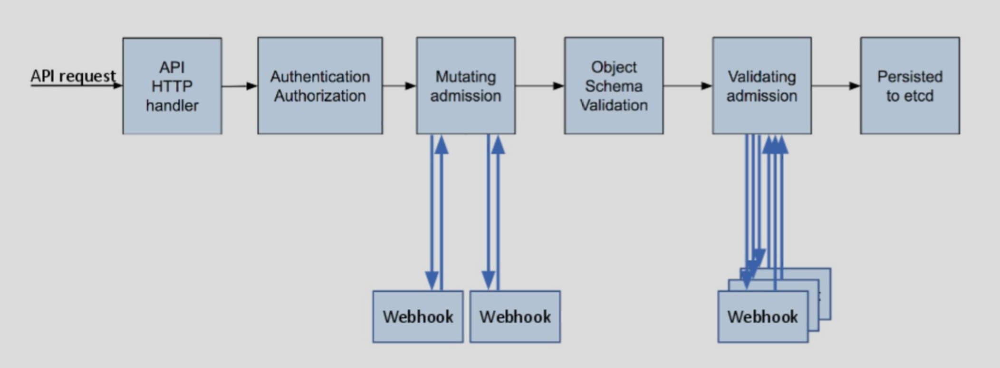
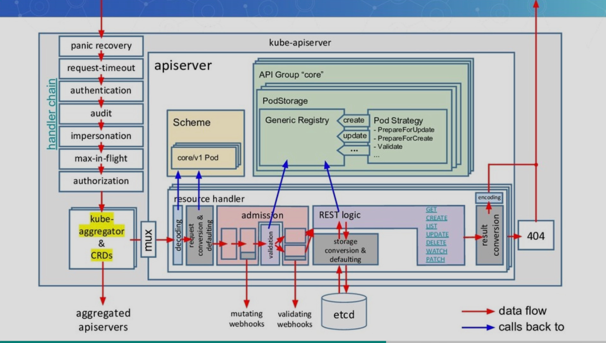
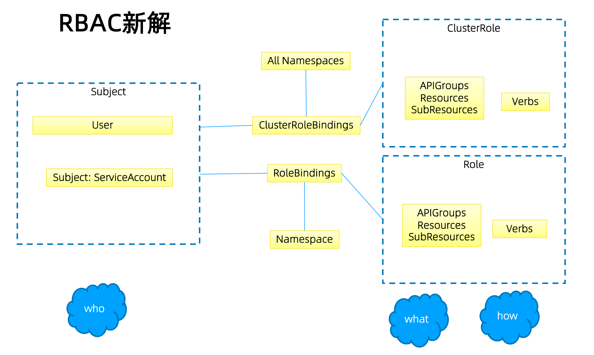
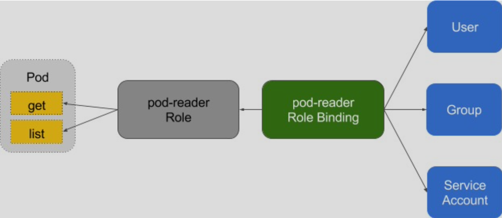
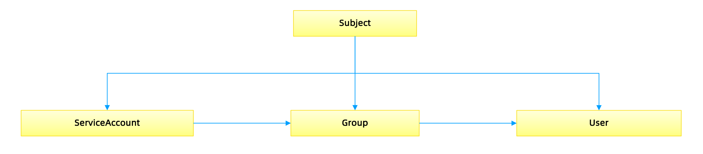

# API-Server

kube-apiserver 是 Kubernetes 最重要的核心组件之一，主要提供以下的功能：

- 提供集群管理的 rest-API 接口，包括认证授权、参数校验以及集群状态变更等
- 提供其他模块之间的数据交互和通信的枢纽（其他模块通过 API Server 查询或修改数据，只有 API Server 才直接操作 etcd）

**访问控制概览**

Kubernetes API 的请求都会经过多阶段的访问控制之后才会被接受，这包括认证、授权以及准入控制等




**访问控制细节**




## 认证

开启 TLS 时，所有请求都需要先进行认证。

Kubernetes 支持多种认证机制，并支持同时开启多个认证插件（只要有一个认证通过即可）。

如果认证成功，则用户的 username 会传入授权模块做进一步授权验证，认证失败的请求则返回 HTTP 401。

### 认证插件

- x509 证书
- 静态 token 文件
- 引导 token
- 静态密码文件
- Service Account
  - 是 Kubernetes 自动生成的，并会自动挂载到容器  `/run/secrets/kubernetes.io/serviceaccount` 目录中
- Open ID
  - OAuth 2.0 的认证机制
- Webhook 令牌认证
- 匿名请求
  - 如果使用 AlwaysAllow 的认证模式，则匿名请求默认开启，但可用 `--anonymous-auth=false` 禁止匿名请求。

### 基于 webhook 的认证服务集成

- 开发认证服务
  - 解码认证请求
  - 转发认证请求至认证服务器
  - 认证结果返回给 APIServer
- 配置认证服务
- 配置 APIServer


## 鉴权

### 授权

授权主要是对集群资源访问控制，通过检查请求包含的相关属性值，与相对应的访问策略相比较，API 请求必须满足某些策略才能被处理。

支持同时开启多个授权插件，只要有一个验证通过即可有访问权限。

如果授权成功，则用户的请求会发送到准入控制模块做进一步的请求验证，否则返回 HTTP 403。

#### Kubernetes 授权处理的属性

- user，group，extra
- API、请求方法和请求路径
- 请求资源和子资源
- Namespace
- API Group

#### Kubernetes 支持以下授权插件

- ABAC：在 Kubernetes 中的实现比较难于管理和理解，而且需要对 Master 所在节点的 SSH 和文件系统权限，要使得对授权的变更成功生效，还需要重新启动 API Server。

- RBAC：在 Kubernetes 中可以利用 kubectl 或者 Kubernetes API 直接进行配置。RBAC 可以授权给用户，让用户有权进行授权管理，这样就可以无需接触节点，直接进行授权管理。RBAC 在 Kubernetes 中被映射为 API 资源和操作。

  

- Webhook

- Node

### Role 与 ClusterRole

Role（角色）是一系列权限的集合，例如一个角色可以包含读取 pod 的权限和列出 po d 的权限。

Role 只能用来给某个特定 namespace 中的资源作鉴权，对多 namespace 和集群级的资源或者是非资源类的 API（如`/healthz`）使用ClusterRole

```yaml
# Role示例
kind: Role
apiVersion: rbac.authorization.k8s.io/v1 
metadata:
	namespace: default
	name: pod-reader 
rules:
- apiGroups: [""] # "" indicates the core API group 
	resources: ["pods"]
	verbs: ["get", "watch", "list"]
```

```yaml
# ClusterRole示例
kind: ClusterRole
apiVersion: rbac.authorization.k8s.io/v1 
metadata:
	# "namespace" omitted since ClusterRoles are not namespaced
	name: secret-reader 
rules:
- apiGroups: [""]
	resources: ["secrets"]
	verbs: ["get", "watch", "list"]
```

### binding



```yaml
# RoleBinding示例(引用ClusterRole)
# This role binding allows "dave" to read secrets in the "development" namespace.
kind: RoleBinding
apiVersion: rbac.authorization.k8s.io/v1
metadata:
  name: read-secrets
  namespace: development # This only grants permissions within the "development" namespace.
subjects:
- kind: User
  name: dave
  apiGroup: rbac.authorization.k8s.io
roleRef:
  kind: ClusterRole
  name: secret-reader
  apiGroup: rbac.authorization.k8s.io
```

### 账户/组的管理

角色绑定（Role Binding）是将角色中定义的权限赋予一个或一组用户。

它包含若干 **主体**（用户、组或服务账号）的列表和对这些主体所获得的角色的引用。

组的概念：

- 当与外部认证系统对接时，用户信息（UserInfo）可包含 Group 信息，授权可针对用户群组
- 当对 ServiceAccount 授权时，Group 代表某个 Namespace 下所有 ServiceAccount




### 规划系统角色

#### User

- 管理员
  - 所有资源的所有权限？
- 普通用户
  - 拥有改用户创建的 namespace 下的所有对象的操作权限？
  - 对其他用户的 namespace 资源是否可读？是否可写？

#### SystemAccount

- SystemAccount 是开发者（kubernetes develope r或者 domain developer）创建应用后，应用于 apiserver 通讯需要的身份
- 用户可以创建自定的 ServiceAccount，kubernetes 也为每个 namespace 创建 default ServiceAccount
- Default ServiceAccount 通常需要给定权限以后才能对 apiserver 做写操作