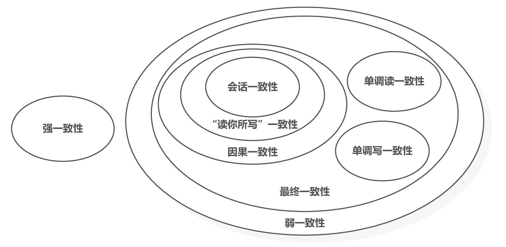

[TOC]

# 数据一致性

数据一致性通常指关联数据之间的逻辑关系是否正确和完整，而数据存储的一致性模型则可以认为是存储系统和数据使用者之间的一种约定，如果使用者遵循这种约定，则可以得到系统所承诺的访问结果[[1]](https://cn.pingcap.com/article/post/5950.html)。

数据一致性分为`多副本数据一致性`和`分布式事务数据一致性`。

系统中可能会面临下面的问题（导致数据不一致）：

1. 程序依托的操作系统层、硬件层可能会随时失效（包括正在执行写操作的过程中）。
2. 应用程序可能随时崩溃（包括一系列操作执行到中间某一步）。
3. 网络中断可能随时会发生，它会切断客户端与服务端的链接或数据库之间的链接。
4. 多个客户端可能会同时访问服务端，并且更新同一批数据，导致数据互相覆盖。
5. 客户端可能会读到一些无意义的、部分更新的数据数据（某些操作执行到一半被中止导致的）。

## 多副本数据一致性

多副本下不同节点之间的数据内容是一样的。

每个保存系统完整数据集的节点称之为`副本`。

### 主从复制

#### 同步复制

主节点写入后还需要等待所有从节点完成写入，并且最新的写入对所有用户可见。

#### 异步复制

在主节点写入完成后，异步复制到从节点。（一般复制到从节点是非常快的）

#### 半同步复制

在数据库中有时会设置一个从节点（从节点数大于 1）复制策略为`同步`。

#### 复制日志的实现

1. 基于语句的复制
2. 基于预写日志（WAL）的复制
3. 基于行的逻辑日志复制
4. 基于触发器的复制

### 多主节点复制

适用于多数据中心场景。

需要考虑写冲突 （场景类似协同编辑文档时，可能会产生冲突，服务很难自动处理）

### 无主节点复制

#### quorum

一种抽屉原理的应用，w（写请求写入节点数） + r（读请求读取节点数） > n（节点总数）

## 分布式事务数据一致性

~~分布式事务下不同节点之间的数据内容是不一样的。~~ 

### 事务

事务将应用程序的多个读、写操作捆绑在一起成为一个逻辑操作单元，即事务中的所有读写是一个执行的整体，整个事务要么成功（提交），要么失败（中止或回滚）。如果失败，应用程序可以安全地重试[[2]]()。

### ACID

1. 原子性 (Atomicity)：是系统中不可分解为更小粒度的东西，它只能处于操作之前后操作之后的状态，没有中间状态，在操作失败时可以安全地重试。
2. 一致性 (Consistency)：系统处于应用程序所期待的`预期状态`。
3. 隔离性 (Isolation)：系统中同时运行的多个事务相互隔离，互不干扰。
4. 持久性 (Durability)：成功完成的事务的更改将持久保存，即使系统崩溃也不会丢失。

#### 隔离级别

如数据库中的读-提交、快照隔离（或可重复读）、可串行化等

### 单节点事务

在单节点上运行的事务，不需要与其他节点交互，也就不会出现部分节点失败导致的操作分割，我们只需要考虑当前节点整体失败导致的操作分割即可。对于单节点事务，一般是在存储引擎上，通过 `Undo Log`、`Redo Log` 和 `Commit 记录`  来实现[[3]]()。（注：此处提到的存储引擎是 MySQL 的 InnoDB）

### 多节点事务

对于多节点上运行的事务（分布式事务）来说，除了当前节点整体失败导致的操作分割之外，还存在部分节点失败导致的操作分割。我们知道当前节点整体失败导致的操作分割，可以按单节点事务来处理，而对于部分节点失败导致的操作分割，一个常见的思路是通过两阶段提交（ 2PC ）来解决[[3]]()。

#### 两阶段提交（2PC）

2PC 引入了单节点事务所没有的一个新组件：协调者（也称事务管理器）[[4]]()。

- 选择一个协调者，这个协调者可以是分布式事务的参与节点，也可以是一个单独的进程。
- 阶段 1
  - 协调者发送事务请求（Prepare）到所有的参与节点，并询问它们是否可以提交。
  - 如果所有的参与节点都回复`是`，那么接下来协调者在阶段 2 发出提交（Commit）请求。
  - 如果任何的参与节点都回复`否`，那么接下来协调者在阶段 2 发出放弃（Rollback）请求。
- 阶段 2
  - 依据阶段 1 返回的结果，决定事务最终是提交（Commit）还是放弃（Rollback）。

##### 协调者发生故障

在协调者发生故障前，如果参与者在第一阶段成功响应，那么将一直等待协调者的提交或放弃请求

#### 三阶段提交（3PC）

在 2PC 两个阶段之间插入了一个阶段，增加了一个相互协商的过程。

加入了超时机制避免阻塞（参与者一直等待）。

通常，非阻塞原子提交依赖于一个完美的故障检测器，即有一个非常可靠的机制可以判断出节点是否已经崩溃。在无限延迟的网络环境中，超时机制并不是可靠的故障检测器，因为即使节点正常，请求也可能由于网络问题而最终超时[[10]]()。

#### TCC（Try-Confirm-Cancel）

TCC 本质上是一个业务层面上的 2PC，他要求业务在使用 TCC 模式时必须实现三个接口`Try()`、`Confirm()`和`Cancel()`[[5]](https://juejin.cn/post/7017333689109446670)

#### XA

是异构环境下实施两阶段提交的一个工业标准[[6]]()

#### SAGA、本地消息表、事务消息

[[7]聊一下分布式事务](https://albenw.github.io/posts/425b6837/)

## 事务管理器

go 跨语言分布式事务管理器 [dtm](https://github.com/dtm-labs/dtm/blob/main/helper/README-cn.md)

- 支持多种事务模式：SAGA、TCC、XA
- 支持消息最终一致性：二阶段消息，比本地消息表更优雅的方案

dtm 示例 https://github.com/dtm-labs/dtm-examples/blob/main/doc/README-cn.md

## 数据一致性基础理论

### CAP 

在分布式系统中共享数据时，无法同时满足一致性（Consistency）、可用性（Availability）和分区容忍性（Partition tolerance）这三个特性

- 一致性（Consistency）：在分布式系统中的所有节点中，对于任何操作的执行结果都是一致的。换句话说，系统中的所有节点都能够看到相同的数据状态。
- 可用性（Availability）：系统必须对于每个请求都能够给出响应，即系统保持持续的可用性，不会因为节点故障或其他原因导致无法响应客户端请求。
- 分区容忍性（Partition tolerance）：系统能够在网络分区的情况下继续正常运行。网络分区是指分布式系统中的节点之间出现通信故障，导致节点无法相互通信的情况。

分区容忍性是分布式系统的必要属性，需要在`一致性`和`可用性`之间取舍

1. `CP` 需要保证一致性，当节点判断分区发生后，需要拒绝服务
2. `AP` 需要保证可用性，当节点判断分区发生后，返回当前节点上已有的数据值

### BASE

BASE 是指基本可用（Basically Available）、软状态（Soft State）、最终一致性（Eventual Consistency）

核心思想是即使无法做到强一致性（CAP 的一致性就是强一致性），但应用可以采用适合的方式达到最终一致性。

- 基本可用（BA）：读写操作尽可能的可用，但写操作在冲突的时候可能丢失结果，读操作可能读取到旧的值。
- 软状态（S）：没有一致性的保证，允许系统存在中间状态，而该中间状态不会影响系统整体可用性，这里的中间状态就是 CAP 理论中的数据不一致。
- 最终一致性（E）：如果系统运行正常且等待足够长的时间，系统最终将达成一致性的状态。

## 一致性模型

  

[[8]]()

更具体的一致性模型介绍 https://es.cs.rptu.de/publications/datarsg/Senf13.pdf

### 线性一致性

强一致性也被叫做线性一致性、严格一致性

比如主从复制架构中的同步复制

### 顺序一致性

#### 单调读一致性

用户总是从固定的同一副本执行读取（而不同的用户可以从不同的副本读取）[[9]]()

### 因果一致性

事件之间存在因果关系

#### 写后读一致性

确保用户总能看到自己最近提交的更新。

“读你所写”一致性（读自己的写）也叫做写后读一致性、读写一致性

## 案例

TODO

## 参考

[[1]数据的一致性是什么?数据一致性解决方案概述](https://cn.pingcap.com/article/post/5950.html)

[[2]数据密集型应用系统设计-P211]()

[[3]极客时间-深入浅出分布式技术原理-第23节]()

[[4]数据密集型应用系统设计-P334]()

[[5]分布式事务-2PC与TCC](https://juejin.cn/post/7017333689109446670)

[[6]数据密集型应用系统设计-P334]()

[[7]聊一下分布式事务](https://albenw.github.io/posts/425b6837/)

[[8]大数据日知录-第二章]()

[[9]数据密集型应用设计- P158]()

[[10]数据密集型应用设计- P337]()

https://mp.weixin.qq.com/s/O9Z5e_BzdxKcULHigYMkRg
