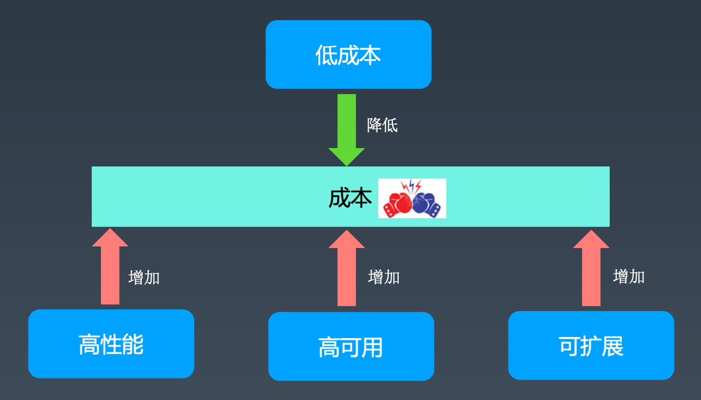
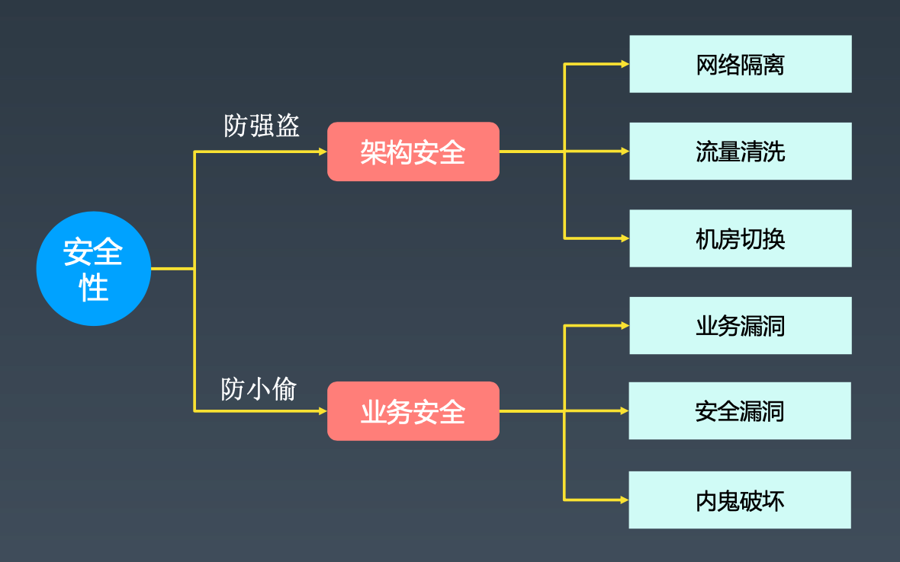
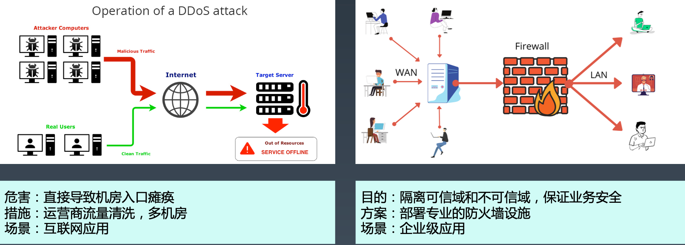
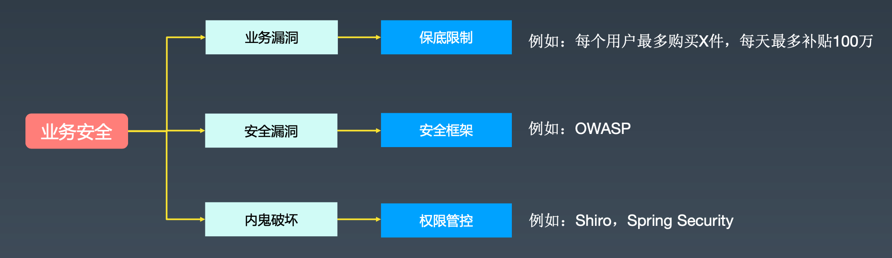
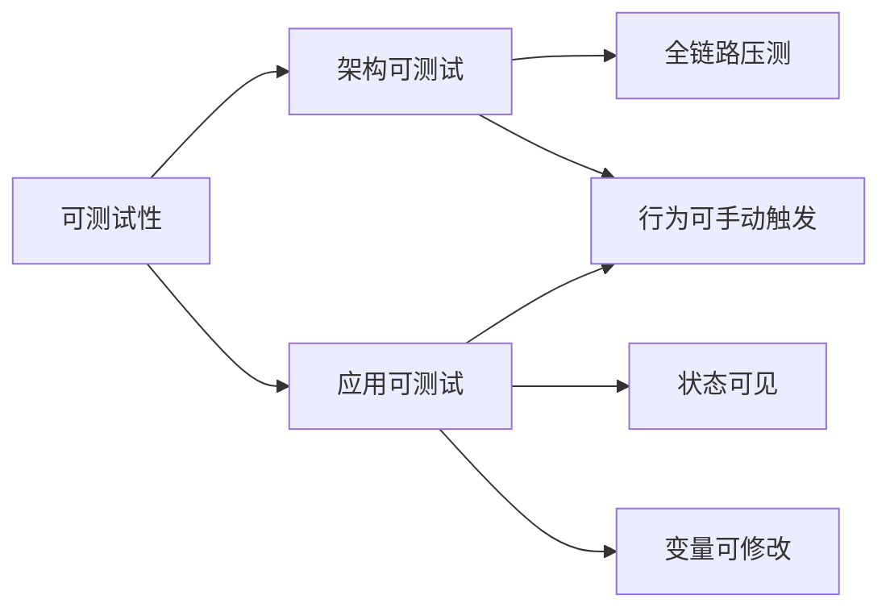
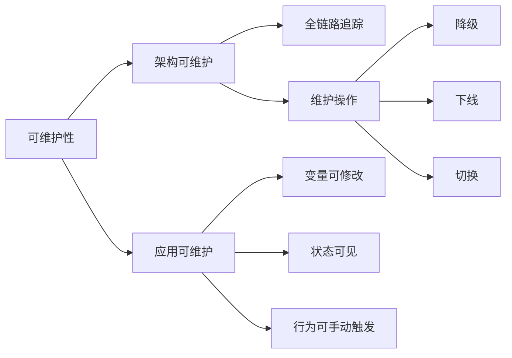
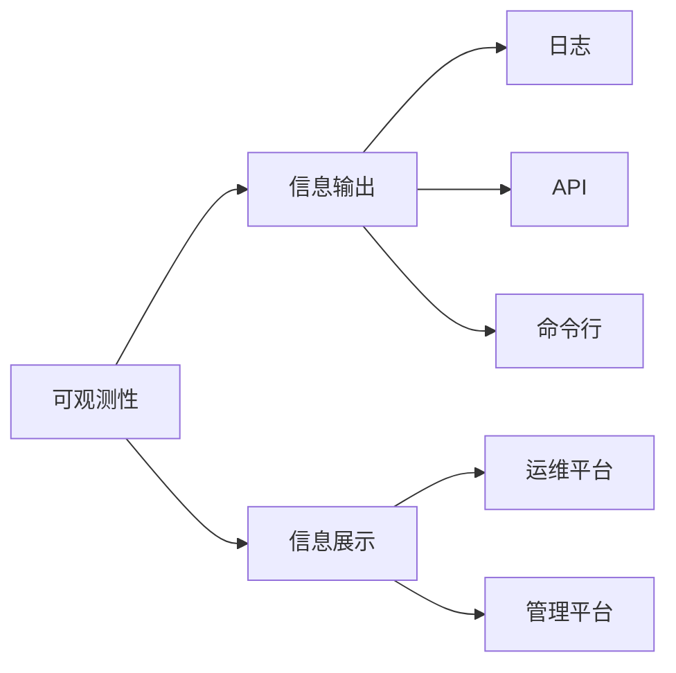
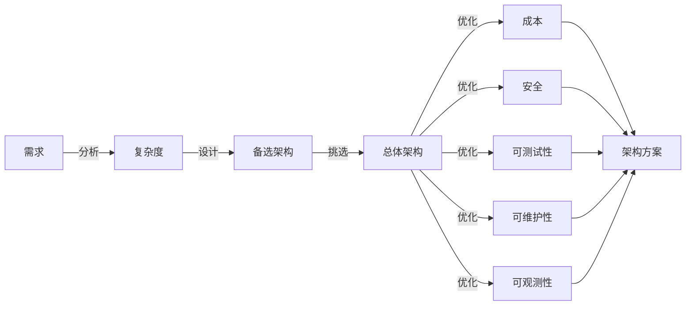

## 思维导图

## 低成本

先设计架构方案，再看如何降低成本。

### 低成本复杂度本质

低成本本质上是对架构的一种约束，与高性能、高可用、可扩展等架构是冲突的。

### 低成本手段

#### 优化

- 引入缓存
- 虚拟化
- 性能调优
- 采用高性能硬件（总体性价比高）
- 采用开源方案

#### 创新

- NoSQL vs SQL
- SQL vs 倒排索引
- Facebook HHVM
- 云计算/k8s弹性集群

### 低成本的主要应用场景

- 互联网超大规模集群：例如10000台机器降到8000台机器，每年节省成本几千万。
- 2B业务：例如1000万的项目，节省100万，利润就多100万。
- 其他业务：加机器在大部分业务场景是综合成本最低的架构设计方式。

UNIX哲学之经济原则：宁花机器一分，不花程序员一秒。

## 安全性

### 安全复杂度本质

主要解决架构安全问题，业务安全更多依赖具体技术实现。

### 架构安全

### 业务安全

业务安全还需要在编码和管理方面添加措施

## 可测试性/可维护性/可观测性

### 可测试性

软件系统在测试环境下能否方便的支持测试各种场景的能力。

### 可维护性

软件系统支持定位问题、修复问题的能力。

#### 为什么可测试性和可维护性的方法非常类似？

目的都是在异常场景处理问题。只是测试是模拟的异常场景，可维护性则是真实的异常场景。

### 可观测性

软件系统对外展示内部状态的能力。可观测性是可测试性、可维护性的基础。

可观测性本质上是应用输出信息，运维平台/管理平台聚合展示信息。

## 如何设计更好的架构

给你的系统增加管理后台，是在哪个步骤？在优化阶段的可测试性和可维护性。

## Q&A

### 架构设计应该尽量做到低成本？

错误，先设计架构方案，再看如何降低成本。

### 架构设计不能保证业务安全？

错误，架构安全一定程度上可以保护业务安全，但是要完全做好业务安全还需要编码和管理方面再添加些措施。

### 全链路压测属于可测试性范畴，而全链路跟踪属于可维护性范畴

对

### 可观测性只能通过运维平台来实现？

错误，管理后台也可以实现，但是一般都是运维平台实现。

### 每次做架构都需要把可维护性、可测试性、可观测性做好？

在架构设计初期不要求做好，可以通过迭代优化去完善。