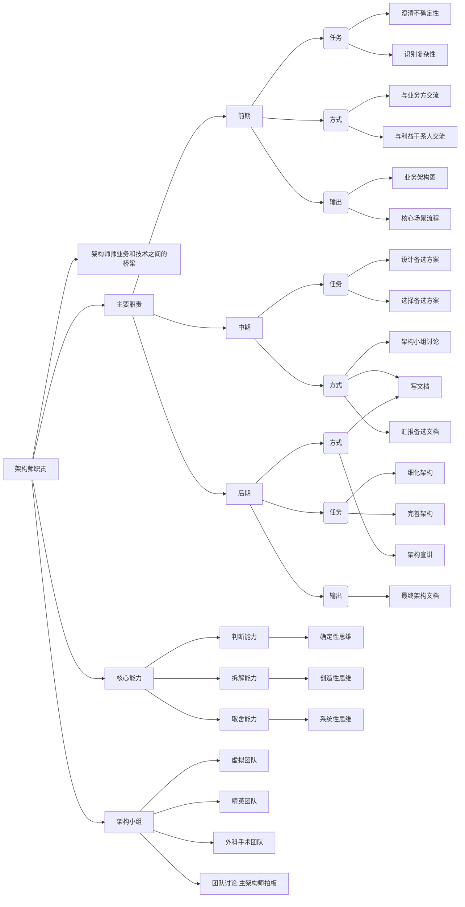
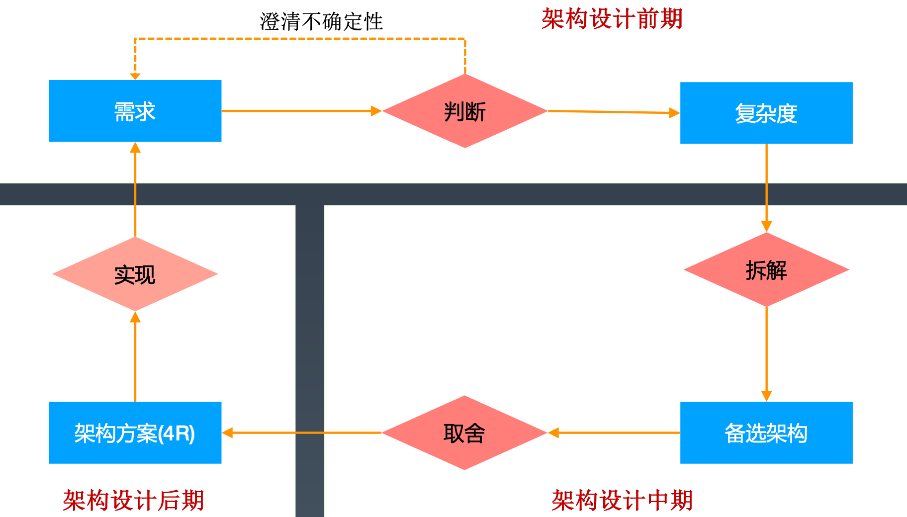

## 思维导图

## 架构师画像

### 架构师的定位

1. 是业务和技术之间的桥梁
2. 架构师不能只顾技术，不懂业务
3. 架构师很容易两头不讨好

### 架构师的三个核心能力

- 判断：业务理解力、技术能力、沟通能力
- 拆解：技术深度、技术宽度（同领域技术）、技术广度（跨领域技术）
- 取舍：设计理念、说服能力、决断能力

### 架构师的三个关键思维

- 确定性思维 -- 判断能力
- 创造性思维 -- 拆解能力
- 系统性思维 -- 取舍能力

## 架构设计流程和架构师职责

### 架构设计

**架构设计影响系统结构**

- Rank：改变系统分层的设计属于架构设计
- Role：修改（增、删、改、拆、合）角色属于架构设计。如微服务拆分
- Relation：修改角色关系属于架构设计。如用消息队列代理接口访问
- Rule：修改角色之间的运作规则属于架构设计。如MongoDB将选举算法从Bully改为Raft

### 架构设计阶段划分

#### 设计前期

**跟相关人员开会**

- 主要任务
  1. 澄清不确定性（明确利益干系人的诉求 -> 消除冲突的诉求 -> 诉求优先级排序）
  2. 识别复杂性（如识别核心场景 -> 明确或者预估质量需求 -> 识别复杂度）
- 工作模式
  1. 与业务方交流
  2. 与利益干系人交流
- 关键输出
  1. 总体业务架构图
  2. 核心场景流程

#### 架构设计中期

**架构小组开会和写架构设计文档**

- 主要任务
  1. 设计备选方案（头脑风暴 -> 筛选方案 -> 设计备选方案）
  2. 选择备选方案（全方面评估 -> 明确选择标准 -> 选择最终方案并汇报）
- 工作模式
  1. 架构小组讨论
  2. 架构小组写文档
  3. 相利益干系人汇报
- 关键输出
  1. 备选方案
  2. 方案评估结论
  3. 方案汇报结论

#### 架构设计后期

**写文档和开宣讲会**

- 主要任务
  1. 细化架构：按照4R架构定义来细化架构
  2. 完善架构：从可维护性、可测试性、可运维性、成本、安全等多方面考虑
- 工作模式
  1. 写架构设计文档
  2. 给技术团队宣讲架构
- 关键输出：完整的架构设计方案

#### 架构验证阶段

- 主要任务
  1. 收集架构意见（开发、测试、运维等人员的意见）
  2. 跟进架构落地效果（性能测试结果、压力测试结果、线上运维情况）
- 工作模式
  1. 总结复盘
  2. 收集吐槽
- 关键输出
  1. 架构优化建议
  2. 架构迭代计划

