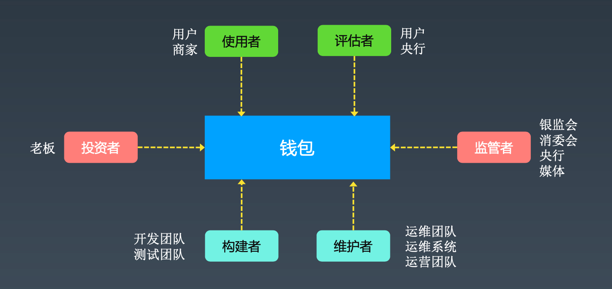
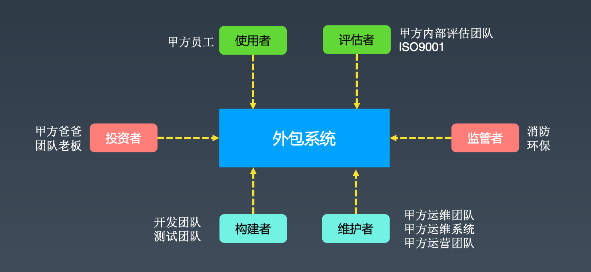
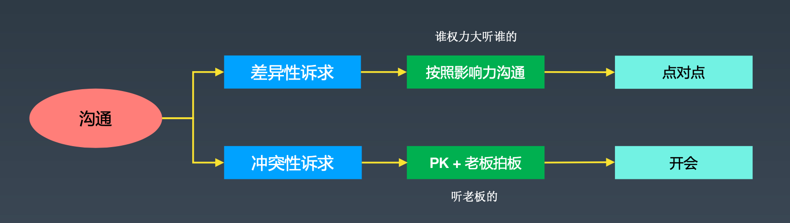
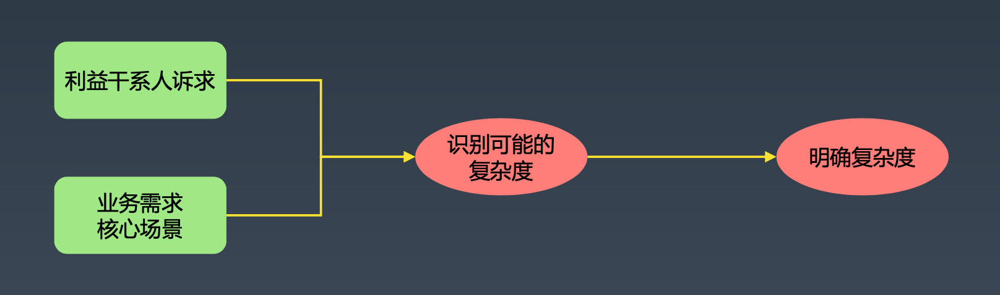

# 设计前期应该怎么做

[TOC]

## 利益干系人分析

### 相关角色

#### 监管者

政府监管者：按照法律法规对系统进行监督的政府组织；利益诉求有合规、处理投诉

媒体监督者：对系统相关的事件进行广泛报道的媒体；利益诉求有消息披露、事件回应

#### 投资者

内部投资人：决定投入人力物力财力开发系统的管理者；利益诉求有成本、时间、竞争力

外部投资者：指购买系统的金主；利益诉求有价格、时间、竞争力

#### 使用者

使用系统完成业务功能的人员或其他系统

利益诉求有易用性、高可用

#### 构建者

负责构建系统的人员

利益诉求有技术、复杂度、时间

#### 评估者

对系统进行评估的人员或者其他系统

利益诉求有可观测性、可测试性

#### 维护者

负责维护系统的人员或其他系统

利益诉求有可维护性、高可用

### 案例

#### 钱包案例

#### 外包系统案例

## 诉求优先级排序

### 利益干系人诉求分组

- 时间：项目周期、交付时间
- 成本：人力成本、硬件成本
- 范围：必做、可做、尽量做
- 质量：可扩展性/可测试性/性能/安全/可用性/可维护性

### 利益干系人诉求排序

#### 差异性

相同维度，不同诉求

#### 冲突性

不同维度，冲突诉求

#### 利益干系人诉求排序常见原则

- 取舍原则：根据业务目标决定哪个优先
- 影响力原则：按照影响力大小排序，监管者 > 投资者 > 评估者 > 使用者 > 构建者 > 维护者

#### 利益干系人诉求排序沟通

## 复杂度分析流程

