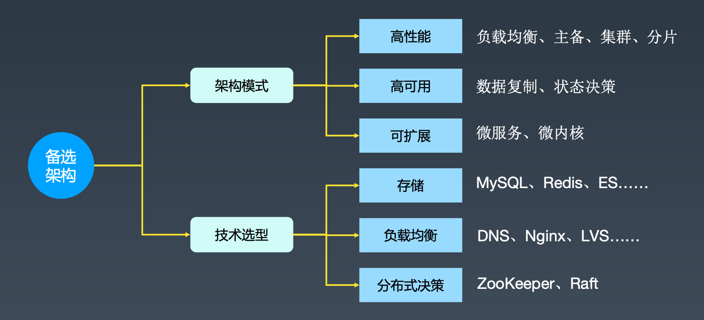
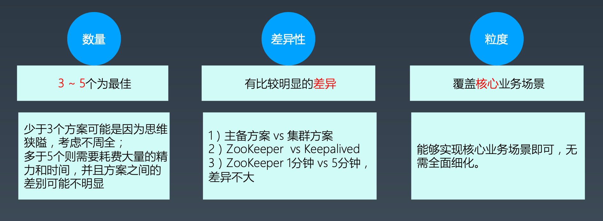
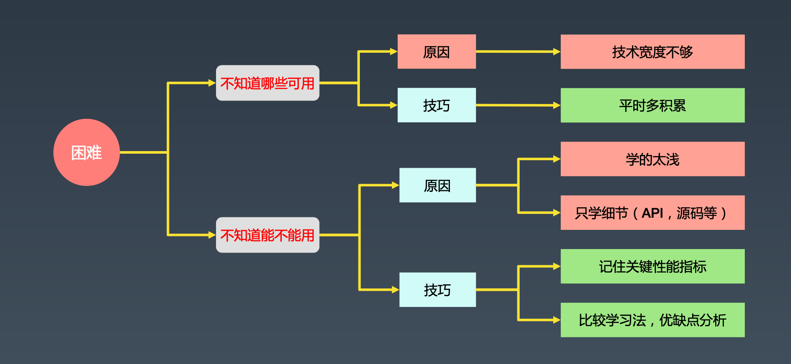
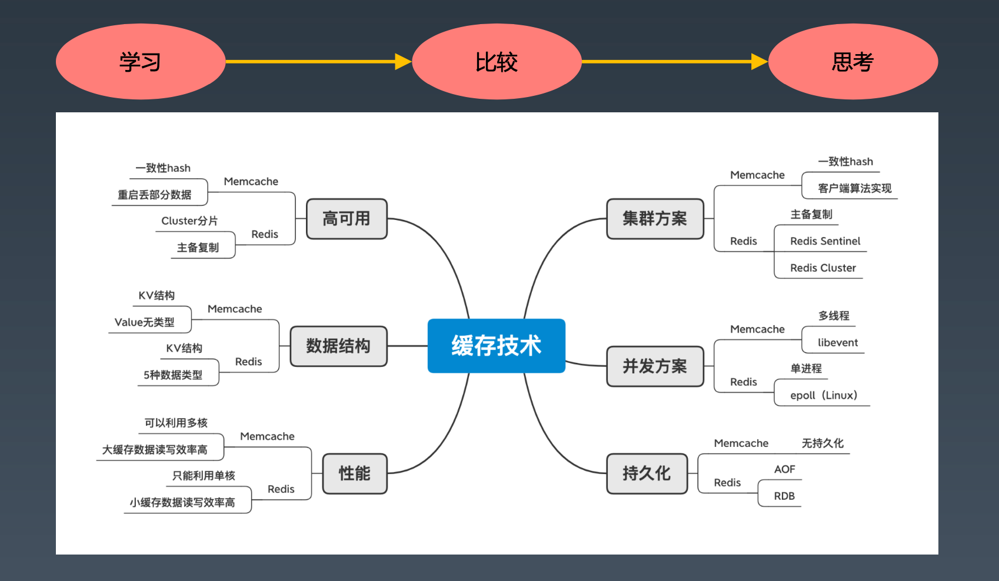
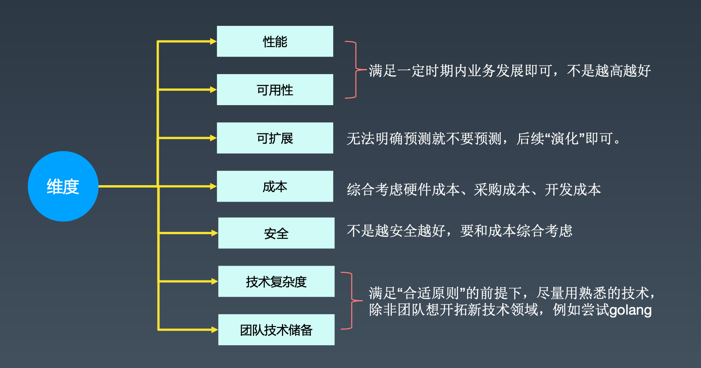

# 架构设计中期应该怎么做

[TOC]

## 设计备选方案

### 架构设计常见的错误思维

- 用最牛的：直接照搬业界最牛的公司的架构，或者用最牛的技术
- 用最热的：采用最近很火热的技术，例如中台
- 用最熟的：自己以前熟悉什么就用什么，例如MySQL

应该遵循合适原则，从多个方案中挑选出最合适的

### 什么是备选架构

### 备选方案设计过程

1. 头脑风暴：对可选技术进行排列组合，得到可能的方案
2. 红线筛选：根据系统明确的约定和限定，一票否决某些方案
3. 4R设计

### 备选架构设计技巧

### 备选方案常见困难和应对技巧

### 比较学习法

## 评估和选择备选方案

从多个维度评估各个备选方案，将维度按照优先级排序，逐级筛选。

 ### 错误的方案

#### 让领导选

备选方案都是可行的，领导喜欢哪个就用哪个。

问题是：领导可能并不是很懂。

正确的做法是：选好，告诉领导为什么选这个。如果和领导观点不一致，则听听领导意见再结合成本、技术考虑，说服领导或调整方案后说服领导。

#### 综合打分

列出多个打分维度，多人打分，然后挑选分数最高的。

问题是：所有维度一视同仁。（架构设计是精英设计！，应由少数人决定）

正确的做法是：按照优先级评估。

### 常见架构评估维度和注意事项

 