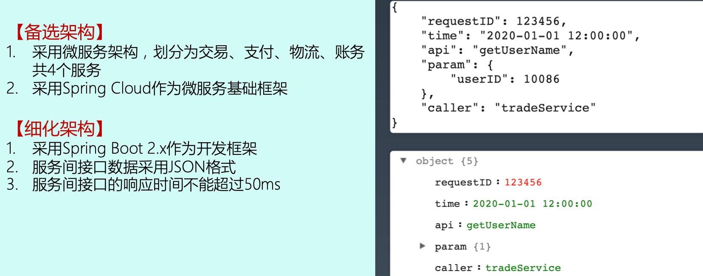

# 架构设计后期应该怎么做

[TOC]

## 详细架构设计

### 详细架构内容

### 详细架构设计案例

#### zookeeper

#### 微服务

## 架构设计文档写作

### 第一部分

来源于利益干系人分析

#### 系统边界黑盒图 -- 描述 Rank 和业务背景

### 第二部分

基于备选架构设计

**系统边界图描述的是外部结构，系统架构图描述的是内部结构**

#### 系统边界白盒图 -- 描述内外 Role 的关系

### 第三部分

## 模版

### 一.简介
架构设计中最重要的两个文档的模板和关键说明。这个案例文档仅给出一些关键内容供你参考，部分细节无法全面覆盖或者完全保证正确。(斜体字是示例)

### 二.备选方案模板
#### 2.1 需求介绍
[需求介绍主要描述需求的背景、目标、范围等]

随着微博业务的不断发展，业务上拆分的子系统越来越多，目前系统间的调用都是同步调用，由此带来几个明显的系统问题：

性能问题：当用户发布了一条微博后，微博发布子系统需要同步调用“统计子系统”“审核子系统”“奖励子系统”等共 8 个子系统，性能很低。
耦合问题：当新增一个子系统时，例如如果要增加“广告子系统”，那么广告子系统需要开发新的接口给微博发布子系统调用。
效率问题：每个子系统提供的接口参数和实现都有一些细微的差别，导致每次都需要重新设计接口和联调接口，开发团队和测试团队花费了许多重复工作量。基于以上背景，我们需要引入消息队列进行系统解耦，将目前的同步调用改为异步通知。
#### 2.2 需求分析
[需求分析主要全方位地描述需求相关的信息]

2.2.1 5W
[5W 指 Who、When、What、Why、Where。Who：需求利益干系人，包括开发者、使用者、购买者、决策者等。When：需求使用时间，包括季节、时间、里程碑等。What：需求的产出是什么，包括系统、数据、文件、开发库、平台等。Where：需求的应用场景，包括国家、地点、环境等，例如测试平台只会在测试环境使用。Why：需求需要解决的问题，通常和需求背景相关]

消息队列的 5W 分析如下：

Who：消息队列系统主要是业务子系统来使用，子系统发送消息或者接收消息。

When：当子系统需要发送异步通知的时候，需要使用消息队列系统。

What：需要开发消息队列系统。

Where：开发环境、测试环境、生产环境都需要部署。

Why：消息队列系统将子系统解耦，将同步调用改为异步通知。

2.2.2 1H
[这里的 How 不是设计方案也不是架构方案，而是关键业务流程。消息队列系统这部分内容很简单，但有的业务系统 1H 就是具体的用例了，有兴趣的同学可以尝试写写 ATM 机取款的业务流程。如果是复杂的业务系统，这部分也可以独立成“用例文档”]

消息队列有两大核心功能：

业务子系统发送消息给消息队列。
业务子系统从消息队列获取消息。
2.2.3 8C
[8C 指的是 8 个约束和限制，即 Constraints，包括性能 Performance、成本 Cost、时间 Time、可靠性 Reliability、安全性 Security、合规性 Compliance、技术性 Technology、兼容性 Compatibility]

注：需求中涉及的性能、成本、可靠性等仅仅是利益关联方提出的诉求，不一定准确；如果经过分析有的约束没有必要，或成本太高、难度太大，这些约束是可以调整的。

性能：需要达到 Kafka 的性能水平。

成本：参考 XX 公司的设计方案，不超过 10 台服务器。

时间：期望 3 个月内上线第一个版本，在两个业务尝试使用。

可靠性：按照业务的要求，消息队列系统的可靠性需要达到 99.99%。

安全性：消息队列系统仅在生产环境内网使用，无需考虑网络安全；如消息中有敏感信息，消息发送方需要自行进行加密，消息队列系统本身不考虑通用的加密。

合规性：消息队列系统需要按照公司目前的 DevOps 规范进行开发。

技术性：目前团队主要研发人员是 Java，最好用 Java 开发。

兼容性：之前没有类似系统，无需考虑兼容性。

#### 2.3 复杂度分析
[分析需求的复杂度，复杂度常见的有高可用、高性能、可扩展等，具体分析方法]

子主题注：文档的内容省略了分析过程，实际操作的时候每个约束和限制都要有详细的逻辑推导，避免完全拍脑袋式决策。

2.3.1 高可用
对于微博子系统来说，如果消息丢了，导致没有审核，然后触犯了国家法律法规，则是非常严重的事情；对于等级子系统来说，如果用户达到相应等级后，系统没有给他奖品和专属服务，则 VIP 用户会很不满意，导致用户流失从而损失收入，虽然也比较关键，但没有审核子系统丢消息那么严重。综合来看，消息队列需要高可用性，包括消息写入、消息存储、消息读取都需要保证高可用性。

2.3.2 高性能
微博系统用户每天发送 1000 万条微博，那么微博子系统一天会产生 1000 万条消息，平均一条消息有 10 个子系统读取，那么其他子系统读取的消息大约是 1 亿次。将数据按照秒来计算，一天内平均每秒写入消息数为 115 条，每秒读取的消息数是 1150 条；再考虑系统的读写并不是完全平均的，设计的目标应该以峰值来计算。峰值一般取平均值的 3 倍，那么消息队列系统的 TPS 是 345，QPS 是 3450，考虑一定的性能余量。由于现在的基数较低，为了预留一定的系统容量应对后续业务的发展，我们将设计目标设定为峰值的 4 倍，因此最终的性能要求是：TPS 为 1380，QPS 为 13800。TPS 为 1380 并不高，但 QPS 为 13800 已经比较高了，因此高性能读取是复杂度之一。

2.3.3 可扩展
消息队列的功能很明确，基本无须扩展，因此可扩展性不是这个消息队列的关键复杂度。

#### 2.4 备选方案
[备选方案设计，至少 3 个备选方案，每个备选方案需要描述关键的实现，无须描述具体的实现细节。此处省略具体方案描述]

2.4.1 备选方案 1：采用开源的 Kafka
Kafka 是成熟的开源消息队列方案，功能强大，性能非常高，而且已经比较成熟，很多大公司都在使用。

2.4.2 备选方案 2：集群 + MySQL 存储
首先考虑单服务器高性能。高性能消息读取属于“计算高可用”的范畴，单服务器高性能备选方案有很多种。考虑到团队的开发语言是 Java，虽然有人觉得 C/C++ 语言更加适合写高性能的中间件系统，但架构师综合来看，认为无须为了语言的性能优势而让整个团队切换语言，消息队列系统继续用 Java 开发。由于 Netty 是 Java 领域成熟的高性能网络库，因此架构师选择基于 Netty 开发消息队列系统。

由于系统设计的 QPS 是 13800，即使单机采用 Netty 来构建高性能系统，单台服务器支撑这么高的 QPS 还是有很大风险的，因此架构师选择采取集群方式来满足高性能消息读取，集群的负载均衡算法采用简单的轮询即可。

同理，“高可用写入”和“高性能读取”一样，可以采取集群的方式来满足。因为消息只要写入集群中一台服务器就算成功写入，因此“高可用写入”的集群分配算法和“高性能读取”也一样采用轮询，即正常情况下，客户端将消息依次写入不同的服务器；某台服务器异常的情况下，客户端直接将消息写入下一台正常的服务器即可。

整个系统中最复杂的是“高可用存储”和“高可用读取”，“高可用存储”要求已经写入的消息在单台服务器宕机的情况下不丢失；“高可用读取”要求已经写入的消息在单台服务器宕机的情况下可以继续读取。架构师第一时间想到的就是可以利用 MySQL 的主备复制功能来达到“高可用存储“的目的，通过服务器的主备方案来达到“高可用读取”的目的。

具体方案：

采用数据分散集群的架构，集群中的服务器进行分组，每个分组存储一部分消息数据。

每个分组包含一台主 MySQL 和一台备 MySQL，分组内主备数据复制，分组间数据不同步。

正常情况下，分组内的主服务器对外提供消息写入和消息读取服务，备服务器不对外提供服务；主服务器宕机的情况下，备服务器对外提供消息读取的服务。

客户端采取轮询的策略写入和读取消息。

2.4.3 备选方案 3：集群 + 自研存储
在备选方案 2 的基础上，将 MySQL 存储替换为自研实现存储方案，因为 MySQL 的关系型数据库的特点并不是很契合消息队列的数据特点，参考 Kafka 的做法，可以自己实现一套文件存储和复制方案（此处省略具体的方案描述，实际设计时需要给出方案）。

可以看出，高性能消息读取单机系统设计这部分时并没有多个备选方案可选，备选方案 2 和备选方案 3 都采取基于 Netty 的网络库，用 Java 语言开发，原因就在于团队的 Java 背景约束了备选的范围。通常情况下，成熟的团队不会轻易改变技术栈，反而是新成立的技术团队更加倾向于采用新技术。

上面简单地给出了 3 个备选方案用来示范如何操作，实践中要比上述方案复杂一些。架构师的技术储备越丰富、经验越多，备选方案也会更多，从而才能更好地设计备选方案。例如，开源方案选择可能就包括 Kafka、ActiveMQ、RabbitMQ；集群方案的存储既可以考虑用 MySQL，也可以考虑用 HBase，还可以考虑用 Redis 与 MySQL 结合等；自研文件系统也可以有多个，可以参考 Kafka，也可以参考 LevelDB，还可以参考 HBase 等。限于篇幅，这里就不一一展开了。

#### 2.5 备选方案评估
2.5.1 备选方案 1：采用开源 Kafka 方案
业务主管倾向于采用 Kafka 方案，因为 Kafka 已经比较成熟，各个业务团队或多或少都了解过 Kafka。

中间件团队部分研发人员也支持使用 Kafka，因为使用 Kafka 能节省大量的开发投入；但部分人员认为 Kafka 可能并不适合我们的业务场景，因为 Kafka 的设计目的是为了支撑大容量的日志消息传输，而我们的消息队列是为了业务数据的可靠传输。

运维代表提出了强烈的反对意见：首先，Kafka 是 Scala 语言编写的，运维团队没有维护 Scala 语言开发的系统的经验，出问题后很难快速处理；其次，目前运维团队已经有一套成熟的运维体系，包括部署、监控、应急等，使用 Kafka 无法融入这套体系，需要单独投入运维人力。

测试代表也倾向于引入 Kafka，因为 Kafka 比较成熟，无须太多测试投入。

2.5.2 备选方案 2：集群 + MySQL 存储
中间件团队的研发人员认为这个方案比较简单，但部分研发人员对于这个方案的性能持怀疑态度，毕竟使用 MySQL 来存储消息数据，性能肯定不如使用文件系统；并且有的研发人员担心做这样的方案是否会影响中间件团队的技术声誉，毕竟用 MySQL 来做消息队列，看起来比较“土”、比较另类。

运维代表赞同这个方案，因为这个方案可以融入到现有的运维体系中，而且使用 MySQL 存储数据，可靠性有保证，运维团队也有丰富的 MySQL 运维经验；但运维团队认为这个方案的成本比较高，一个数据分组就需要 4 台机器（2 台服务器 + 2 台数据库）。

测试代表认为这个方案测试人力投入较大，包括功能测试、性能测试、可靠性测试等都需要大量地投入人力。

业务主管对这个方案既不肯定也不否定，因为反正都不是业务团队来投入人力来开发，系统维护也是中间件团队负责，对业务团队来说，只要保证消息队列系统稳定和可靠即可。

2.5.3 备选方案 3：集群 + 自研存储系统
中间件团队部分研发人员认为这是一个很好的方案，既能够展现中间件团队的技术实力，性能上相比 MySQL 也要高；但另外的研发人员认为这个方案复杂度太高，按照目前的团队人力和技术实力，要做到稳定可靠的存储系统，需要耗时较长的迭代，这个过程中消息队列系统可能因为存储出现严重问题，例如文件损坏导致丢失大量数据。

运维代表不太赞成这个方案，因为运维之前遇到过几次类似的存储系统故障导致数据丢失的问题，损失惨重。例如，MongoDB 丢数据、Tokyo Tyrant 丢数据无法恢复等。运维团队并不相信目前的中间件团队的技术实力足以支撑自己研发一个存储系统（这让中间件团队的人员感觉有点不爽）。

测试代表赞同运维代表的意见，并且自研存储系统的测试难度也很高，投入也很大。

业务主管对自研存储系统也持保留意见，因为从历史经验来看，新系统上线肯定有 bug，而存储系统出 bug 是最严重的，一旦出 bug 导致大量消息丢失，对系统的影响会严重。

2.5.4 360度环表

**注意**：性能一览描述过于简单，可以提供量化数据 如 5w QPS 等

最终选择备选方案 2：

排除备选方案 1 的主要原因是可运维性，因为再成熟的系统，上线后都可能出问题，如果出问题无法快速解决，则无法满足业务的需求；并且 Kafka 的主要设计目标是高性能日志传输，而我们的消息队列设计的主要目标是业务消息的可靠传输。

排除备选方案 3 的主要原因是复杂度，目前团队技术实力和人员规模（总共 6 人，还有其他中间件系统需要开发和维护）无法支撑自研存储系统（参考架构设计原则 2：简单原则）。

备选方案 2 的优点就是复杂度不高，也可以很好地融入现有运维体系，可靠性也有保障。

备选方案 2 的缺点：

备选方案 2 的第一个缺点是性能，业务目前需要的性能并不是非常高，方案 2 能够满足，即使后面性能需求增加，方案 2 的数据分组方案也能够平行扩展进行支撑（参考架构设计原则 3：演化原则）

备选方案 2 的第二个缺点是成本，一个分组就需要 4 台机器，支撑目前的业务需求可能需要 12 台服务器，但实际上备机（包括服务器和数据库）主要用作备份，可以和其他系统并行部署在同一台机器上。

备选方案 2 的第三个缺点是技术上看起来并不很优越，但我们的设计目的不是为了证明自己（参考架构设计原则 1：合适原则），而是更快更好地满足业务需求。

### 三.架构设计模板
[备选方案评估后会选择一个方案落地实施，架构设计文档就是用来详细描述细化方案的]

#### 3.1 总体方案
[总体方案需要从整体上描述方案的结构，其核心内容就是架构图，以及针对架构图的描述，包括模块或者子系统的职责描述、核心流程]

#### 3.2 架构总览
[架构总览给出架构图以及架构的描述]

架构关键设计点：

采用数据分散集群的架构，集群中的服务器进行分组，每个分组存储一部分消息数据。
每个分组包含一台主 MySQL 和一台备 MySQL，分组内主备数据复制，分组间数据不同步。
正常情况下，分组内的主服务器对外提供消息写入和消息读取服务，备服务器不对外提供服务；主服务器宕机的情况下，备服务器对外提供消息读取的服务。
客户端采取轮询的策略写入和读取消息。

#### 3.3 核心流程
3.3.1 消息发送流程
[此处省略流程描述]

3.3.2 消息读取流程
[此处省略流程描述]

#### 3.4 详细设计
[详细设计需要描述具体的实现细节，跟随实际情况增删]

3.4.1高可用设计
消息发送可靠性：

业务服务器中嵌入消息队列系统提供的 SDK，SDK 支持轮询发送消息，当某个分组的主服务器无法发送消息时，SDK 挑选下一个分组主服务器重发消息，依次尝试所有主服务器直到发送成功；如果全部主服务器都无法发送，SDK 可以缓存消息，也可以直接丢弃消息，具体策略可以在启动 SDK 的时候通过配置指定。

如果 SDK 缓存了一些消息未发送，此时恰好业务服务器又重启，则所有缓存的消息将永久丢失，这种情况 SDK 不做处理，业务方需要针对某些非常关键的消息自己实现永久存储的功能。

消息存储可靠性：

消息存储在 MySQL 中，每个分组有一主一备两台 MySQL 服务器，MySQL 服务器之间复制消息以保证消息存储高可用。如果主备间出现复制延迟，恰好此时 MySQL 主服务器宕机导致数据无法恢复，则部分消息会永久丢失，这种情况不做针对性设计，DBA 需要对主备间的复制延迟进行监控，当复制延迟超过 30 秒的时候需要及时告警并进行处理。

消息读取可靠性

每个分组有一主一备两台服务器，主服务器支持发送和读取消息，备服务器只支持读取消息，当主服务器正常的时候备服务器不对外提供服务，只有备服务器判断主服务器故障的时候才对外提供消息读取服务。

每个分组有一主一备两台服务器，主服务器支持发送和读取消息，备服务器只支持读取消息，当主服务器正常的时候备服务器不对外提供服务，只有备服务器判断主服务器故障的时候才对外提供消息读取服务。

3.4.2 高性能设计
3.4.3 可扩展设计
3.4.4 安全设计
消息队列系统需要提供权限控制功能，权限控制包括两部分：身份识别和队列权限控制。

3.4.5 其它设计
[其他设计包括上述以外的其他设计考虑点，例如指定开发语言、符合公司的某些标准等，如果篇幅较长，也可以独立进行描述]

消息队列系统需要接入公司已有的运维平台，通过运维平台发布和部署。

消息队列系统需要输出日志给公司已有的监控平台，通过监控平台监控消息队列系统的健康状态，包括发送消息的数量、发送消息的大小、积压消息的数量等，详细监控指标在后续设计方案中列出。

3.4.6 部署方案
[部署方案主要包括硬件要求、服务器部署方式、组网方式等]

消息队列系统的服务器和数据库服务器采取混布的方式部署，即：一台服务器上，部署同一分组的主服务器和主 MySQL，或者备服务器和备 MySQL。因为消息队列服务器主要是 CPU 密集型，而 MySQL 是磁盘密集型的，所以两者混布互相影响的几率不大。

硬件的基本要求：32 核 48G 内存 512G SSD 硬盘，考虑到消息队列系统动态扩容的需求不高，且对性能要求较高，因此需要使用物理服务器，不采用虚拟机。

#### 3.5 架构演进规划
[通常情况下，规划和设计的需求比较完善，但如果一次性全部做完，项目周期可能会很长，因此可以采取分阶段实施，即：第一期做什么、第二期做什么，以此类推]

整个消息队列系统分三期实现：

第一期：实现消息发送、权限控制功能，预计时间 3 个月。

第二期：实现消息读取功能，预计时间 1 个月。

第三期：实现主备基于 ZooKeeper 切换的功能，预计时间 2 周。
