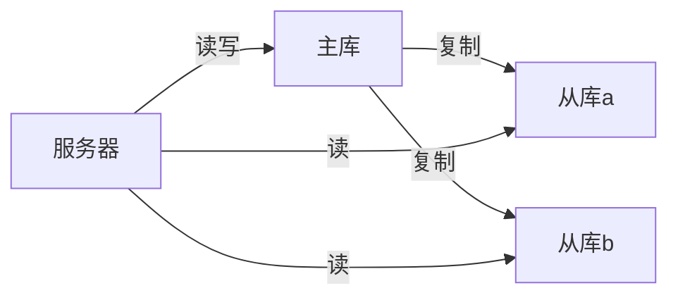
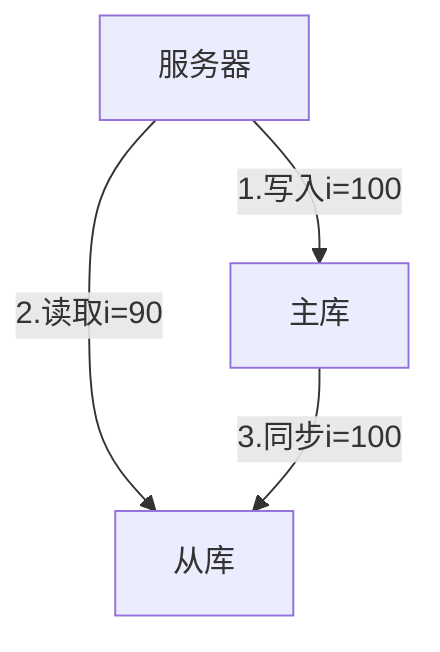
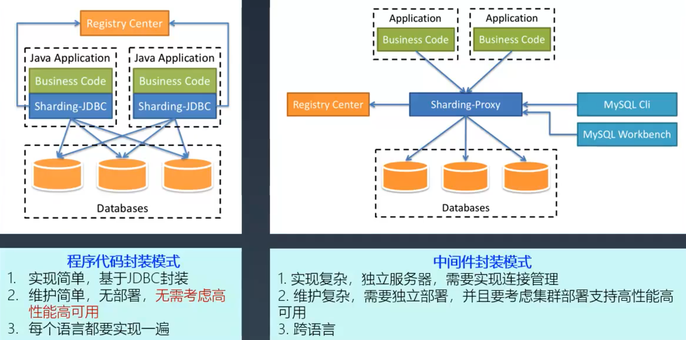

## 数据库读写分离

### 读写分离架构

### 实现原理

- 数据库服务器搭建主从集群，一主一从、一主多从都可以
- 数据库主机负责读写操作，从机只负责读操作
- 数据库主机通过复制讲数据同步到从机，每台数据库服务器存储了所有的业务数据
- 业务服务器将写操作发给数据库主机，将读操作发给数据库从机

### 如何判断要读写分离

- 业务量持续增长
- 先优化（优化索引、加入缓存），优化后还不满足再重构

### chatgpt: 数据库读写分离怎么做

数据库读写分离是一种常见的数据库优化方案，它的主要思想是将数据库的读操作和写操作分离到不同的数据库服务器上，从而提高数据库的并发性和读写性能。

下面是一个简单的数据库读写分离的实现流程：

- 安装主从复制环境: 将主数据库（写操作）和从数据库（读操作）分别安装在不同的服务器上，并配置主从复制环境，使得从数据库可以自动同步主数据库的数据。

- 配置应用程序: 在应用程序中，将读操作和写操作分别指向不同的数据库服务器。一般情况下，写操作只需要连接主数据库，而读操作则可以连接从数据库。如果应用程序中的数据访问层使用了ORM框架，也可以在ORM配置中实现读写分离。

- 负载均衡: 在高并发场景下，单台从数据库可能无法满足读取请求的需求，需要使用负载均衡技术，将读请求均衡分配到多个从数据库中。

- 数据同步: 由于主数据库和从数据库之间存在一定的延迟，可能会导致读操作读取到的数据并非最新的数据，因此需要实现数据同步机制。一般情况下，可以使用MySQL自带的binlog和relay log机制来实现数据同步。

总之，数据库读写分离需要结合应用程序、数据库和负载均衡等多个方面进行综合优化，才能达到最佳的性能提升效果。

### 数据库读写分离引入的复杂度

会引入`复制延迟`和`任务分解`两个复杂度

#### 复制延迟处理

复制延迟会导致，业务服务器读取到的数据是修改之前的（最新的修改未被同步）。

- 应对方法 -- 读写绑定：写操作后的读操作指定发给数据库主服务器。【缺点是业务侵入很大，容易留坑】
- 应对方法 -- 二次读取：读从机失败后再读一次主机。【缺点是如果出现很多的二次读取，会大大增加主机的读操作压力，并且这种方法只能应对数据是新增的情况】
- 【建议】应对方法 -- 业务分级：关键业务读写操作全部指向主机，非关键业务（比如实时性要求较低的）采用读写分离。【缺点是编码人员容易全部采用读写主机。可以通过代码 review 去避免】

#### 读写分离任务拆解

任务分解是指将数据库的读写操作分散到不同的数据库服务器上。

