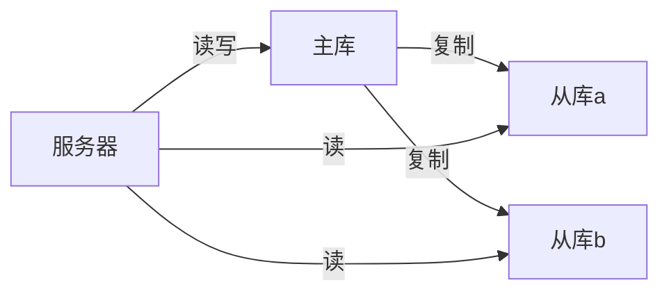
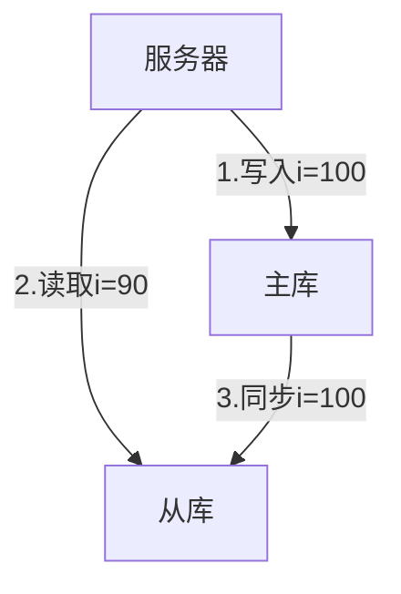
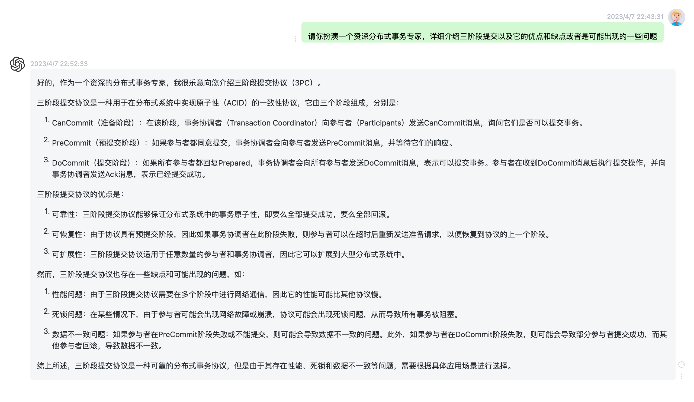

## 数据库读写分离

### 读写分离架构

### 实现原理

- 数据库服务器搭建主从集群，一主一从、一主多从都可以
- 数据库主机负责读写操作，从机只负责读操作
- 数据库主机通过复制讲数据同步到从机，每台数据库服务器存储了所有的业务数据
- 业务服务器将写操作发给数据库主机，将读操作发给数据库从机

### 如何判断要读写分离

- 业务量持续增长
- 先优化（优化索引、加入缓存），优化后还不满足再重构

### chatgpt: 数据库读写分离怎么做

数据库读写分离是一种常见的数据库优化方案，它的主要思想是将数据库的读操作和写操作分离到不同的数据库服务器上，从而提高数据库的并发性和读写性能。

下面是一个简单的数据库读写分离的实现流程：

- 安装主从复制环境: 将主数据库（写操作）和从数据库（读操作）分别安装在不同的服务器上，并配置主从复制环境，使得从数据库可以自动同步主数据库的数据。

- 配置应用程序: 在应用程序中，将读操作和写操作分别指向不同的数据库服务器。一般情况下，写操作只需要连接主数据库，而读操作则可以连接从数据库。如果应用程序中的数据访问层使用了ORM框架，也可以在ORM配置中实现读写分离。

- 负载均衡: 在高并发场景下，单台从数据库可能无法满足读取请求的需求，需要使用负载均衡技术，将读请求均衡分配到多个从数据库中。

- 数据同步: 由于主数据库和从数据库之间存在一定的延迟，可能会导致读操作读取到的数据并非最新的数据，因此需要实现数据同步机制。一般情况下，可以使用MySQL自带的binlog和relay log机制来实现数据同步。

总之，数据库读写分离需要结合应用程序、数据库和负载均衡等多个方面进行综合优化，才能达到最佳的性能提升效果。

### 数据库读写分离引入的复杂度

会引入`复制延迟`和`任务分解`两个复杂度

#### 复制延迟处理

复制延迟会导致，业务服务器读取到的数据是修改之前的（最新的修改未被同步）。

- 应对方法 -- 读写绑定：写操作后的读操作指定发给数据库主服务器。【缺点是业务侵入很大，容易留坑】
- 应对方法 -- 二次读取：读从机失败后再读一次主机。【缺点是如果出现很多的二次读取，会大大增加主机的读操作压力，并且这种方法只能应对数据是新增的情况】
- 【建议】应对方法 -- 业务分级：关键业务读写操作全部指向主机，非关键业务（比如实时性要求较低的）采用读写分离。【缺点是编码人员容易全部采用读写主机。可以通过代码 review 去避免】

#### 读写分离任务拆解

任务分解是指将数据库的读写操作分散到不同的数据库服务器上。

如果大部分都是使用的 java 语言则基于 JDBC 封装（选择程序代码封装模式）即可，如果业务服务器有多种程序语言则考虑中间件封装模式。

**奥卡姆剃刀：若无必要误增实体。**

奥卡姆剃刀（Occam's Razor）是一种科学和哲学上的原则，最早由英国逻辑学家威廉·奥卡姆提出。该原则的核心思想是：在多个解释或假说可用时，应该选择最简单、最少假设的那一个，即应该尽量避免引入不必要的复杂性。具体来说，它可以被表述为“如无必要，勿增实体”，也就是说，不应该引入不必要的概念、实体或假设。

在科学领域中，奥卡姆剃刀通常用于指导理论的选择和发展。在多个解释或理论可以解释同一现象的情况下，科学家们会倾向于选择最简单、最符合经验事实的那一个。这是因为简单的解释通常更易于理解、验证和推广，同时也更加稳定和可靠。然而，这并不意味着最简单的解释一定是正确的，因为简单的解释也可能过于简化或忽略了一些重要的细节或因素。

## 数据库分库分表

读写分离只解决了读性能问题。如果写压力上来了，可以考虑分库分表。

分库分表主要解决数据写入瓶颈。

### 数据分库

可以按业务分库，每个业务可以根据情况创建自己的数据库。

#### join 问题

原本在同一数据库中的表分散到不同数据库中，导致无法使用 SQL 的 join 查询

解决方法：

- 小表冗余：将一些小表在每个库中冗余一份，例如字典表
- 代码 join：在代码里面实现 join 功能
- 字段冗余：例如订单表直接记录商品类型

#### 事务问题

表分散到不同的数据库中，无法通过事务统一修改。

解决方法：

- 分布式事务

### 数据分表

#### 水平拆分

按行拆分：提升系统处理性能

什么时候需要水平拆分？

1. B+ 树的层数，3 层大约是 2000 万条
2. InnoDB Buffer Pool：2000 万数据，每条数据 100 字节，单表就 2G 了
3. 数据量持续增长的表

#### 垂直拆分

按列拆分：优化单机处理性能

什么时候需要垂直拆分？

1. 列数过多时，比如有些大型企业业务单表设计可能设计到几百个字段

### 水分分表复杂度和应对方法

在 java 语言中使用 JDBC 完成。【使用中间件】

#### 路由问题

路由算法进行计算数据归属

#### count 操作

如何计算总数

#### join 操作

如何执行与其他表 join

#### order by 

如何执行 order by

### 水平分表伸缩瓶颈

1. 业务服务器处理能力有限
2. 地址数据库的连接数过多会导致数据库性能下降

### chatgpt 理解的分库分表

**You:**

数据分库分表

* * *

**ChatGPT:**

数据分库分表是一种常见的数据分片技术，用于将大量数据分散存储在多个数据库和表中，以提高系统的性能和可扩展性。具体来说，数据分库分表通常涉及以下几个方面：

1.  分库：将大型数据库中的数据划分为多个较小的数据库，每个数据库可以独立部署在不同的物理服务器上，以减少单个数据库的负载压力，并提高整个系统的吞吐量。
    
2.  分表：将单个表中的数据按照一定规则分散到多个表中，每个表只包含部分数据，以提高查询效率和降低单表的数据量。
    
3.  数据路由：根据特定的规则，将数据路由到正确的数据库和表中，以确保数据的完整性和一致性。
    
4.  数据同步：由于数据分散在多个数据库和表中，因此需要实现数据同步机制来确保数据的实时性和一致性。
    
5.  分片键：分片键是指用于将数据划分到不同数据库和表中的关键字段，可以是主键、时间戳、地理位置等等。
    

数据分库分表可以帮助应对数据规模和访问压力不断增加的情况，但是也会增加系统的复杂性和维护成本。因此，在使用数据分库分表技术时需要仔细考虑数据划分策略、路由规则和同步机制等方面的问题。

* * *

**You:**

怎么分库

* * *

**ChatGPT:**

在分库的过程中，需要考虑以下几个方面：

1.  数据量：将数据按照一定的规则分散到不同的数据库中，每个数据库应该包含适量的数据，既能够减轻单个数据库的负载压力，又能够降低分片带来的复杂性和维护成本。
    
2.  业务场景：分库的目的是为了提高系统的性能和可扩展性，因此需要根据实际业务场景来确定分库的策略，比如按照用户、产品、订单等业务实体来划分数据。
    
3.  数据关联性：如果一组数据之间存在关联关系，那么应该将它们存储在同一个数据库中，以确保数据的完整性和一致性。
    
4.  读写比例：如果系统中的大部分操作都是读操作，那么可以将读写分离，将读操作路由到只读数据库中，以提高系统的性能。
    
5.  扩展性：在设计分库方案时应该考虑到系统的扩展性，比如可以按照分片键将数据划分到不同的数据库中，以便于增加新的数据库实例。
    

总的来说，分库的过程需要综合考虑以上几个方面，并根据具体的业务场景来确定合适的分库策略。一般来说，可以根据数据量和业务实体来划分数据库，以确保每个数据库包含适量的数据，并尽可能减少数据之间的关联关系，从而提高系统的性能和可扩展性。

* * *

**You:**

怎么分表

* * *

**ChatGPT:**

在分表的过程中，需要考虑以下几个方面：

1.  数据量：将单个表中的数据按照一定的规则分散到多个表中，每个表应该包含适量的数据，既能够提高查询效率，又能够降低单表的数据量和查询复杂度。
    
2.  数据关联性：如果一组数据之间存在关联关系，那么应该将它们存储在同一个表中，以确保数据的完整性和一致性。
    
3.  访问模式：根据系统的访问模式来确定分表策略，如果系统中的大部分查询操作都是针对某些特定的字段，那么可以根据这些字段来划分表，以提高查询效率。
    
4.  数据均衡：在设计分表方案时应该考虑到数据的均衡性，尽可能使得每个表包含相同数量的数据，避免出现某个表数据过多或者过少的情况。
    
5.  扩展性：在设计分表方案时应该考虑到系统的扩展性，比如可以根据分片键来划分表，以便于增加新的数据表实例。
    

总的来说，分表的过程需要综合考虑以上几个方面，并根据具体的业务场景来确定合适的分表策略。一般来说，可以根据数据量和访问模式来划分数据表，尽可能避免数据之间的关联关系，从而提高系统的查询效率和可扩展性。

* * *

**You:**

水平分表和垂直分表

* * *

**ChatGPT:**

水平分表和垂直分表是两种常用的数据分表技术。

水平分表指将一个表中的数据按照某个规则拆分成多个表存储，每个表中包含一部分数据。水平分表通常是基于某个分片键来划分表，比如按照时间、用户ID等字段将数据分散到不同的表中。水平分表可以提高系统的查询效率和扩展性，避免单个表数据量过大导致查询效率下降的问题。但是，水平分表也会带来一些问题，比如需要进行跨表查询的时候会增加查询复杂度和延迟。

垂直分表指将一个表中的数据按照字段划分成多个表存储，每个表中包含一部分字段。垂直分表通常是根据字段的访问模式来进行划分，比如将经常被查询的字段和不经常被查询的字段分别存储在不同的表中。垂直分表可以提高查询效率和降低数据冗余度，同时也可以减少数据表的宽度，提高数据库的性能。但是，垂直分表也会增加跨表查询的复杂度，并且可能会导致表之间的关联查询变得更加复杂。

一般来说，在实际应用中可以同时使用水平分表和垂直分表来优化系统性能和可扩展性。水平分表可以避免单表数据量过大的问题，提高查询效率和扩展性；垂直分表可以降低数据冗余度，提高查询效率和数据库性能。

* * *

**You:**

什么时候需要进行水平分表

* * *

**ChatGPT:**

进行水平分表通常是在以下情况下：

1.  数据量过大：当单张表的数据量过大，导致查询效率下降时，可以考虑进行水平分表，将数据分散到多个表中，从而提高查询效率。
    
2.  访问频率不同：当某些数据访问频率非常高，而其他数据访问频率较低时，可以将访问频率高的数据和访问频率低的数据分别存储在不同的表中，从而提高查询效率。
    
3.  扩展性要求高：当系统需要支持大规模的数据存储和查询时，可以考虑进行水平分表，以便于将数据分散到多个表实例中，提高系统的可扩展性。
    
4.  数据归档要求：当需要对历史数据进行归档，同时又需要保证归档数据能够快速查询时，可以考虑进行水平分表，将历史数据和实时数据存储在不同的表中。
    

需要注意的是，在进行水平分表的过程中，需要考虑分片键的选择，分片键的选择应该考虑到查询的频率和分布情况，以及数据的均衡性和可扩展性等因素。同时，进行水平分表也需要考虑表之间的关联关系和跨表查询的问题，尽可能减少跨表查询的次数，避免影响查询效率。

* * *

**You:**

什么时候需要进行垂直分表

* * *

**ChatGPT:**

进行垂直分表通常是在以下情况下：

1.  数据表中存在大量不常用的列：当一个表中存在大量的列，但是只有少数几列是经常被查询和使用的时候，可以考虑进行垂直分表，将经常使用的列和不经常使用的列分别存储在不同的表中。
    
2.  存储空间受限：当数据表的存储空间受限，但是表中存在大量冗余数据时，可以考虑进行垂直分表，将冗余数据存储在单独的表中，从而节省存储空间。
    
3.  数据表查询效率低：当一个表中的数据量非常大，而且查询效率非常低时，可以考虑进行垂直分表，将表中的数据按照访问频率划分到不同的表中，从而提高查询效率。
    
4.  数据库性能问题：当一个表中存在大量的字段，而且查询和更新的操作非常频繁时，可以考虑进行垂直分表，将经常使用的字段和不经常使用的字段分别存储在不同的表中，从而提高数据库性能。
    

需要注意的是，在进行垂直分表的过程中，需要考虑数据表之间的关系和数据的一致性，尤其是在处理关系型数据库时，垂直分表可能会导致表之间的关联关系变得更加复杂，需要仔细考虑。另外，垂直分表也可能会增加跨表查询的复杂度，需要合理设计查询语句，避免影响查询效率。

* * *

**You:**

如果是 MySQL 数据库什么时候需要水平拆分

* * *

**ChatGPT:**

在MySQL数据库中，通常需要进行水平拆分（Sharding）的情况有以下几种：

1.  数据量过大：当单张表的数据量过大，超过了MySQL单表的存储容量限制，导致查询效率下降时，可以考虑进行水平拆分。
    
2.  负载均衡问题：当MySQL数据库中存在大量的数据和高并发访问时，可能会导致单个MySQL实例的负载过高，影响系统的稳定性和可用性，这时可以考虑进行水平拆分，将数据分散到多个MySQL实例中，实现负载均衡。
    
3.  数据访问区域性：当数据访问的区域性比较强时，可以考虑根据地理位置或其他条件进行水平拆分，将不同区域的数据存储在不同的MySQL实例中，从而提高数据的访问效率。
    

需要注意的是，在进行水平拆分时，需要合理选择分片键，保证数据的均衡性和查询的效率。另外，进行水平拆分也需要考虑数据的一致性和跨分片事务的处理问题，需要合理设计分片方案，避免数据一致性问题和分片事务问题的发生。

* * *

**You:**

MySQL单表的存储容量限制是多少，为什么会导致查询效率下降

* * *

**ChatGPT:**

在MySQL中，单表的存储容量限制取决于存储引擎的不同。下面列举几种存储引擎的限制：

1.  InnoDB存储引擎：默认情况下，InnoDB存储引擎中单表的存储容量限制为64TB。但是，如果使用的是16KB的页大小，则单表的存储容量限制为256TB。
    
2.  MyISAM存储引擎：MyISAM存储引擎中单表的存储容量限制为4GB。
    
3.  Memory存储引擎：Memory存储引擎中单表的存储容量限制为64GB。
    

当单张表的数据量过大时，可能会导致查询效率下降，主要原因是：

1.  索引失效：单张表中数据量过大，可能会导致索引失效，从而影响查询效率。
    
2.  查询性能下降：单张表中数据量过大，可能会导致查询性能下降，从而影响查询效率。
    
3.  数据库IO负载过高：单张表中数据量过大，可能会导致数据库IO负载过高，从而影响查询效率。
    
4.  数据库锁竞争：单张表中数据量过大，可能会导致数据库锁竞争增加，从而影响查询效率。
    

因此，在MySQL中，为了保证查询效率，需要合理控制单张表的数据量，避免单张表数据量过大的情况发生。如果单张表数据量过大，可以考虑进行水平拆分，将数据分散到多张表或多个MySQL实例中，从而提高查询效率。

* * *

**You:**

MySQL 水平分表你有什么建议

* * *

**ChatGPT:**

在进行MySQL水平分表时，需要注意以下几点：

1.  合理选择分片键：分片键是用来将数据分散到不同分片（Shard）中的依据。在选择分片键时，需要考虑数据的访问模式、数据的一致性、分片的均衡性等因素。一般来说，选择合适的分片键可以提高查询效率和负载均衡能力。
    
2.  设计分片策略：在进行MySQL水平分表时，需要考虑分片策略，包括分片的数量、分片的大小、分片的数据备份等因素。需要保证分片的数量适当，避免过多的分片增加系统的复杂度。同时，需要考虑分片的大小，避免分片过大导致数据访问效率下降。此外，需要合理设计分片的数据备份策略，保证数据的可靠性和一致性。
    
3.  跨分片事务的处理：当进行MySQL水平分表时，需要考虑跨分片事务的处理问题。由于数据分散在不同分片中，可能会导致跨分片事务的处理复杂性增加。因此，需要采用一些特殊的技术，如分布式事务、两阶段提交等，来保证跨分片事务的一致性和可靠性。
    
4.  性能监控和优化：在进行MySQL水平分表时，需要进行性能监控和优化，包括查询效率、负载均衡、数据备份等方面。需要定期监控系统性能，并进行优化调整，以保证系统的高可用性和高性能。
    

总之，在进行MySQL水平分表时，需要合理设计分片策略和数据备份策略，保证数据的可靠性和一致性。同时，需要采用一些特殊的技术，如分布式事务、两阶段提交等，来保证跨分片事务的一致性和可靠性。

* * *

**You:**

InnoDB Buffer Pool 是否对水分分表有影响

* * *

**ChatGPT:**

InnoDB Buffer Pool 对水平分表有一定的影响。在MySQL中，InnoDB Buffer Pool是一个内存缓存区，用于缓存数据库中的数据和索引。当MySQL执行查询时，如果需要读取的数据或索引已经存在于Buffer Pool中，则可以直接从内存中读取，而无需从磁盘中读取，从而提高查询效率。因此，在水平分表后，如果每个分片所占的数据量增加，那么整个数据库的数据量也会增加，从而导致InnoDB Buffer Pool的大小需要相应增加，以保证缓存的数据量足够。

同时，在水平分表后，由于数据被分散到不同的分片中，可能会导致跨分片查询的频率增加，从而增加查询时从磁盘中读取数据的次数。如果InnoDB Buffer Pool的大小无法满足查询所需的数据量，就会导致查询效率下降。因此，在进行水平分表时，需要合理设置InnoDB Buffer Pool的大小，以保证系统的查询效率。

另外，垂直分表也可能会对InnoDB Buffer Pool产生影响。在垂直分表后，由于数据表的列数减少，每个数据表所占用的空间也会减少，从而使得整个数据库的数据量变小。如果InnoDB Buffer Pool的大小过大，可能会浪费系统的内存资源，从而降低系统的性能。因此，在进行垂直分表时，也需要合理设置InnoDB Buffer Pool的大小，以避免浪费系统资源。

* * *

**You:**

水平分表能够通过加服务器来不断提升性能吗

* * *

**ChatGPT:**

水平分表在一定程度上可以通过加服务器来提升性能，但需要注意以下几点：

1.  增加服务器的成本：增加服务器需要增加硬件成本、人员成本等，因此需要考虑到实际情况下的可行性。
    
2.  数据库分片的复杂度：增加服务器需要进行数据分片，需要考虑到分片的复杂度和维护成本，同时也需要考虑到分片策略对系统性能的影响。
    
3.  分布式事务的一致性：在水平分表的情况下，可能需要进行分布式事务，这会带来一致性的问题，需要考虑到事务管理的成本和可靠性。
    
4.  系统的水平扩展能力：增加服务器的效果取决于系统的水平扩展能力，需要考虑到系统的瓶颈和扩展难度。
    

因此，需要综合考虑以上因素，并进行系统设计和调优，才能够充分利用水平分表和增加服务器来提升系统的性能。

### 数据库分布式事务

#### 两阶段提交（2PC）

#### 三阶段提交（3PC）

## Q & A

### 水平分表能够通过加服务器来不断提升性能吗？

不能，每个应用都需要连接所有的分片，当应用数量增多后，`数据库连接`会逐渐成为瓶颈。

以 MySQL 为例，默认 100 连接，实测 50 ~ 100 连接性能最高，超过 200 后会显著下降。

### 读写分离主要是提供系统的读性能，对写性能没有帮助？

错误，读写分离添加了机器，从库承担了一部分读压力，一定程度减少了之前主库的负载从而提升了写性能。

### 数据分库和数据分表都可以提升系统的写性能

正确

### 水平分表后，尽量使用中间件来实现各种 SQL 操作

正确，在中间件不满足业务需求的时候再考虑自己实现。

### 3PC 比 2PC 功能更强大，所以应该优先采取 3PC ？

错误，3PC 的性能问题和脑裂问题更难解决。

### 2PC 中的事务协调者可以是代码，也可以是独立的系统

正确

