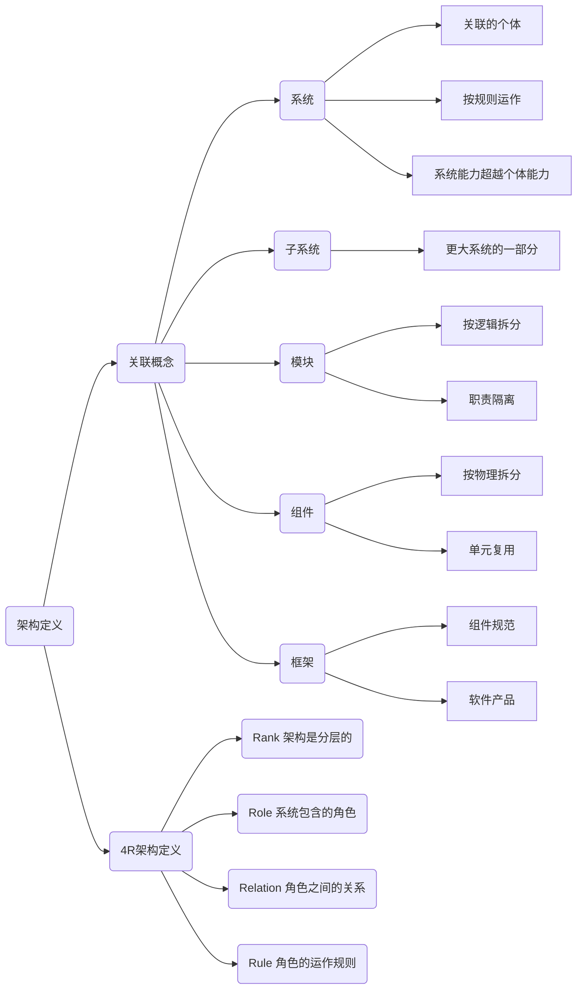
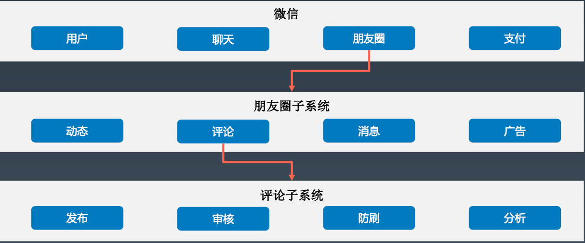
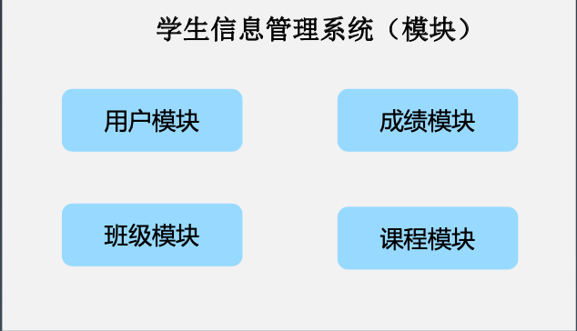
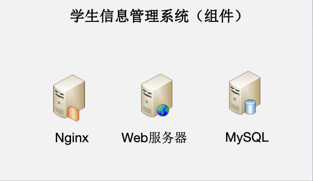
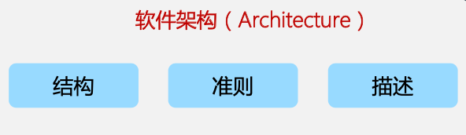
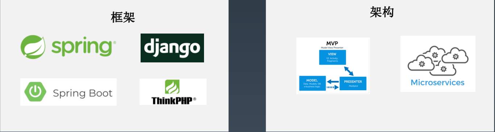
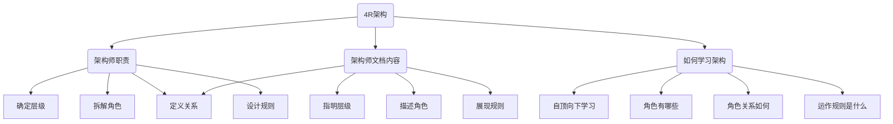

## 思维导图

## 系统与子系统

### 定义

- 关联：一群有关联的个体
- 规则：个体之间按照规则运作
- 能力：超越个体能力
- 分层：自顶向下逐层分解

### 样例

## 模块与组件

### 模块

是一套一致而互相有紧密关连的软件组织。

它包括了程序和数据结构两部分。

模块的接口表达了由该模块提供的功能和调用它时所需的元素。

### 组件

自包含的、可编程的、可重用的、与语言无关的软件单元，软件组件可以很容易被用于组装应用程序中。

## 架构与框架

### 框架

通常指的是为了实现某个业界标准或完成特定基本任务的软件<u>组件规范</u>，也指为了实现某个软件组件规范时，提供规范所要求之基础功能的<u>软件产品</u>。

### 架构

指软件系统的基础<u>结构</u>，创造这些基础结构的<u>准则</u>，以及对这些结构的<u>描述</u>。

### 样例

## 架构定义剖析

### 4R架构

- Rank 顶层结构
- Role 组成角色
- Relation 角色关系
- Rule 运作规则

### 4R架构应用

