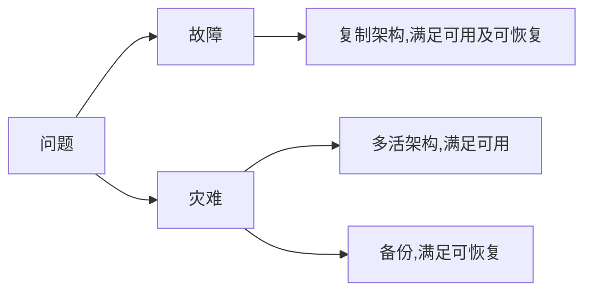

## 高可用关键指标

### 存储类问题处理框架图

注意备份责任人为运维。

### 高可用存储的几个核心指标

RPO、RTO、WRT、MTD 是与恢复计划和业务连续性有关的术语。它们分别表示：

- RPO（Recovery Point Objective）：恢复点目标，指“最大可接受的数据损失”，因为数据备份和数据复制都是有时间限制的，不可能做到绝对实时。表示在恢复操作之前所允许的数据损失量。通常以时间为单位，例如“在发生故障后，恢复到最后备份的时间点之前不超过4小时的数据损失”。RPO用于确定备份频率和恢复点选择，以确保在故障发生时最小化数据丢失。
- RTO（Recovery Time Objective）：恢复时间目标，指“最大可接受的系统恢复所需时间”，因为定位、处理、恢复需要时间。表示在发生故障或灾难后，系统或业务恢复到正常运行所需的时间。通常以时间为单位，例如“在发生故障后，系统必须在2小时内恢复正常运行”。RTO用于确定恢复计划和备份策略，以确保在故障发生时能够快速恢复业务运行。
- WRT（Work Recovery Time）：工作恢复时间，指“系统恢复正常后，恢复业务所需的时间”，因为要进行各种业务检查、校验、修复。表示在故障后，业务能够恢复到正常运行所需的时间。与RTO类似，但WRT更侧重于业务恢复而不仅仅是系统恢复。例如，“在发生故障后，业务必须在4小时内恢复到正常运行”。WRT用于确定业务恢复计划和测试策略，以确保在故障发生时能够快速恢复业务运行。
- MTD（Maximum Tolerable Downtime）：最大可容忍宕机时间，等于`RTP`+`WRT`。表示业务中断或故障的最长可接受时间。通常以时间为单位，例如“业务中断或故障的最长可接受时间为8小时”。MTD用于确定业务连续性计划，以确保在故障发生时业务中断的时间不会超过可接受的范围。

这些术语在制定恢复计划和业务连续性计划时非常重要，可以帮助组织确定合适的备份策略、灾难恢复计划和业务恢复计划。

## Q & A

### 直接上多活架构就好了，还要复制架构干啥呢？

从架构设计三原则考虑，多活架构技术复杂度相对较高，如果两种架构都适合业务，那么应该优先选择复制架构。

