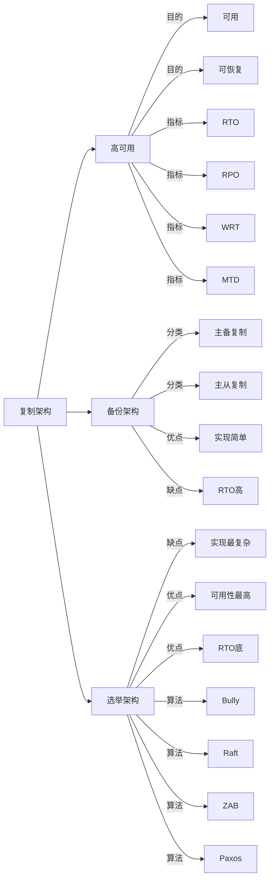

## 高可用关键指标

### 存储类问题处理框架图

注意备份责任人为运维。

### 高可用存储的几个核心指标

RPO、RTO、WRT、MTD 是与恢复计划和业务连续性有关的术语。它们分别表示：

- RPO（Recovery Point Objective）：恢复点目标，指“最大可接受的数据损失”，因为数据备份和数据复制都是有时间限制的，不可能做到绝对实时。表示在恢复操作之前所允许的数据损失量。通常以时间为单位，例如“在发生故障后，恢复到最后备份的时间点之前不超过4小时的数据损失”。RPO用于确定备份频率和恢复点选择，以确保在故障发生时最小化数据丢失。
- RTO（Recovery Time Objective）：恢复时间目标，指“最大可接受的系统恢复所需时间”，因为定位、处理、恢复需要时间。表示在发生故障或灾难后，系统或业务恢复到正常运行所需的时间。通常以时间为单位，例如“在发生故障后，系统必须在2小时内恢复正常运行”。RTO用于确定恢复计划和备份策略，以确保在故障发生时能够快速恢复业务运行。
- WRT（Work Recovery Time）：工作恢复时间，指“系统恢复正常后，恢复业务所需的时间”，因为要进行各种业务检查、校验、修复。表示在故障后，业务能够恢复到正常运行所需的时间。与RTO类似，但WRT更侧重于业务恢复而不仅仅是系统恢复。例如，“在发生故障后，业务必须在4小时内恢复到正常运行”。WRT用于确定业务恢复计划和测试策略，以确保在故障发生时能够快速恢复业务运行。
- MTD（Maximum Tolerable Downtime）：最大可容忍宕机时间，等于`RTP`+`WRT`。表示业务中断或故障的最长可接受时间。通常以时间为单位，例如“业务中断或故障的最长可接受时间为8小时”。MTD用于确定业务连续性计划，以确保在故障发生时业务中断的时间不会超过可接受的范围。

这些术语在制定恢复计划和业务连续性计划时非常重要，可以帮助组织确定合适的备份策略、灾难恢复计划和业务恢复计划。

## 主备复制 & 主从复制

### 主备复制

- 本质：通过冗余来提升可用性
- 优点：实现简单，只需要数据复制，无状态检测和角色切换。
- 缺点：需要人工干预，RTO 比较大。

#### 主备级联复制

- 变化：备机作为复制源，如图中`备库a`是`备库b`的复制源
- 优点：主机故障后，切换`备库a`为主库，方便快捷，直接修改配置即可。（不需要修改`备库b`的配置，不需要判断`备库a`和`备库b`的数据覆盖问题）
- 缺点：`备库a`对备份非常关键，`备库a`宕机会导致两台备份机都备份失败
- 应用：MySQL、Redis 支持这种模式

实际业务中很少应该该架构。

#### 主备架构的灾备部署

主备跨机房复制，可以应对机房级别的灾难，如果机房分别位于不同城市则可以应对城市级别的灾难。

### 主从复制

- 本质：通过冗余来提升可用性，通过叠加来提升读性能。
- 优点：实现简单，只需要数据复制，无状态检测，在业务层确定读请求的分发。
- 缺点：需要人工干预，RTO 比较大。

#### 主从架构的债备部署

Q：为什么不把机房2的备库b改为从机提供读取服务？

A：延时相对较高，不合适提供读服务。

### 案例学习 - redis

Redis 主从架构中，任务由 `客户端`分解，将写请求发送给领导者节点，将读请求发送给跟随者节点。

### chatgpt: 请详细介绍一下主备架构和主从架构，包括它们的工作原理，区别，优点，缺点以及应用场景等

**You:**

请详细介绍一下主备架构和主从架构，包括它们的工作原理，区别，优点，缺点以及应用场景等

* * *

**ChatGPT:**

主备架构和主从架构是常见的系统架构模式，主要用于提高系统的可用性和可靠性。下面是它们的详细介绍。

1.  主备架构

主备架构是一种系统架构模式，由两个或多个服务器组成，其中一个被称为主服务器，另一个或其他几个被称为备服务器。在正常情况下，主服务器处理所有的请求，并将结果同步到备服务器。如果主服务器出现故障，备服务器将接管主服务器的工作，并成为新的主服务器。这个过程称为故障转移。主备架构的工作原理可以分为以下几个步骤：

*   正常情况下，主服务器处理所有请求，备服务器将主服务器的数据同步到本地。
*   当主服务器出现故障时，备服务器检测到主服务器的失效并接管主服务器的工作。
*   当主服务器恢复正常运行时，备服务器将数据同步到主服务器，主服务器再次成为主服务器。

主备架构的优点包括：

*   提高了系统的可用性和可靠性，因为备服务器可以快速接管主服务器的工作，避免系统停机时间过长。
*   提高了数据的安全性，因为备服务器可以实时备份主服务器的数据，确保在主服务器故障时不会丢失数据。
*   可以方便地进行维护和升级，因为备服务器可以在主服务器停机时接管其工作，主服务器可以随时进行维护和升级。

主备架构的缺点包括：

*   成本较高，因为需要多台服务器和专业的软件和硬件设备来实现备份和故障转移。
*   在主服务器故障时，备服务器需要一定时间来接管主服务器的工作，会导致系统停机时间较长。

主备架构适用于需要高可用性和可靠性的系统，例如金融交易系统、电子商务网站、数据库服务器等。

2.  主从架构

主从架构也是一种系统架构模式，由一个主服务器和多个从服务器组成。在正常情况下，主服务器处理所有的请求，并将结果同步到从服务器。从服务器只读取主服务器的数据，不允许对数据进行修改。主从架构的工作原理可以分为以下几个步骤：

*   正常情况下，主服务器处理所有请求，从服务器只读取主服务器的数据。
*   当主服务器修改数据时，从服务器会接收到更新的数据并进行同步。
*   当从服务器出现故障时，不会对主服务器产生任何影响。

主从架构的优点包括：

*   提高了系统的可伸缩性和可用性，因为主服务器分担了负载，可以处理更多的请求。

*   从服务器可以用于读取数据，减轻主服务器的负担，提高系统性能。
*   可以通过增加从服务器来扩展系统的容量，提高系统的可扩展性。

主从架构的缺点包括：

*   不能进行写入操作，从服务器只能读取数据，限制了系统的功能。
*   可能存在数据同步延迟的问题，从服务器的数据不一定实时同步到主服务器。
*   在主服务器出现故障时，需要手动将从服务器切换为主服务器，会导致系统停机时间较长。

主从架构适用于需要处理大量读操作和少量写操作的系统，例如搜索引擎、电子邮件服务器、新闻网站等。

总的来说，主备架构和主从架构都是提高系统可用性和可靠性的有效方式。在选择架构模式时，需要根据系统的实际需求和性能要求来选择适合的架构模式。如果需要高可用性和数据安全性，可以选择主备架构；如果需要处理大量读操作，可以选择主从架构。

## 集群选举

### redis sentinel

使用 sentinel 集群来解决“决策者‘单点问题，sentinel 又是通过 raft 算法进行选举的。

### mongoDB

在 3.2 之前使用的是 Bully 选举算法。在 3.2 之后改为 raft 算法。

### 选举算法

| 算法  | 应用                                                         |
| ----- | ------------------------------------------------------------ |
| bully | 谁的 ID 最大或最小来当领导者（一般选择 ID 打的），Elasticsearch 有使用 |
| raft  | 分布式一致性协议，etcd、MongoDB、redis 有使用                |
| zab   | 分布式一致性协议，Zookeeper 有使用                           |
| paxos | 分布式一致性协议，OceanBase、Chubby 有使用                   |

## Q & A

### 直接上多活架构就好了，还要复制架构干啥呢？

从架构设计三原则考虑，多活架构技术复杂度相对较高，如果两种架构都适合业务，那么应该优先选择复制架构。

