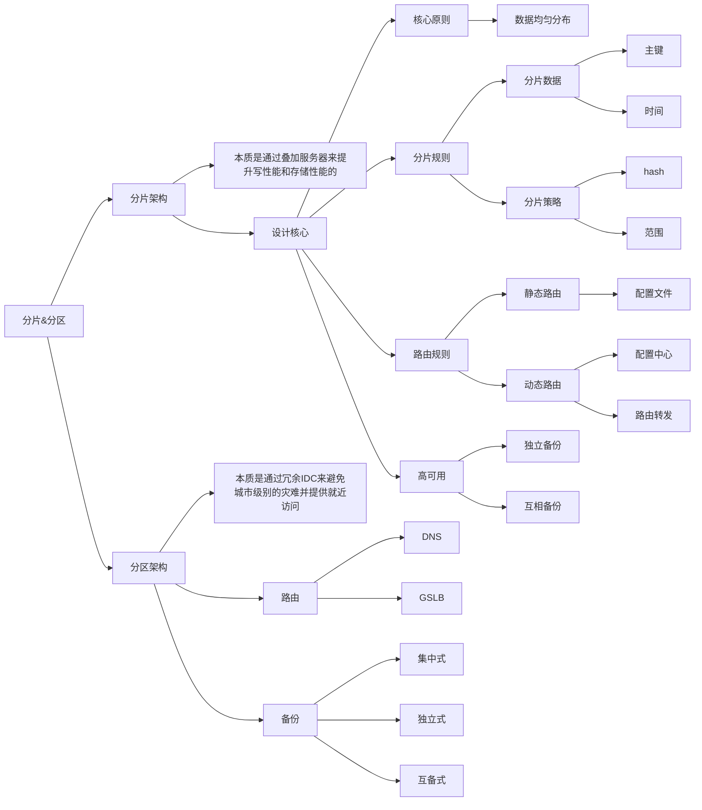
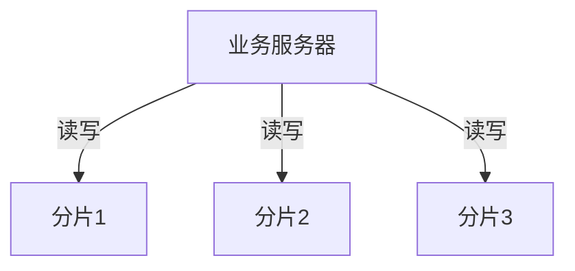
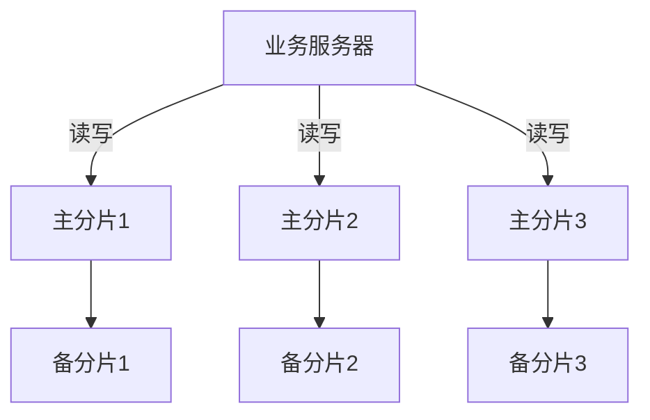
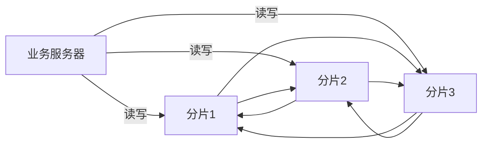
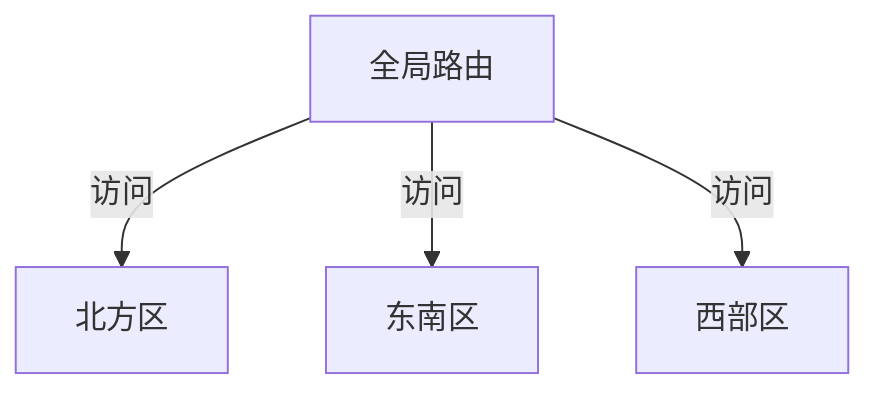
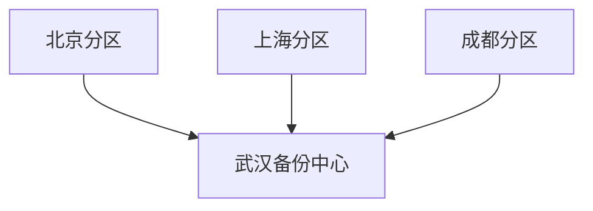
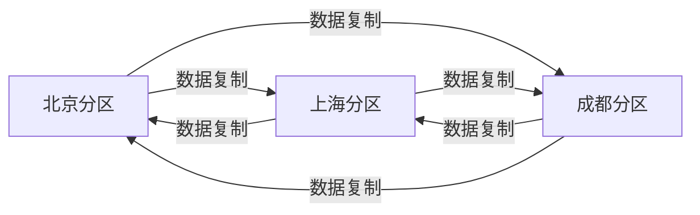
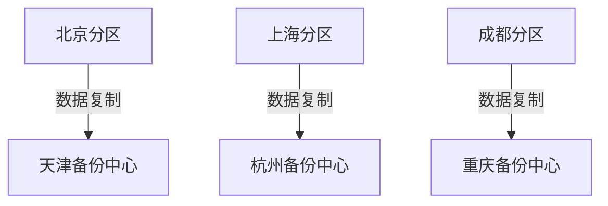

## 分片架构

### 分片架构本质

**通过叠加更多服务器来提升写性能和存储性能**

### 分片架构的核心

从核心条件看，和数据库存储架构中提到的数据库的分库分表有相似点，其实数据库的分库分表就是在操作数据库所做的分片架构。

#### 分片规则

数据按照什么规则分片

- 核心原则：选取基数（被选的数据维度取值范围）比较大的某个数据键值，让数据均匀分布（数据在取值范围内是均匀分布的），避免热点分片。
- 分片数据：
  - 使用主键：适合主业务数据，例如用户 ID、订单 ID 等
  - 按照时间：适合流水型业务，例如创建日期
- 分片规则：
  - hash 分片：分布相对均匀，不支持范围查询
  - 范围分片：可能不均匀（因为可能存在一些热点数据），支持范围查询

#### 路由规则

业务服务器如何找到数据

- 静态路由：基于配置文件，实现简单但是不灵活，无法动态扩容，数据库分表用这种形式

- 动态路由：基于配置中心、基于路由转发等，实现复杂，支持动态扩容

  - 配置中心

    - 工作原理：在配置中心中记录分片信息，客户端要向配置中心查询分片信息，然后发起读写请求。

    - 优点：可以支持超大规模集群，节点数量可以达到几百上千。
    - 缺点：架构复杂，一般需要独立的配置中心节点，且配置中心节点又需要高可用。

  - 路由转发

    - 工作原理：每个节点都保存所有路由信息，如果数据不在访问节点上，客户端的请求将被转发（比如 es，会将该请求转发到目标节点）或者重定向（如 redis，告诉客户端这个数据在哪个节点上，让客户端区目标节点获取）。
    - 优点：架构相对简单，一般通过 gossip 协议来实现分片信息更新。
    - 缺点：无法支持大规模集群（数量建议在 100 个以内），因为节点变更（或故障）需要同步到其他所有节点，同步的延迟会有短暂的不一致性可能导致用户不断重试，同步过于频繁也会增大系统开销，将降低系统的可用性。

### chatgpt 对分片架构的理解

对话地址：https://webapp.chatgpt4google.com/s/NzgyNjIy

**You:**

请详细介绍一下分片架构

* * *

**ChatGPT:**

分片架构是一种用于处理大规模数据和流量的分布式计算模型。在分片架构中，数据被分成多个部分（分片）存储在不同的服务器上，同时应用程序也被分成多个部分（分片）运行在不同的服务器上，以实现横向扩展和高可用性。

下面是分片架构的一些主要特点：

1.  水平扩展性：通过增加服务器数量和分片数量，可以方便地扩展系统的吞吐量和容量。

2.  高可用性：由于数据和应用程序的复制和分布，即使某个服务器出现故障，系统也能够继续正常工作。

3.  负载均衡：通过将负载分散到多个服务器上，可以平衡系统中不同服务器的负载，以提高系统的性能和可靠性。

4.  数据一致性：分片架构通过使用一致性哈希算法、复制机制等技术，确保分片数据在系统中的一致性。

5.  易于维护：分片架构将数据和应用程序分布在多个服务器上，使得维护、扩展和升级系统变得更加容易。

常见的分片架构包括数据库分片架构和应用程序分片架构。数据库分片架构将数据库中的数据分散到多个服务器上，以实现数据的横向扩展和高可用性。应用程序分片架构将应用程序拆分为多个部分（分片），每个部分运行在不同的服务器上，以实现应用程序的横向扩展和高可用性。

总之，分片架构是一种强大的分布式计算模型，可以有效地处理大规模数据和流量，并实现横向扩展和高可用性。

* * *

**You:**

分片架构数据怎么分片

* * *

**ChatGPT:**

在分片架构中，数据被分成多个部分（分片），每个分片存储在不同的服务器上，以实现数据的横向扩展和高可用性。数据如何被分片取决于系统的具体需求和架构设计，一般有以下几种常见的分片策略：

1.  哈希分片：将数据的关键字段（如ID、用户名等）进行哈希计算，将哈希值相近的数据分配到同一个分片中。这种方法可以均衡数据的负载，并且具有很好的可扩展性。

2.  范围分片：根据数据的范围进行分片，比如按照时间、地理位置等范围。这种方法可以保证分片数据的连续性，并且方便进行数据的查询和统计。

3.  前缀分片：将数据的关键字段按照前缀进行分片，比如按照字母、数字等前缀。这种方法可以保证数据的平衡分布，同时可以方便地进行数据的查询和统计。

4.  随机分片：将数据随机分配到各个分片中，可以保证数据的均衡分布，但是随机分片可能导致数据的不连续性，不利于数据的查询和统计。

5.  混合分片：结合以上几种分片策略，根据系统的具体需求和架构设计，综合考虑数据的均衡性、连续性、查询效率等因素，采用多种分片策略进行混合分片。

需要注意的是，数据分片不仅仅是简单的将数据拆分成多份存储在不同的服务器上，还需要考虑分片之间的关系和一致性，以保证分片数据的正确性和可靠性。常用的方法包括一致性哈希算法、分片数据的复制和备份、数据同步等。

* * *

**You:**

分片架构数据怎么访问

* * *

**ChatGPT:**

在分片架构中，数据被分成多个部分（分片）存储在不同的服务器上。应用程序需要访问这些分片数据时，可以采用以下几种常见的访问方式：

1.  客户端直接访问：客户端直接访问存储分片数据的服务器，可以使用负载均衡算法将请求分发到不同的服务器上，以实现负载均衡和高可用性。

2.  代理层访问：使用代理层（如缓存服务器、反向代理服务器等）作为中间层，代理客户端与存储分片数据的服务器之间的交互。代理层可以缓存数据，提高数据访问速度，同时还可以对分片数据进行路由和负载均衡等处理。

3.  统一访问接口：使用统一的访问接口（如API接口、RPC接口等）访问存储分片数据的服务器，由接口层进行分片数据的路由和负载均衡等处理。这种方式可以使应用程序和分片数据的具体实现解耦，提高系统的可维护性和可扩展性。

需要注意的是，数据分片不仅仅是将数据拆分成多份存储在不同的服务器上，还需要考虑分片之间的关系和一致性，以保证分片数据的正确性和可靠性。在访问分片数据时，需要采用一致性哈希算法、分片数据的复制和备份、数据同步等技术，确保数据的一致性和可用性。

### 分片架构高可用方案

可以采用主备、主从、集群选举等方式实现

#### 独立备份

- 原理：每个分片有独立的备份节点
- 优点：实现简单
- 缺点：机器硬件成本比较高
- 应用：存储系统已经支持节点级别的复制

### 互相备份

- 原理：分片节点互相备份
- 优点：机器硬件成本相对较低，互相利用
- 缺点：实现复杂
- 应用：存储系统已经支持数据块级别的复制

**类似 raid 阵列**

## 分区架构

### 分区架构本质

通过冗余 IDC 来避免城市级别的灾难，并提供就近访问。

（分片架构无法应对城市级别的故障）

### 分区架构全局路由

#### DNS

在分区架构中，DNS负责将域名解析为IP地址。它可以被用来实现流量管理和负载均衡。如果有多个数据中心，DNS可以将客户端请求分配到最近的数据中心。但是，DNS可能会受到缓存和延迟的影响。

#### GSLB

全局服务器负载平衡（GSLB）可以提供更细粒度的流量管理和负载均衡。GSLB可以监控全球各地的服务器并确定哪些服务器是最近的。这可以帮助您确保客户端请求被路由到距离最近的可用服务器。

### 分区架构备份策略

|        | 集中式 | 互备式 | 独立式 |
| ------ | ------ | ------ | ------ |
| 成本   | 中     | 低     | 高     |
| 可扩展 | 高     | 低     | 高     |
| 复杂度 | 低     | 高     | 低     |

#### 集中式

- 优点：设计简单，各分区之间并无直接联系，可以做到互不影响；扩展容易，如果要增加新的分区，只需要将新的分区数据复制到武汉备份中心即可。
- 缺点：成本较高，需要建设一个独立的备份中心。

#### 互备式

- 优点：成本低，直接利用已有机房和网络
- 缺点：设计比较复杂，各个分区除了要承担业务数据存储，还需要承担备份功能，相互之间互相关联和影响；扩展麻烦，新增一个分区，需要和其他分区建立数据复制连接。

#### 独立式

- 优点：设计简单，各分区互不影响；扩展容易，新增分区只需要搭建自己的备份中心即可。
- 缺点：成本高，每个分区都需要独立的备份中心，备份中心的场地成本是主要成本。

### chatgpt 理解的分区架构

https://webapp.chatgpt4google.com/s/OTcyMTM0

**You:**

请你详细介绍分区架构

* * *

**ChatGPT:**

分区架构（Partition Architecture）是一种软件架构模式，其目的是将系统划分为多个独立的子系统或模块（即分区），以提高系统的可扩展性、可维护性和可靠性。

在分区架构中，每个分区都是相对独立的，其内部实现可以是任何合理的方式，例如单体应用程序、微服务、组件等。每个分区都有自己的接口和规范，以便与其他分区交互，并且每个分区都可以独立进行开发、测试、部署和运行。

分区架构的优点包括：

1.  可扩展性：通过添加或删除分区，可以方便地扩展或缩小系统，而无需影响其他分区。
2.  可维护性：每个分区都是相对独立的，因此可以单独进行维护和更新，而不影响其他分区。
3.  可靠性：当一个分区发生故障时，其他分区仍然可以继续运行，从而提高了系统的可靠性。

但是，分区架构也有一些缺点：

1.  分区之间的通信需要进行网络通信，因此可能会出现网络延迟和故障。
2.  分区之间的数据共享和一致性需要进行复杂的处理。
3.  分区之间的依赖关系需要进行管理，以确保系统的正确性和可靠性。

因此，在设计和实现分区架构时，需要仔细考虑系统的需求和设计，以确保系统的正确性、可靠性和可扩展性。

## Q&A

### 主从复制无法解决主机写性能问题，因此要采用分片架构来提升写性能？

正确，分片架构可以通过叠加机器来提升写性能。

### 分片架构做到数据均匀分布后，读写就能够做到负载均衡？

错误，热点数据会影响读写的负载，可能导致不均衡。

### 分片架构需要结合复制架构才能具备高可用特性？

正确，分片架构本身具有高性能特性，但是高可用特性需要对分片进行复制或备份。

### 分片架构如果跨城市部署，就相当于分区架构了？

错误，分片架构一般不要跨城市部署，这种方式会带来许多问题，比如数据访问延迟过高等。

