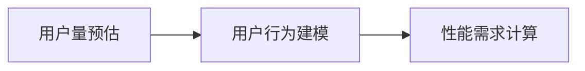

## 存储架构设计整体思路

### 存储架构设计三个步骤

1. 估算性能需求
   - 任务：基于具体的任务场景来估算性能需求，包括存储量、读写性能等。
   - 挑战：如何估算？估算不准？
2. 选择存储系统
   - 任务：根据技术储备、方案优缺点选择合适的存储系统。
   - 挑战：不知道有哪些存储系统；知道但是不知道怎么选
3. 设计存储方案
   - 任务：基于选择的存储系统，设计其具体的存储方案，如果发现不行，回到步骤2换一个
   - 挑战：如何设计存储方案？

## 如何估算业务所需存储性能

### 估算模型

架构师在2B业务中需要同客户、解决方案架构师澄清他们预估的用户量，在2C业务中需要同产品人员、运营人员、老板沟通去做决策给出用户量预估。

### 用户量预估

- 规划：根据成本、预算、目标等确定
- 推算：基于已有数据推算
- 对比：根据已有标杆对比

注意：用户不一定是人，对于云平台来说接入对象是公司也就是说用户是公司

### 用户行为建模

- 行为：用户的典型行为
- 数量：某种行为的用户数量
- 频率：用户某种行为的频率

### 存储性能的需求计算

- 数据量：需要存储的数据总量
- 请求量：对数据的读写请求量分析，评估参考 TPS、QPS等
- 预留量：预留的增长空间

说明和技巧：

1. 并不是所有的数据都一定要用同样的存储方式，例如当前数据和历史数据可以分开存储
2. TPS/QPS 需要计算出以秒为单位的树枝，并且计算“平均值”和“峰值”
3. 预留空间要合适，如果能做到线性伸缩是最好的

### 存储性能需求计算案例

案例：每天使用扫码乘车的用户有 500 万（用户量），平均扫码次数 4.6 次（用户行为模型）

部分分析和计算过程：

1. 假设总用户数 1000 万，则用户数据存储量是 1000 万
2. 每次扫码乘车，都需要访问一次用户数据，则用户数据读取次数为：500 万 * 4.6 约为 2300 万
3. 每次扫码乘车，都会生成一条乘车记录，则单日乘车记录数为：500 万 * 4.6 约为 2300 万
4. 乘车记录要保存 2 年，则总数据量为 2300 万 * 800  约为 200 亿
5. 每条乘车记录对应一条乘车记录，单日支付记录数月 2300 万，两年总数量月 200 亿
6. 地铁乘车 60% 集中在早晚高峰的 2 个小时内，因此乘车记录写入峰值 TPS 平均月为 2300 万 * 60% / （2 * 3600）约为 2000