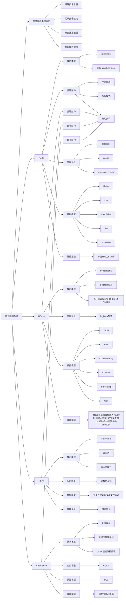

# 常见存储系统剖析




## 步骤

### 1. 理解技术本质

理解系统的核心技术本质，技术本质决定了应用场景和性能量级。

比如：

- Redis 是 k-v 存储系统
- HBase 是 sorted map

### 2. 明确部署架构

学习存储系统支持的部署架构，明确其架构的本质

### 3. 研究数据模型

研究存储系统提供的数据模型，包含哪些概念，如何应用。

### 4. 模拟业务场景

模拟一些场景的业务场景，完整的实现一个案例，并测试其性能。

## Redis

### 技术本质

- in-memory：意味着性能高，但同时意味着数据持久化不是核心，可能丢数据
- data structure store：数据存储结构，而不是关系数据，也不是文件存储

#### 用途

- cache
- database
- message broker

#### 性能量级

单机 TPS 5~10 万

#### 相关知识

关系数据：数据之间的关系非常密切，互相依赖和影响，核心特征就是读的时候 join，写的时候用`事务`保证一致性

非关系数据：数据之间关系疏松，互相独立，数据间的一致性要求很低


### 部署架构（主从、哨兵、集群分片）

Redis 支持 4 种部署架构

1. 单机部署：最简单的部署方式，即将 Redis 安装在一台服务器上，所有数据都存储在该服务器上。这种方式适用于小型应用，需要考虑高可用性和数据备份等问题。
2. 主从复制部署：该部署方式使用主节点（Master）来处理读写请求，同时将数据复制到多个从节点（Slave），从节点只能处理读请求。主节点故障时，从节点可以升级为主节点继续提供服务。该方式提高了读性能和可用性，但写性能不如单机部署。
3. 哨兵部署：基于主从复制，该方式在主节点故障时自动将一个从节点升级为主节点，保证高可用性。使用哨兵监控 Redis 集群，发现主节点故障时，自动进行主节点切换。该方式增加了自动故障切换的功能，但复杂度较高。
4. 集群部署：将数据分片存储在多个节点上，每个节点只存储部分数据，通过节点之间的协调，实现数据的高可用和负载均衡。该方式适用于数据量较大的场景，可以提高读写性能和可用性。

### 数据模型

Redis 支持多种数据结构，每种数据结构都有其独特的特点和适用场景，以下是 Redis 支持的数据结构及其应用场景：

1. 字符串（String）：存储字符串、整数或浮点数。应用场景包括缓存、计数器、存储序列化对象等。
2. 哈希（Hash）：存储键值对，每个键值对是一个字段和值的组合。应用场景包括存储对象属性、用户信息、文章评论等。
3. 列表（List）：存储有序的字符串元素，支持在列表头部和尾部添加或删除元素。应用场景包括消息队列、最新文章列表、好友关注列表等。
4. 集合（Set）：存储无序的唯一字符串元素，支持交集、并集、差集等操作。应用场景包括点赞列表、标签管理、共同关注列表等。
5. 有序集合（Sorted Set）：类似于集合，但每个元素都有一个分数（score）值，可以根据分数值进行排序。应用场景包括排行榜、计数器、范围查询等。

根据不同的应用场景和数据结构的特点，选择合适的数据结构可以提高 Redis 的性能和效率。

### 模拟业务场景

可以使用 Redis 的集合（Set）数据结构来存储关注关系，具体步骤如下：

1. 创建两个集合，一个用于存储用户的关注者，另一个用于存储用户关注的人。以用户 A 为例：

   ```
   SADD followers:A B C    // 将用户 B 和 C 添加为用户 A 的关注者
   SADD following:A D E   // 将用户 D 和 E 添加为用户 A 关注的人
   ```

2. 查询用户 A 的关注者和关注的人：

   ```
   SMEMBERS followers:A   // 获取用户 A 的所有关注者，返回值为集合 {B, C}
   SMEMBERS following:A  // 获取用户 A 关注的所有人，返回值为集合 {D, E}
   ```

3. 取消关注操作，以取消用户 A 关注用户 B 为例：

   ```
   SREM following:A B   // 从用户 A 的关注列表中移除用户 B
   SREM followers:B A   // 从用户 B 的粉丝列表中移除用户 A
   ```

使用 Redis 来存储关注关系，可以快速、高效地实现关注、取消关注等操作，并且可以支持多种查询操作，如获取某个用户的关注者、获取某个用户关注的人等。同时，由于 Redis 的高并发性能，可以满足高流量的关注系统的需求。

如果需要考虑按关注先后排序，则可以采用 Sorted Set

## HBase

### 技术本质

- no-relational：非关系型数据
- versioned：多版本的
- after Bigtable：参考 Bigtable 的原理，multidimensional sorted map
- on top of Hadoop and HDFS：基于 Hadoop 和 HDFS，底层存储结构是 LSM

#### 用途

Big Data 存储

#### 性能量级

4 台 32 核主机每秒插入 70000 条，读取大约是 25000 条，扫描 100 条以内的记录，每秒 15000 条。

因为底层存储结构是 LSM，读取性能比写性能低。

### 部署架构（集群分片）

HBase 可以根据不同的使用场景和需求，采用不同的部署架构，主要有以下几种：

1. 单机部署：最简单的部署方式，即将 HBase 安装在一台服务器上，所有数据都存储在该服务器上。这种方式适用于小型应用，需要考虑高可用性和数据备份等问题。
2. 伪分布式部署：使用单个节点的多个进程模拟分布式环境，包括 HBase Master 和多个 HBase RegionServer 进程，每个进程运行在不同的线程上。该方式可以测试 HBase 分布式环境，但不支持数据分片和负载均衡。
3. 完全分布式部署：将 HBase 集群部署在多台服务器上，其中包括 HBase Master 和多个 HBase RegionServer，每个服务器运行一个或多个 HBase 进程。该方式支持数据分片和负载均衡，可以提高 HBase 的性能和可用性。
4. 高可用部署：基于完全分布式部署，使用 ZooKeeper 管理 HBase 集群的元数据和状态，实现主备切换和自动故障转移。该方式增加了自动故障转移和高可用性的功能，但复杂度较高。

根据实际需求和场景，选择合适的部署方式可以提高 HBase 的性能、可用性和可维护性。

### 数据模型

HBase 支持的数据模型是基于 Google 的 Bigtable 论文而来的，主要支持以下两种数据结构：

1. 表格（Table）：HBase 的基本数据结构，由行和列组成。每行都有一个唯一的行键（rowkey），多个列可以组成一个列族（column family），列族内的列可以存储不同的版本。表格在存储结构化数据方面非常有用，比如用于存储电子邮件、日志、通讯录等数据。
2. 数据流（Stream）：HBase 0.96 版本引入的新功能，是一个有序的、不断增长的、可追溯的、容错的、支持复制和过期策略的数据结构。数据流在处理流数据方面非常有用，比如处理 IoT 数据、实时日志、实时事件数据等。

在实际应用场景中，可以根据数据的类型和处理方式选择合适的数据结构。例如，如果数据是结构化的，并且需要支持多版本存储，可以使用表格结构。如果数据是无限流式的，并且需要按照时间顺序处理，可以使用数据流结构。

### 模拟业务场景

在 HBase 中，可以使用表格（Table）数据结构来存储关注关系。具体步骤如下：

1. 创建 HBase 表格，以用户 A 为例：

   ```
   create 'following', 'followings'
   create 'followers', 'followers'
   ```

2. 向表格中添加数据，以用户 A 关注用户 B 和用户 C 为例：

   ```
   put 'following', 'A', 'followings:B', ''
   put 'following', 'A', 'followings:C', ''
   
   put 'followers', 'B', 'followers:A', ''
   put 'followers', 'C', 'followers:A', ''
   ```

3. 查询用户 A 的关注者和关注的人：

   ```
   scan 'following', {ROWPREFIXFILTER => 'A', COLUMNS => 'followings'}
   
   scan 'followers', {ROWPREFIXFILTER => '', COLUMNS => 'followers:A'}
   ```

4. 取消关注操作，以取消用户 A 关注用户 B 为例：

   ```
   delete 'following', 'A', 'followings:B'
   delete 'followers', 'B', 'followers:A'
   ```

在 HBase 中存储关注关系时，需要注意以下几点：

1. 表格的行键（rowkey）需要根据具体的业务需求进行设计，可以根据用户 ID、时间戳等来设计。
2. 表格中的列族（column family）需要根据具体的业务需求进行设计，可以根据关注者和关注的人来分别设计列族。
3. HBase 的查询操作是基于行键的，因此需要在设计表格时考虑如何支持快速的查询操作。可以通过设计行键前缀过滤器来实现。

总之，在实际应用中，需要根据具体的业务需求和系统性能要求来选择适合的存储方案。


## HDFS

### 技术本质

- file system：是文件存储，不是关系数据，也不是数据结构
- distributed：分布式的文件存储，不是 Linux 上的 ext 文件系统这种
- low-cost hardware：运行在低成本硬件，而不是 IOE 的高成本硬件

#### 用途

large data sets：大数据存储

#### 性能量级

性能可横向伸缩，瓶颈是带宽

### 部署架构（集群分片）

在 HDFS 中，通常可以使用以下三种部署架构：

1. 单节点部署：在单个节点上启动 NameNode 和 DataNode，适用于开发和测试环境。
2. 伪分布式部署：在单个节点上启动一个 NameNode 和多个 DataNode，适用于小型生产环境。
3. 分布式部署：在多个节点上启动一个 NameNode 和多个 DataNode，适用于大型生产环境。

在分布式部署中，可以根据具体的需求和规模选择适当的架构，例如：

- 标准架构：使用一个 NameNode 和多个 DataNode，适用于中等规模的生产环境。
- 高可用架构：使用两个 NameNode 和多个 DataNode，其中一个 NameNode 为活动状态，另一个为备用状态，当活动的 NameNode 发生故障时，备用的 NameNode 会自动接管，适用于对系统可用性有较高要求的生产环境。
- 安全架构：使用 Kerberos 和 Hadoop 的安全模块来保证数据的安全性，适用于对数据安全性有较高要求的生产环境。

需要注意的是，不同的部署架构会对 HDFS 的性能、可用性和安全性产生不同的影响，因此需要根据具体的业务需求和系统规模来选择适合的部署架构。

### 数据模型

是一个文件系统，用户规划好目录和文件就可以了

## Clickhouse

### 技术本质

- column-oriented：列式存储
- DBMS：数据库管理系统
- OLAP：OLAP 场景（MySQL 是 OLTP）

#### 用途

OLAP

#### 性能量级

见官方测试数据

#### 相关知识

OLTP：联机事务处理，执行大量增删改查，关注响应速度，高并发、数据一致性

OLAP：联机分析处理，执行少量复杂查询，关注吞吐量，很少修改数据

行式存储：表中的一行记录存储在一个数据块中

列式存储：表中的一列记录存储在一个数据块中

|          | 列式存储                                                   | 行式存储                                                   |
| -------- | ---------------------------------------------------------- | ---------------------------------------------------------- |
| 优点     | - 查询聚合操作效率高                                       | - 支持快速插入和更新操作                                   |
|          | - 压缩效率高                                               | - 支持高效的事务处理                                       |
|          | - 支持快速的列裁剪操作                                     | - 查询单条记录效率高                                       |
|          | - 支持宽表和稀疏表                                         | - 数据结构简单，易于理解和维护                             |
|          | - 支持列存储的索引优化查询                                 | - 支持丰富的数据类型和数据结构，例如数组、嵌套结构等       |
| 缺点     | - 不支持快速的单条记录查询                                 | - 查询聚合操作效率低，需要扫描整个表格                     |
|          | - 不支持高效的事务处理                                     | - 不支持宽表和稀疏表                                       |
|          | - 不支持直接的数据更新操作，需要重新写入整个列             | - 对于复杂的数据类型和数据结构，需要进行嵌套查询和处理操作 |
|          | - 对于复杂的数据类型和数据结构，需要进行嵌套查询和处理操作 | - 压缩效率低，占用存储空间较大                             |
| 应用场景 | - 数据仓库                                                 | - 交易系统、金融系统、电商系统等                           |
|          | - 日志分析                                                 | - 系统监控、报表分析、在线分析等                           |
|          | - 高并发、低延迟查询                                       | - 交互式查询、在线事务处理等                               |
|          | - 宽表和稀疏表                                             | - 支持高并发读写操作                                       |

需要注意的是，列式存储和行式存储并不是绝对的，实际上很多存储系统采用了混合存储的方式来兼顾两种存储模式的优势，例如 HBase 中的列式存储和 Cassandra 中的混合存储。因此，在选择存储方案时需要根据具体的业务需求和数据特点来选择合适的存储模式和存储系统。

### 部署架构（集群分片）

1. 单机部署：将 ClickHouse 安装在单台服务器上，适用于小型业务或者测试场景。
2. 分布式部署：将 ClickHouse 集群化部署，可以提高系统的可用性和扩展性，适用于大型业务场景。

### 数据模型

基于 SQL 表设计

## Q & A

### Redis 不适合存储关系型数据

正确，的确不适合，数据结构不合适以及核心功能不包括数据持久化

### HBase 主要适合离线大数据存储

错误，HBase 更适合在线数据处理，总的来说就是适合大数据处理场景

### HDFS 可以用来存储视频、日志等文件

正确，HDFS 是一个分布式文件存储系统

### ClickHouse 是 OLAP，可以代替 Hadoop 之类的离线分析平台

正确，并且非常适合配合如 MySQL 等关系型数据库使用

### 存储系统部署架构有多种会更有利于架构设计，可以根据场景灵活应用

错误，有时候部署架构只有一种反而减少了存储系统部署架构的选择成本