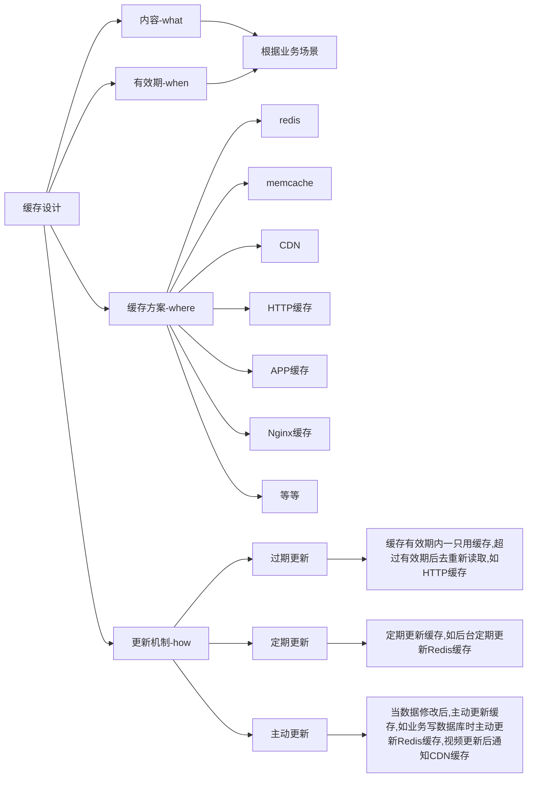
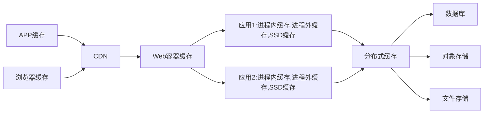
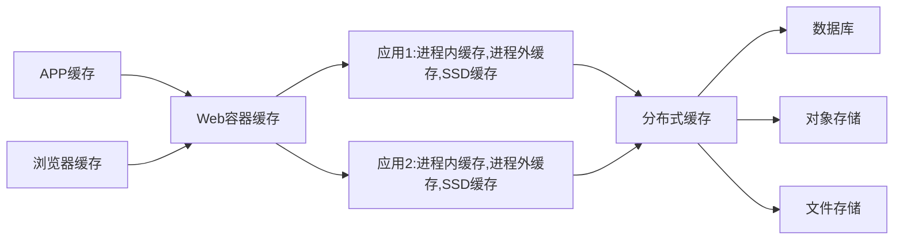
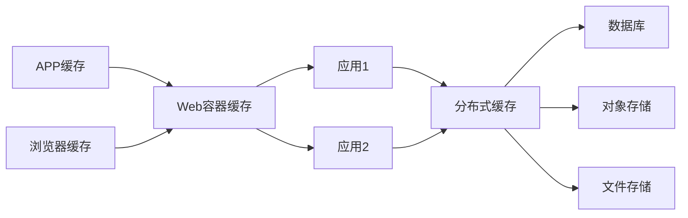

## 缓存原理和设计框架

### 缓存（cache）

指位于速度相差较大的两种硬件之间，用于协调两者数据传输速度差异的结构。

#### 技术本质

空间换时间

### 缓冲（buffer）

指某个临时存储区域，保存将要从一个设备（或系统）传输到另一个设备（或系统）的数据。

### 设计框架

- 内容：存什么（what）
- 有效期：存多久（when）
- 缓存方案：存哪里（where）
- 更新机制：如何存（how）

### 缓存设计案例

#### 朋友圈动态缓存设计

**GPT-4:**

根据上述缓存设计框架，可以进行如下的朋友圈动态缓存设计：

（1）内容-what：根据业务场景确定缓存需要缓存什么内容。朋友圈动态缓存需要缓存的内容包括但不限于：用户发布的动态、动态点赞数、动态评论数等。

（2）有效期-when：根据业务场景确定缓存需要设置的有效期。朋友圈动态缓存的有效期需要根据业务需求决定，建议设置较短的有效期，可以在一定程度上保证数据的实时性，减少脏数据的存在。

（3）缓存方案-where：根据业务场景确定选择哪一种或者哪几种缓存方案。建议使用Redis作为朋友圈动态缓存的存储方案，因为Redis具有高性能、高可用性和多样化的缓存策略，可以满足朋友圈动态缓存的存储和读取需求。

（4）更新机制-how：

- 过期更新：在缓存有效期内仍然使用缓存数据，超过有效期后再重新读取数据更新缓存。对于朋友圈动态缓存，可以使用HTTP缓存策略，例如设置Cache-Control和Expires头来控制缓存的过期时间，从而实现缓存的自动更新。
- 定期更新：在后台定期更新缓存。对于Redis缓存，可以使用Redis的定时任务功能来实现缓存的定期更新。
- 主动更新：当数据修改后，主动更新缓存。对于朋友圈动态缓存，可以在用户发布动态、点赞、评论等操作时，主动更新Redis缓存。例如，当用户发布一条动态时，在将动态存储到数据库后，再将动态的相关信息存储到Redis缓存中，更新缓存数据。

#### 朋友圈广告缓存设计

**GPT-4:**

针对朋友圈广告缓存的设计，我们可以参考下面的框架：

内容-what：

- 根据业务场景，我们需要缓存的数据包括广告图片、文案、投放时间、投放位置等信息。

有效期-when：

- 根据业务场景的要求，我们需要设置缓存的有效期，比如每隔5分钟更新一次缓存。

缓存方案-where：

- 我们可以选择使用Redis来实现朋友圈广告的缓存，因为Redis支持高并发、快速响应和可持久化存储等特性，非常适合用于缓存场景。
- 我们也可以考虑使用CDN来缓存广告图片，以加快图片的加载速度。

更新机制-how：

- 对于过期更新，我们可以在缓存时间到期后，重新读取数据库中最新的广告信息，并更新缓存。
- 对于定期更新，我们可以定时从数据库中读取最新的广告信息，并更新缓存。
- 对于主动更新，我们可以在广告信息更新后，及时通知缓存服务器更新缓存。例如，当有新的广告投放时，先写入数据库并更新缓存，然后再将广告信息发送至广告平台，以便展示新的广告。

## 多级缓存架构

### 5 级缓存架构

存储系统也有缓存，能否当作第 6 级缓存？

### 多级缓存架构设计关键点

- 性能需求
- 架构复杂度

#### 应用多级缓存架构时，如果数据发生了变化，如何保证每一级及时更新数据？

很难保证每一级缓存都能及时更新，需要结合业务考虑该级缓存存在的必要性。

#### 多级缓存大大增加了架构复杂度，直接用分布式缓存不是更简单？

只使用分布式缓存，可能满足不了某些业务场景，比如微博的热门话题。

#### 是否所有业务都要按照这个多级缓存架构来做？

不是，合适、简单、演进

### 4 级缓存架构

#### 为什么首先就考虑去掉 CDN？

成本高，在满足业务的前提下，去除 CDN 可以降低成本

### 3 级缓存架构

#### 为什么去掉应用内缓存而不是分布式缓存？

应用内缓存相对复杂，在满足业务的前提下，去除应用内缓存可以降低系统复杂度。

#### 可否继续去掉 Web 容器缓存和 APP缓存/浏览器缓存？

一般可以选择不去掉，因为实现并不复杂、成本也相对较低。

## 缓存技术概要介绍

### 本地缓存

#### APP

- 定义：APP 将数据缓存在本地
- 应用场景：所有能缓存的都可以缓存
- 常见技术
  - SQLite 缓存
  - 本地文件缓存
  - 图片缓存

#### HTTP

- 定义：HTTP 标准协议缓存
- 应用场景：HTTP 资源
- 具体实现：参考 HTTP 协议，Cache-Control、ETag/If-None-Match 等指令

### CDN 缓存

#### 定义

Content Delivery Network，即内容分发网络，依靠部署在各地的边缘服务器，通过中心平台的负载均衡、内容分发、调度等功能模块，使用户就近获取所需内通，降低网络拥塞，提高用户访问响应速度和命中率，关键技术是内容存储和分发技术。

#### 优点

功能强大，能够支撑超高流量

#### 缺点

贵

#### 典型场景

- 直播
- 视频
- 资讯

### Web 容器缓存

一般缓存静态资源，如图片、js、css 等，配合 HTTP 协议实现缓存

### 应用缓存

#### 定义

应用在本地缓存数据

#### 应用场景

所有能缓存的都可以缓存

#### 常见技术

1. 进程内缓存
2. 进程外缓存，堆外缓存
3. 本地磁盘 SSD 缓存

### 分布式缓存

#### 定义

由分布式系统提供缓存功能

#### 应用场景

所有能缓存的都可以缓存

#### 具体实现

1. 基于 Redis
2. 基于 Memcached

## Q & A

### 缓存架构是高性能计算架构还是高性能存储架构？

是高性能计算架构，缓存的目的是提高性能。

### APP 通过 HTTP 接口获取的业务数据用哪种方式缓存比较好？

使用 APP 缓存较好，业务使用更灵活，比如可以通过用户交互主动更新缓存。

### SSD 为什么可以做缓存？

内存访问大约耗时 70 ~ 100 ns，SSD 随机读大约耗时为 16 us，延迟相对低，性能高，适合做缓存。

### 不是所有的缓存架构都必须要用 CDN

正确，在满足业务性能要求的前提下，不要使用 CDN，降低成本

