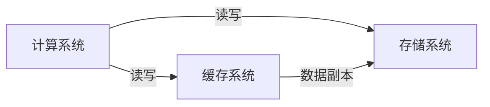
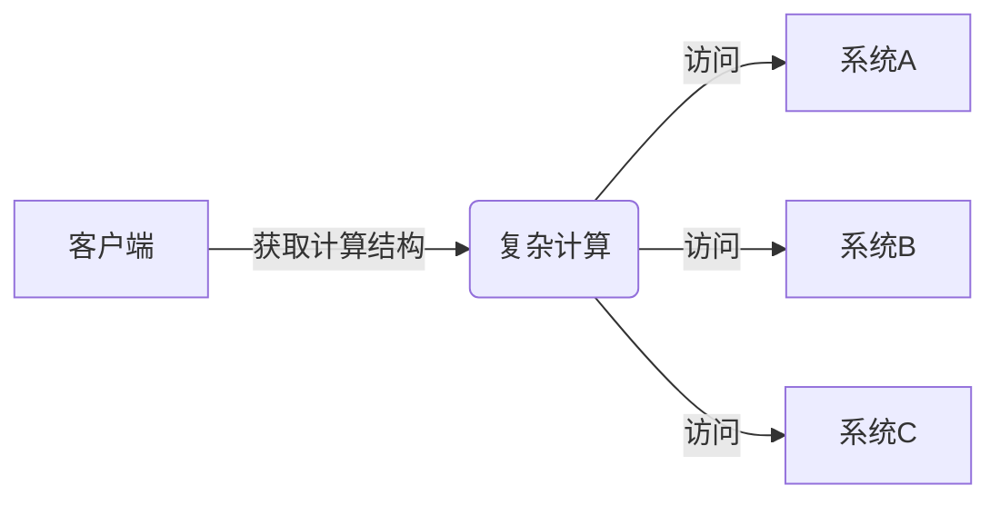
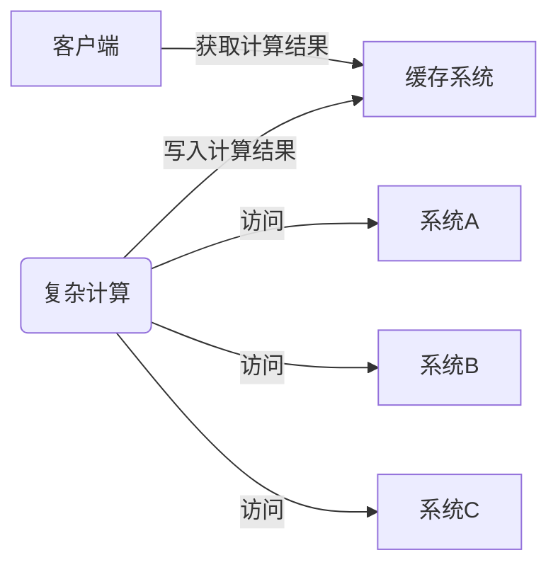
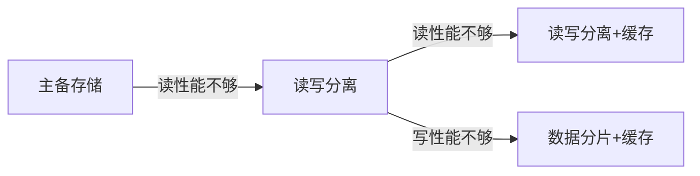

# 分布式缓存架构设计

## 分布式缓存架构模式

### 数据缓存

主要为了解决读写慢的问题，计算系统和存储系统间的性能差异

#### 数据缓存架构

#### 设计核心

- 用什么缓存系统
- 如何应对数据一致性调整

#### 应用场景

适用于实时性要求高的业务，读多写少的场景（如微博浏览）

### 结果缓存

主要为了解决计算慢的问题

#### 结构缓存架构

#### 设计核心

- 用什么缓存系统
- 缓存有效期与结果新鲜度的平衡

#### 应用场景

计算量大但实时性要求不高的业务场景，例如推荐、热榜、排行榜、分页等

### 分布式缓存架构设计思路

当然值得一提的是，大多数公司存储架构比较简单（或者说粗糙），采用的是单机存储，写读性能不够时就大概率会引入缓存，因为他们几乎没有主从架构的演进计划。

## 数据缓存架构一致性设计

### 数据缓存架构的一致性复杂度

#### 读操作

读缓存系统，读不到再去读存储系统

#### 写操作

| 方式                   | 问题及影响                                                   | 示例                                                 |
| ---------------------- | ------------------------------------------------------------ | ---------------------------------------------------- |
| 先写缓存后写存储       | 可能写缓存成功但写存储失败，单个数据读取没问题，但是关联业务会出异常 | 订单数据，用户自己可以看见，但是系统统计不到这个订单 |
| 先写存储后写缓存       | 写存储成功写缓存失败，业务读到的是旧数据，缓存失效后才能更新为新数据 |                                                      |
| 先删除缓存再写存储系统 | 在缓存系统异常时会出现删除缓存失败，写存储系统成功的情况，仍然会出现数据不一致 |                                                      |

一般推荐使用 “先删除缓存再写存储系统” 的方式

### 数据缓存架构的一致性解决方案

1. 容忍不一致性
   - 方案：根据容忍度设定缓存的有效期，例如：新闻资讯、微博、商品信息等
   - 优点：简单
   - 缺点：一定时期的数据不一致
2. 关系数据库本地事务表
   - 方案：正常的时候采用先删除缓存后写入数据库的策略；缓存系统异常的时候，通过事务记录一条消息到本地消息表，然后后台定时读取消息表记录，重试删除操作。
   - 优点：数据不一致时间短，等于重试间隔
   - 缺点：复杂
3. 消息队列异步删除
   - 方案：正常的时候采用先删除缓存后写入数据库的策略；缓存系统异常的时候，发送一条删除操作给消息队列，然后后台读取消息队列记录，重试删除操作
   - 优点：数据不一致时间短
   - 缺点：复杂，且消息队列可能挂掉

一般来讲使用缓存，理论都需要容忍不一致性，因此采用方案 1 的较多。 

## Q & A

### Redis 做缓存的时候可以持久化，那么可能带来什么风险？

当 Redis 重启后可能会读取到旧的数据，因为持久化有延迟，可能会丢部分缓存日志

### 为什么先建议采用读写分离而不是先用缓存

在对系统质量要求相对较高的环境下，存储系统一般会有备份策略，这种模式下，将主备架构变更为主从架构相对要比引入缓存组件更简单。

