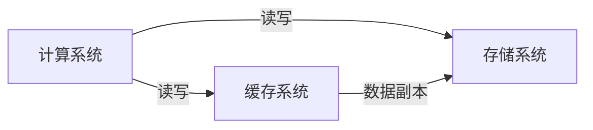
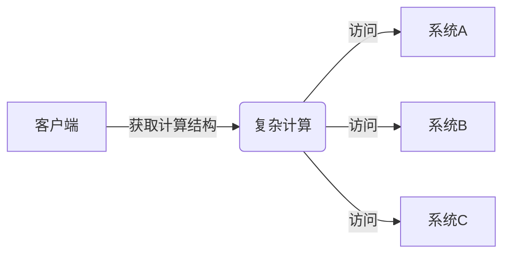
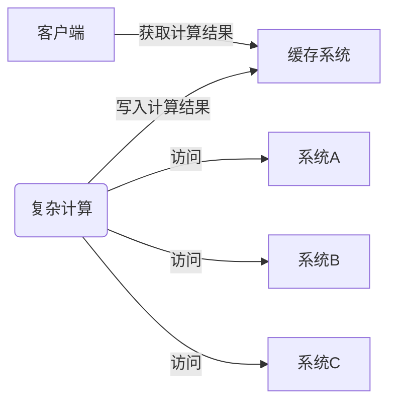
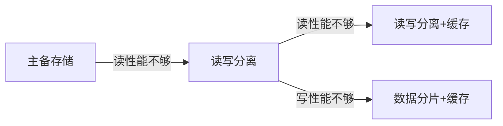

# 分布式缓存架构设计

## 分布式缓存架构模式

### 数据缓存

主要为了解决读写慢的问题，计算系统和存储系统间的性能差异


#### 数据缓存架构



#### 设计核心

- 用什么缓存系统
- 如何应对数据一致性调整

#### 应用场景

适用于实时性要求高的业务，读多写少的场景（如微博浏览）


### 结果缓存

主要为了解决计算慢的问题



#### 结构缓存架构



#### 设计核心

- 用什么缓存系统
- 缓存有效期与结果新鲜度的平衡

#### 应用场景

计算量大但实时性要求不高的业务场景，例如推荐、热榜、排行榜、分页等

### 分布式缓存架构设计思路



当然值得一提的是，大多数公司存储架构比较简单（或者说粗糙），采用的是单机存储，写读性能不够时就大概率会引入缓存，因为他们几乎没有主从架构的演进计划。


## 数据缓存架构一致性设计

### 数据缓存架构的一致性复杂度

#### 读操作

读缓存系统，读不到再去读存储系统

#### 写操作

| 方式                   | 问题及影响                                                   | 示例                                                 |
| ---------------------- | ------------------------------------------------------------ | ---------------------------------------------------- |
| 先写缓存后写存储       | 可能写缓存成功但写存储失败，单个数据读取没问题，但是关联业务会出异常 | 订单数据，用户自己可以看见，但是系统统计不到这个订单 |
| 先写存储后写缓存       | 写存储成功写缓存失败，业务读到的是旧数据，缓存失效后才能更新为新数据 |                                                      |
| 先删除缓存再写存储系统 | 在缓存系统异常时会出现删除缓存失败，写存储系统成功的情况，仍然会出现数据不一致 |                                                      |

一般推荐使用 “先删除缓存再写存储系统” 的方式

### 数据缓存架构的一致性解决方案

1. 容忍不一致性
   - 方案：根据容忍度设定缓存的有效期，例如：新闻资讯、微博、商品信息等
   - 优点：简单
   - 缺点：一定时期的数据不一致
2. 关系数据库本地事务表
   - 方案：正常的时候采用先删除缓存后写入数据库的策略；缓存系统异常的时候，通过事务记录一条消息到本地消息表，然后后台定时读取消息表记录，重试删除操作。
   - 优点：数据不一致时间短，等于重试间隔
   - 缺点：复杂
3. 消息队列异步删除
   - 方案：正常的时候采用先删除缓存后写入数据库的策略；缓存系统异常的时候，发送一条删除操作给消息队列，然后后台读取消息队列记录，重试删除操作
   - 优点：数据不一致时间短
   - 缺点：复杂，且消息队列可能挂掉

一般来讲使用缓存，理论都需要容忍不一致性，因此采用方案 1 的较多。 


## 缓存架构的三类问题

### 缓存穿透（较多 key 失效，多个请求访问的是不同的 key）

缓存中没有数据。

#### 定义

缓存没有发挥作用，业务系统虽然去缓存查询数据，但缓存中没有数据，业务系统需要再次去存储系统查询数据。

#### 场景

1. 存储系统中确实不存在被访问的数据。如被黑客攻击，导致大量无效业务请求。
2. 存储中存在，但缓存中不存在的数据。如冷门数据，老数据，常见的案例像爬虫或者用户翻页到相对靠后的数据导致系统变慢。
3. 系统刚启动时，大量缓存还没有生成。如抢购、秒杀等业务场景会这缓存节点刚启动。
4. 缓存集中失效。如批量生成的缓存批量失效，缓存节点挂掉等。

#### 常见应对方法

1. 空值缓存（可应对被攻击的情况）

   ```mermaid
   graph LR;
   业务系统 -- 1.读缓存失败 --> 缓存系统 
   业务系统 -- 2.读数据失败 --> 存储系统 
   业务系统 -- 3.写null值 --> 缓存系统 
   ```

2. 缓存当前数据（应对翻页到相对靠后页数的场景）

   ```mermaid
   graph LR;
   业务系统 -- 直接读历史数据存储系统 --> 历史数据存储系统
   业务系统 -- a.1读缓存失败 --> 缓存系统
   业务系统 -- a.2读当前数据存储系统 --> 当前数据存储系统
   业务系统 -- a.3写缓存 --> 缓存系统
   ```

   对于历史数据访问相对不频繁，直接从历史数据存储系统读取尽管慢但合理，做好交互让用户耐心等待即可。

3. 缓存预热（能够应对场景 3 大量缓存还未生成的情况）

   - 推荐在灰度发布/预发布触发系统生成缓存
   - 后台按照规则批量生成缓存，实现工作量较大，且有些情况很难模拟需要用户真实操作，不太推荐。
   - 模拟请求触发系统生成缓存，实现比较复杂，不太推荐。

4. 随机失效（能够应对场景 4 缓存批量失效的情况），缓存有效期设定一个范围内的随机值。

### 缓存雪崩（少数 key 失效，但多个并发请求同一个 key）

缓存失效引起雪崩效应

#### 定义

当缓存失效（过期）后引起系统性能急剧下降的情况。

#### 场景

1. 缓存雪崩导致存储系统无法响应

   ```mermaid
   graph LR;
   业务系统 -- 1.缓存失效 --> 缓存系统
   业务系统 -- 2.并发多个读取请求 --> 存储系统处理不过来
   ```

   根因：存储系统无法独立支撑瞬时高并发业务读写请求。

2. 缓存雪崩导致计算系统无法响应

   ```mermaid
   graph LR;
   业务系统 -- 1.缓存失效 --> 缓存系统
   业务系统 -- 2.并发多个读取请求 --> 计算系统触发个计算任务
   ```

   根因：生成缓存的计算任务太耗时


#### 常见应对方法

| 方法     | 方案                                                         | 优点                       | 缺点                                                         |
| -------- | ------------------------------------------------------------ | -------------------------- | ------------------------------------------------------------ |
| 更新锁   | 对缓存更新操作进行加锁保护，保证只有一个线程能够进行缓存更新；未能获取到更新锁的线程要么等待锁释放后重新读取，要么就返回空值或者默认值 | 能够保证只有一个线程能更新 | 需要引入分布式锁                                             |
| 后台更新 | 由后台线程来更新缓存，而不是由业务线程来更新缓存；缓存有效期设置为永久，后台线程可以通过“定时更新”、“事件触发更新”等策略更新缓存；业务线程只读取缓存，缓存不存在就返回空值 | 实现简单                   | 需要保证后台线程高可用；内存不足时可能会随机淘汰 key，且如果更新周期较长那么有概率出现雪崩、击穿等情况 |


### 缓存热点

部分缓存访问量超高

#### 定义

特别热点的数据，如果大部分甚至所有的业务请求都命中同一份缓存数据，则这份数据所在的缓存服务器的压力也很大，有可能撑不住。

#### 场景

热点事件、突发事件

#### 场景应对方法

多副本缓存，通过增加副本（机器）提升处理缓存读取能力。

（值得注意的是，热点 key 往往不太好预料，还需要动态决策或者人工干预） 


## Q & A

### Redis 做缓存的时候可以持久化，那么可能带来什么风险？

当 Redis 重启后可能会读取到旧的数据，因为持久化有延迟，可能会丢部分缓存日志

### 为什么先建议采用读写分离而不是先用缓存

在对系统质量要求相对较高的环境下，存储系统一般会有备份策略，这种模式下，将主备架构变更为主从架构相对要比引入缓存组件更简单。

### 缓存系统时为了解决存储系统慢的问题吗？

错误，缓存系统架构分为数据缓存和结果缓存。

### 爬虫可能导致缓存穿透和缓存雪崩问题吗？

错误，爬虫几乎不会短时间频繁访问同一个 key，因此不会造成缓存雪崩 ，但是它有可能在短时间内访问许多的 key，而引发缓存穿透问题。
