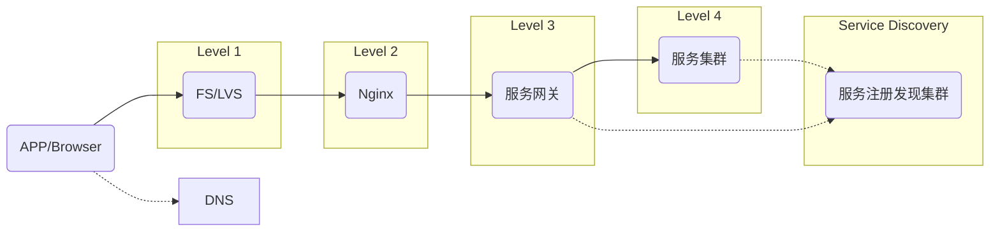
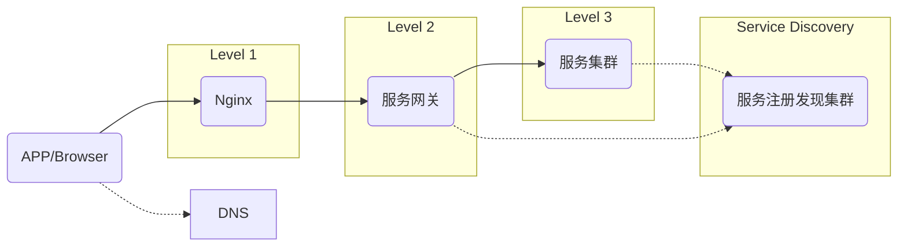
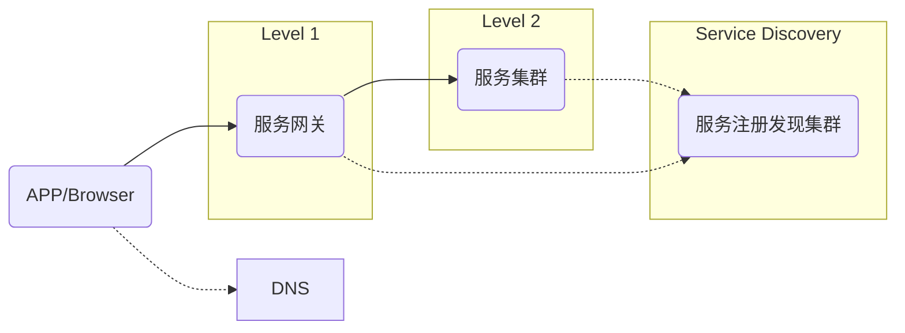
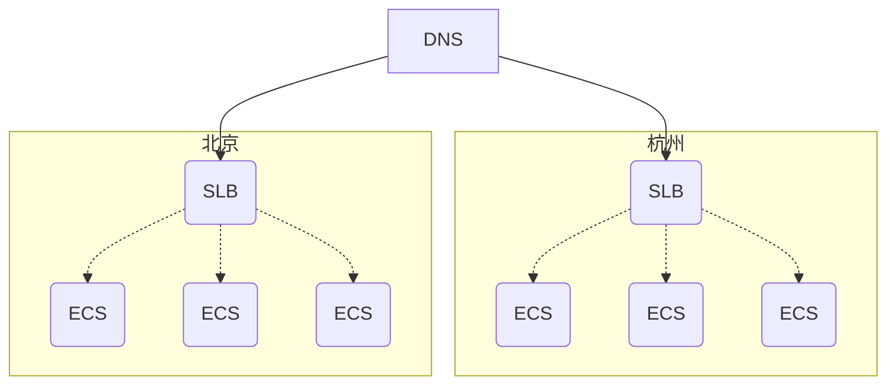
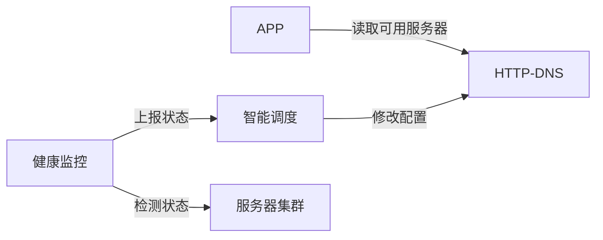
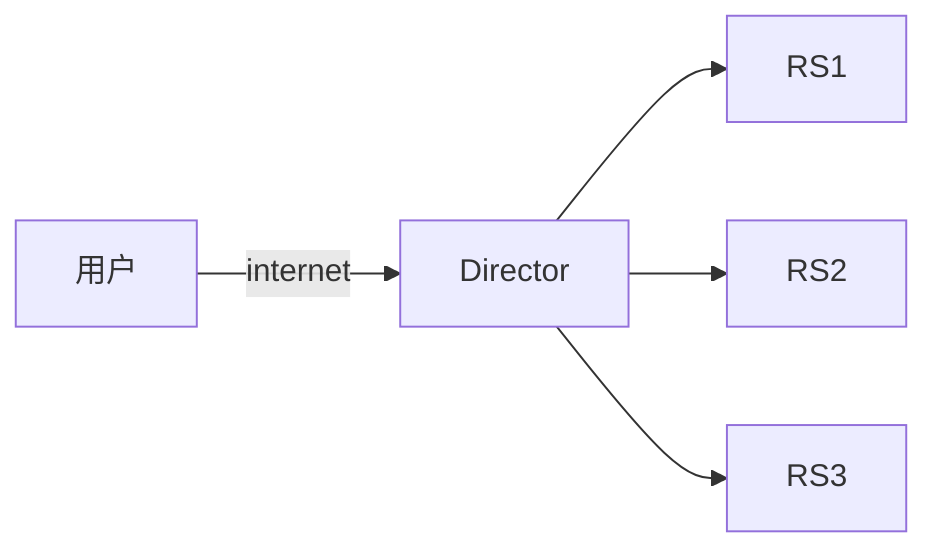
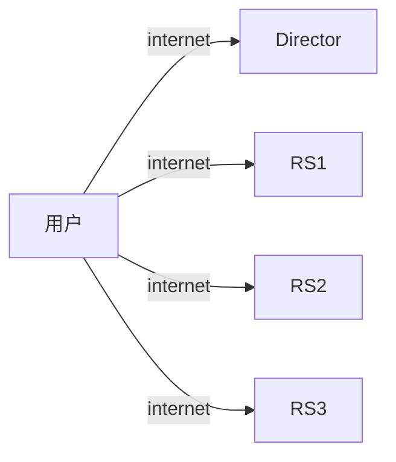
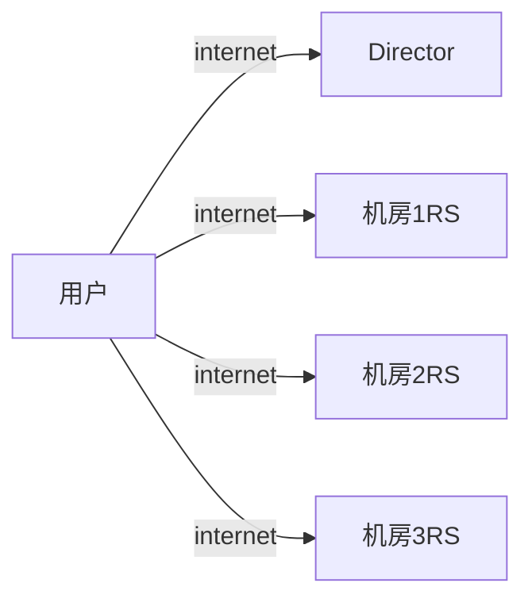

# 负载均衡架构

## 多级负载均衡架构

### 变化1: 去掉 F5/LVS

#### 为什么先去掉 F5/LVS

因为 F5/LVS 相对复杂，如果性能要求不是特别高就没有必要上 F5/LVS。并且 F5 的价格比较贵。

### 变化2: 去掉 Nginx

一般来讲采用这种负载均衡架构的业务相对粗糙，或者流量确实不大，不需要接 nginx

## 负载均衡技术剖析

### DNS

#### 应用

就近接入，一般是用于地理位置和机房级别的负载均衡。

**ChatGPT：**

DNS负载均衡是一种常用的负载均衡技术，它通过在DNS服务器上配置多个IP地址来实现将流量分发到不同的服务器的能力。以下是DNS负载均衡的一些常见应用场景：

1. 高可用性和故障转移：通过在DNS服务器上配置多个服务器的IP地址，当其中一个服务器出现故障时，DNS服务器可以将流量自动重定向到其他可用的服务器，以实现故障转移和提高系统的可用性。
2. 负载分担：DNS负载均衡可以将流量均匀地分发到多个服务器上，以避免单一服务器过载的情况。通过将流量分散到多个服务器上，可以提高系统的整体性能和可伸缩性。
3. 地理位置负载均衡：DNS负载均衡可以根据用户的地理位置将流量分发到最近的服务器，以降低网络延迟并提供更好的用户体验。这在全球分布式应用程序和内容分发网络（CDN）中特别有用。
4. 多服务负载均衡：DNS负载均衡不仅可以用于分发Web流量，还可以用于负载均衡其他类型的服务，如数据库、邮件服务器、VoIP服务器等。通过将这些服务的多个实例的IP地址配置到DNS服务器上，可以实现对它们的负载均衡。

需要注意的是，DNS负载均衡主要用于流量分发，而不是实时的负载监控和调整。对于更复杂的负载均衡需求，可能需要结合其他技术，如专用的负载均衡设备或软件负载均衡器，以实现更高级的负载均衡功能。

#### 优点

**ChatGPT:**

DNS负载均衡具有以下一些优点：

1. 简单易用：DNS负载均衡是一种相对简单的负载均衡解决方案。配置DNS服务器以实现负载均衡通常是直观和易于理解的过程。
2. 高可用性：DNS负载均衡可以提供高可用性，当一个服务器出现故障时，DNS服务器可以将流量自动重定向到其他可用的服务器。这有助于确保系统的连续性和可靠性。
3. 无单点故障：由于DNS负载均衡是在DNS服务器层面进行的，没有单个设备或组件是整个负载均衡系统的单点故障。即使其中一个DNS服务器出现故障，其他DNS服务器仍然可以继续提供服务。
4. 灵活性：通过在DNS服务器上配置不同服务器的IP地址，可以根据需求和策略对流量进行灵活的调整和分发。可以根据负载情况、地理位置或其他因素来定制和优化负载均衡策略。
5. 可扩展性：DNS负载均衡是一种相对容易扩展的解决方案。通过添加新的服务器并在DNS服务器上配置其IP地址，可以轻松地扩展和增加负载均衡能力，以满足不断增长的流量和用户需求。
6. 适用于多种应用：DNS负载均衡不仅适用于Web服务，还适用于其他类型的服务，如数据库、邮件服务器、VoIP服务器等。它为各种应用程序提供了灵活和可靠的负载均衡能力。

需要注意的是，DNS负载均衡也有一些限制和考虑因素，如DNS缓存、TTL（Time to Live）的影响、DNS解析延迟等。在设计和实施DNS负载均衡时，需要综合考虑这些因素以及具体的应用需求。

#### 缺点

- 能力有限，不够灵活

  1. 不同客户端的不一致性：由于DNS负载均衡是通过将多个IP地址返回给客户端来实现的，不同客户端可能会收到不同的IP地址列表。这可能导致流量在不同客户端之间不均匀地分布，从而影响负载均衡的效果。
  2. 无法实时监测和调整：DNS负载均衡是一种静态的负载均衡方法，它不具备实时监测和动态调整的能力。一旦IP地址被返回给客户端，DNS服务器无法在运行时对负载进行实时监测和调整。
  3. 不支持会话保持：DNS负载均衡本身不支持会话保持（session persistence）功能，即无法保证同一个客户端的请求始终被发送到同一台服务器。这对于某些应用程序和服务可能是必需的，如需要保持会话状态的应用程序。
  4. DNS解析延迟：DNS解析需要一定的时间，这可能会增加用户请求的响应时间。尤其是当负载均衡器的数量较多时，客户端可能需要进行多次DNS解析才能获取到有效的IP地址。
  5. 依赖于DNS基础设施：DNS负载均衡依赖于可靠的DNS基础设施。如果DNS服务器或相关网络组件出现故障或性能问题，整个负载均衡系统可能会受到影响。

- DNS 劫持

  DNS劫持是一种恶意行为，它涉及篡改或控制域名系统（DNS）的查询和响应过程，以达到攻击者的目的。以下是DNS劫持的一些关键点和影响：

  1. 劫持原理：DNS劫持通常通过篡改DNS查询的响应来实现。攻击者可能在本地网络、ISP（互联网服务提供商）或其他网络节点上部署恶意的DNS服务器，以截获DNS查询并返回错误的或经过修改的IP地址。
  2. 影响范围：一旦DNS查询被劫持，用户将被重定向到攻击者控制的恶意网站或服务器。这可能导致用户访问被篡改的网页、泄露敏感信息、受到恶意软件感染或其他未经授权的操作。
  3. Phishing（钓鱼）攻击：DNS劫持经常被用于进行钓鱼攻击。攻击者可以将受害者重定向到类似的伪装网站，以获取用户的个人信息、账号凭据或金融数据。
  4. 广告注入：攻击者可以在劫持的DNS响应中注入广告内容，从而在用户访问的网页上显示未经授权的广告。这种广告注入可能对用户体验造成干扰，并为攻击者带来经济利益。
  5. 网络监控和篡改：DNS劫持可以被用于网络监控和数据篡改。攻击者可以拦截和修改通过DNS传输的数据，例如修改下载文件或劫持用户的网络连接。
  6. 防御措施：为了防止DNS劫持，建议采取以下措施：
     - 使用可信赖的DNS解析服务商，以减少受到劫持的风险。
     - 配置防火墙或网络设备来限制不受信任的DNS查询和响应。
     - 定期更新操作系统和网络设备的固件，以修补可能存在的漏洞。
     - 使用加密的DNS（如DNS over HTTPS或DNS over TLS）来保护DNS查询的隐私和完整性。
     - 监测和检测DNS劫持的迹象，例如通过网络流量分析或使用专用的安全解决方案。

  总之，DNS劫持是一种潜在的网络安全威胁，可能导致用户受到欺骗、数据泄露和其他恶意行为。采取适当的安全措施和注意警惕可以帮助减少DNS劫持的风险。

- DNS 缓存：DNS解析结果通常会被客户端或中间DNS缓存器缓存一段时间。这可能导致流量在缓存过期之前仍然被发送到故障的服务器，从而降低了故障转移的速度。

### HTTP-DNS

#### 应用场景

APP、客户端

#### 优点

可以根据业务和团队技术灵活定制

#### 缺点

非标准协议，不通用，不太适合 web 业务。因为 web 业务的 DNS 解析受浏览器控制，不太能够（几乎不能）嵌入 HTTP-DNS sdk

#### 架构设计关键点

- 智能调度模块可以独立，也可以嵌入待 HTTP-DNS 中，一般独立成运维系统，因为智能调度系统有很多作用。
- 正常的时候走 DNS，异常的时候才走 HTTP-DNS
- SDK 会缓存 HTTP-DNS 解析结构

### GSLB 全局负载均衡

GSLB（Global Server Load Balancing），全局负载均衡，主要用于在多个区域拥有自己的服务器站点，为全球用户只以一个 IP 地址或者域名就能访问到离自己最近的服务器，从而获得最快的访问速度。

#### 应用场景

适合超大规模业务，多地甚至全球部署的业务，例如 Google、Facebook

#### 优点

功能强大，可以实现就近访问，容灾切换，流量调节

#### 缺点

实现复杂

#### 相关实现

- 基于 DNS 的 GSLB
- 基于 HTTP redirect 的 GSLB
- 基于 IP 欺骗的 GSLB

### F5

| 配置                                                         | 性能                                                         |
| ------------------------------------------------------------ | ------------------------------------------------------------ |
| 处理器：英特尔四核 Xeon 处理器（共8个超线程逻辑处理器内核） 内存：32 GB 硬盘：400 G SSD | 每秒 L7 请求数：1M，每秒 L4 连接数：400K 每秒 L4 HTTP 请求数：7M，最大 L4 并发连接数：24M，L4 吞吐量：40Gbps，L7 吞吐量：18Gbps |
| 处理器：单 CPU 内存：8GB 硬盘：500GB               | 吞吐量：4Gbps                                                |

### LVS 

内核级别的负载均衡，基本能跑满千兆网卡带宽，性能量级 10～100 万请求

#### LVS-NAT 模型

- 基本原理：客户端向 VIP 发起请求，Director 在经过调度之后选取 RS，将本地端口于 RS 的端口做映射，然后 RS 返还数据 Director 讲数据返还给客户端
- 应用场景：反向代理，类似于 Nginx，internet 不知道内部服务器的任何信息。

#### LVS-DR 模型

- 基本原理：客户端向 VIP 发起请求连接，Director 修改目的 mac 地址为某个服务器 RS，RS 服务器处理后直接返回结果给客户端。
- 应用场景：企业内网，LVS 和服务器在同一企业内网

#### LVS-TUN 模型

- 基本原理：客户端向 VIP 发起请求连接，Director 通过隧道技术转发给某个 RS 服务器，RS 服务器处理后直接返回结果给客户端。
- 应用场景：LVS 和服务器在不同企业网络

### F5/LVS/Nginx 对比

|          | F5                             | LVS                         | Nginx                                                     | 备注             |
| -------- | ------------------------------ | --------------------------- | --------------------------------------------------------- | ---------------- |
| 基本原理 | 硬件实现                       | linux 内核实现              | 软件实现                                                  | 硬件>内核>应用   |
| 流量类型 | L4                             | L4                          | L7，仅限 HTTP 也支持做 L4，但相对来说选择 LVS 更合适 |                  |
| 成本     | 高                             | 一般，需要 CPU 较高的服务器 | 低                                                        |                  |
| 功能     | 强，负载均衡、防火墙、高速缓存 | 网络负载均衡                | 方向代理                                                  |                  |
| 性能量级 | 100 万 ～ 1000 万              | 10 万 ～ 100 万             | 5 万 ～ 10 万                                             | 以 HTTP 请求为例 |

## 相关术语

### 流量

- 南北向：用户请求的流量
- 东西向：微服务之间调用的流量