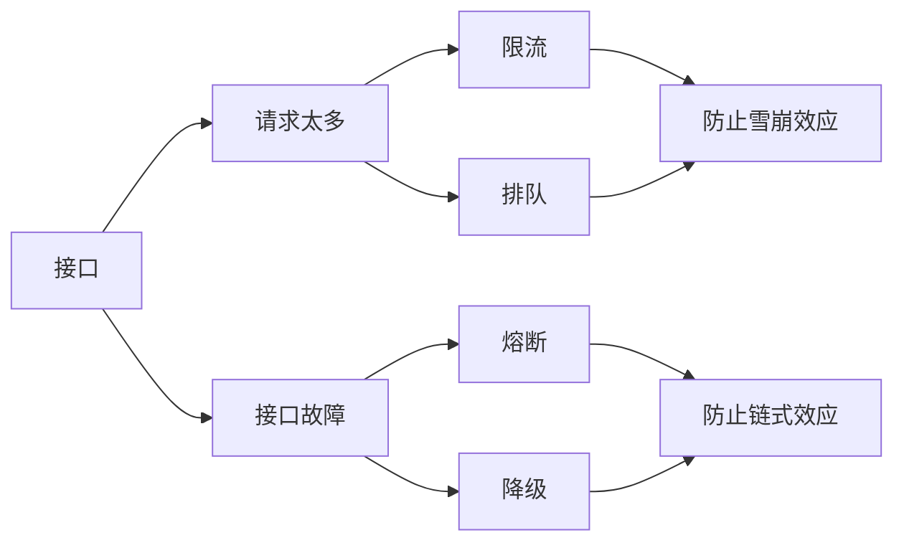

# 计算架构模式之高可用架构

## 接口高可用整体框架

接口高可用本质上是 “丢车保帅” 策略，业务或者用户体验会部分有损。

### 雪崩效应

请求量超过系统处理能力后导致系统性能螺旋快速下降。

### 链式效应

某个故障引起后续一连串的故障。

## 限流

用户请求全流程各个环节都可以限流：

1. 请求端限流：发起请求的时候就进行限流，被限流的请求实际上并没有发送给后端服务器。
2. 接入端限流：接到业务请求的时候进行限流，避免业务请求进入实际的业务处理流程。
3. 服务限流：单个服务的自我保护措施，处理能力不够的时候丢弃新的请求。

### 请求端限流

#### 常见手段

- 限制请求次数，例如按钮变灰
- 嵌入简单业务逻辑，例如生成随机数

#### 优点

- 实现简单
- 流量本地就控制住了

#### 缺点

- 无法限制用户抓取接口直接访问

### 接入端限流

#### 常见手段

- 限制同一用户请求频率
- 随机抛弃无状态请求，例如限流浏览请求，不限流下单请求

#### 优点

- 可以防刷

#### 缺点

- 实现复杂
- 限流阈值可能需要人工判断

### 服务限流

#### 场景手段

- 根据处理能力，丢弃无法处理的请求

#### 优点

- 实现简单

#### 缺点

- 处理能力难以精准配置

### 限流算法

| 算法       | 基本原理                                                     | 技术本质                           | 优点                     | 缺点                                                         | 应用场景                                     |
| ---------- | ------------------------------------------------------------ | ---------------------------------- | ------------------------ | ------------------------------------------------------------ | -------------------------------------------- |
| 固定时间窗 | 统计固定时间周期内的请求量，超过阈值则限流                   |                                    | 实现相对简单             | 存在临界点问题，如果在两个周期之间的一段时间内发送了大量请求导致限流效果差 |                                              |
| 滑动时间窗 | 统计滑动时间周期内的请求量，超过阈值则限流                   |                                    | 实现相对复杂             | 限流效果好，判断比较准确                                     |                                              |
| 漏桶       | 请求放入“桶”中，业务处理单元从桶中拿请求处理，桶满则丢弃新的请求 | 总量控制，桶大小是设计关键         | 突发流量时丢弃的请求较少 | 桶大小动态调整比较困难；无法控制流出速度                     | 瞬时高并发流量，如秒杀                       |
| 写缓冲漏桶 | 在漏桶算法的基础上，漏桶容量为无限（如基于 kafka 消息队列），用来做写缓冲 | 同步改异步，缓冲所有请求，慢慢处理 | 避免重要的业务请求被丢弃 | 用户请求作用延时。实现相对复杂                               | 高并发写入请求，如热门微博评论               |
| 令牌桶     | 将某个处理单元按照速率将令牌放入“桶”，业务处理单元收到请求后需要获取令牌，获取不到就丢弃请求 | 速率控制，令牌产生速度是设计关键   | 可以动态调整处理速度     | 突发流量的时候可能丢弃很多请求；实现相对复杂                 | 控制访问第三方服务的速度；控制自己的处理速度 |

