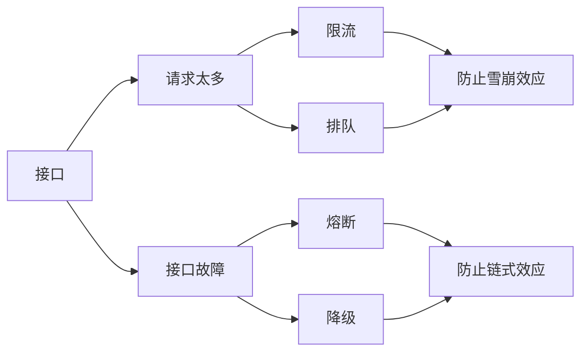
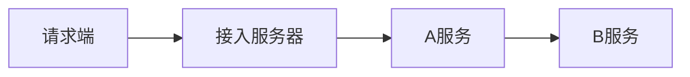
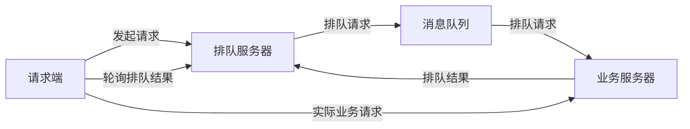
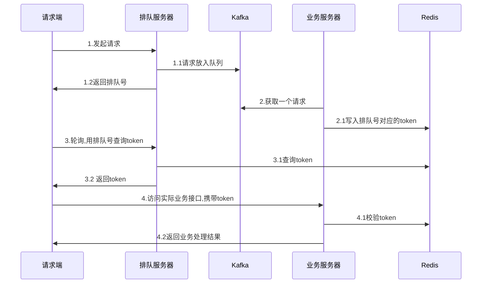
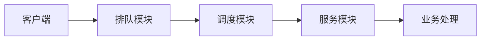
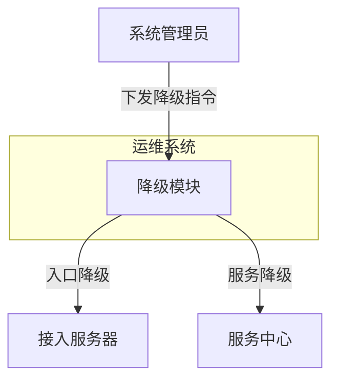
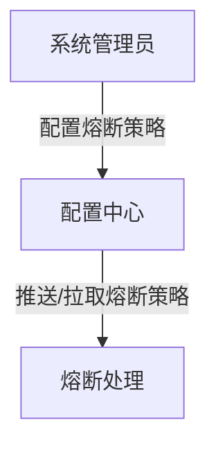

# 计算架构模式之高可用架构

## 接口高可用整体框架

接口高可用本质上是 “丢车保帅” 策略，业务或者用户体验会部分有损。

### 雪崩效应

请求量超过系统处理能力后导致系统性能螺旋快速下降。

### 链式效应

某个故障引起后续一连串的故障。

## 限流

用户请求全流程各个环节都可以限流：

1. 请求端限流：发起请求的时候就进行限流，被限流的请求实际上并没有发送给后端服务器。
2. 接入端限流：接到业务请求的时候进行限流，避免业务请求进入实际的业务处理流程。
3. 服务限流：单个服务的自我保护措施，处理能力不够的时候丢弃新的请求。

### 请求端限流

#### 常见手段

- 限制请求次数，例如按钮变灰
- 嵌入简单业务逻辑，例如生成随机数

#### 优点

- 实现简单
- 流量本地就控制住了

#### 缺点

- 无法限制用户抓取接口直接访问

### 接入端限流

#### 常见手段

- 限制同一用户请求频率
- 随机抛弃无状态请求，例如限流浏览请求，不限流下单请求

#### 优点

- 可以防刷

#### 缺点

- 实现复杂
- 限流阈值可能需要人工判断

### 服务限流

#### 场景手段

- 根据处理能力，丢弃无法处理的请求

#### 优点

- 实现简单

#### 缺点

- 处理能力难以精准配置

### 限流算法

| 算法       | 基本原理                                                     | 技术本质                           | 优点                     | 缺点                                                         | 应用场景                                     |
| ---------- | ------------------------------------------------------------ | ---------------------------------- | ------------------------ | ------------------------------------------------------------ | -------------------------------------------- |
| 固定时间窗 | 统计固定时间周期内的请求量，超过阈值则限流                   |                                    | 实现相对简单             | 存在临界点问题，如果在两个周期之间的一段时间内发送了大量请求导致限流效果差 |                                              |
| 滑动时间窗 | 统计滑动时间周期内的请求量，超过阈值则限流                   |                                    | 实现相对复杂             | 限流效果好，判断比较准确                                     |                                              |
| 漏桶       | 请求放入“桶”中，业务处理单元从桶中拿请求处理，桶满则丢弃新的请求 | 总量控制，桶大小是设计关键         | 突发流量时丢弃的请求较少 | 桶大小动态调整比较困难；无法控制流出速度                     | 瞬时高并发流量，如秒杀                       |
| 写缓冲漏桶 | 在漏桶算法的基础上，漏桶容量为无限（如基于 kafka 消息队列），用来做写缓冲 | 同步改异步，缓冲所有请求，慢慢处理 | 避免重要的业务请求被丢弃 | 用户请求作用延时。实现相对复杂                               | 高并发写入请求，如热门微博评论               |
| 令牌桶     | 将某个处理单元按照速率将令牌放入“桶”，业务处理单元收到请求后需要获取令牌，获取不到就丢弃请求 | 速率控制，令牌产生速度是设计关键   | 可以动态调整处理速度     | 突发流量的时候可能丢弃很多请求；实现相对复杂                 | 控制访问第三方服务的速度；控制自己的处理速度 |

## 排队

### 基本原理

收到请求后并不同步处理，而是将请求放入队列，系统根据根据能力异步处理。

设计关键

- 如何设计异步处理流程
- 如何保证用户体验（前端、客户端交互）

### 排队具体方案

设计关键点：

- 排队号是唯一的，可以利用用户信息、机器信息等生成
- token 需要做加密，避免被恶意用户推断出来生成规则
- 排队号与 token 有唯一绑定关系

**为什么要用 token, 直接用排队号不就可以了吗？**

本质上排队号是用于计算用户当前的次位。

使用 token 防刷，避免伪造或者冒用等情况。

### 秒杀排队案例

- 排队模块：负责接收用户的抢购请求，将请求以先入先出的方式保存下来。每一个参与秒杀活动的商品保存到一个队列，队列的大小可以根据参与秒杀的商品数量自行定义。
- 调度模块：负责排队模块到服务模块的动态调度，不断检查服务模块，一旦处理能力有空闲，就从排队队列头上把用户访问请求调入服务模块。
- 服务模块：负责调用真正业务处理服务，并返回处理结果，并调用排队模块的接口回写业务处理结果。

## 降级

### 基本原理

直接停用某个接口或者 URL，收到请求后直接返回错误（例如 HTTP 503）

### 应用场景

故障应急，通常将非核心业务降级，保证核心业务，例如降级日志服务、升级服务等。

### 降级架构实现

设计要点：

- 独立系统操作降级，可以是独立的降级系统，也可以是嵌入到其他系统的降级功能
- 应对的场景很难完全预料，仍然需要人工判断人工执行

### ChatGPT

降级是指在系统出现故障、性能下降或负载过高等异常情况时，为了保证系统的稳定性和可用性，有意地减少或关闭一些功能或服务。通过降低系统的功能或服务级别，可以减轻系统的负载，提高响应速度，避免系统崩溃或无法正常运行。

降级的目的是优先保障系统的核心功能和关键服务，而牺牲一些次要或非必要的功能。通过降级，可以在紧急情况下保持系统的可用性，并确保核心业务的正常进行。

降级的策略可以根据具体情况而定，例如：

1. 功能降级：暂时关闭一些非关键或不常用的功能，以减少系统的负载和复杂性。例如，电商网站可能在高峰期关闭某些营销活动或推荐功能，以确保订单处理和支付功能的正常运行。
2. 数据降级：降低数据的处理精度或采样率，以减少计算和存储的压力。例如，日志记录系统可以降低日志的详细级别或减少采样频率，以降低系统的负载。
3. 服务降级：将某些服务切换到备用或简化的版本，以确保系统的核心服务可用。例如，社交媒体应用程序在高负载情况下可以关闭一些社交功能，如评论、点赞等，以确保用户可以正常浏览和发布内容。

降级需要在系统设计和架构中考虑，并在预设的条件下自动触发或手动干预。在实施降级策略时，需要平衡系统的可用性和功能完整性，确保关键业务得以继续运行，同时及时进行故障诊断和修复，以恢复正常的系统状态。

## 熔断

### 基本原理

下游接口故障的时候，一定时期内不再调用。

### 应用场景

服务自我保护，防止故障链式效应。

### 熔断架构实现

### ChatGPT

熔断（Circuit Breaker）是一种用于提高系统稳定性和可用性的设计模式。它主要用于防止故障或异常服务对系统造成雪崩效应，通过快速失败和恢复来保护系统。

熔断器在应用程序中充当一个保护屏障，当检测到故障或异常情况时，它可以迅速中断对故障服务的请求，而不是等待超时或让请求一直阻塞，从而释放系统资源，并避免耗费更多的时间和资源。

熔断器通常具有以下几个状态：

1. 关闭状态（Closed）：正常运行状态，所有请求都可以通过。
2. 打开状态（Open）：检测到故障或异常情况，熔断器打开，所有请求将被直接拒绝，不再发送到目标服务。
3. 半开状态（Half-Open）：在一段时间后，熔断器会自动进入半开状态，允许部分请求通过，以便检测目标服务是否已经恢复正常。

熔断器的工作原理如下：

1. 设置失败阈值：熔断器会根据设定的失败阈值，例如连续多少次请求失败或失败率达到多少百分比，来判断目标服务是否发生故障。
2. 监控请求状态：熔断器会监控请求的响应状态，如果请求失败或超时，计数器会递增。当计数器达到设定的失败阈值时，熔断器将触发打开状态。
3. 进入打开状态：一旦熔断器进入打开状态，所有后续的请求都会立即被拒绝，不会发送到目标服务。这样可以减少对故障服务的访问，避免造成更多的负载和资源消耗。
4. 定期重试：在一段时间后，熔断器会自动进入半开状态，允许部分请求通过，以便检测目标服务是否已经恢复正常。如果这些请求成功，则熔断器将进入关闭状态，继续允许所有请求通过。如果请求失败，则熔断器将重新进入打开状态。

通过使用熔断器，可以快速失败和恢复，提高系统的可用性和稳定性。它可以防止故障服务对系统的负面影响，并提供对故障恢复的自动控制。同时，熔断器还可以提供监控和报警机制，以便及时发现和处理故障情况。

### 相关 Go 开源库

https://github.com/afex/hystrix-go

https://github.com/sony/gobreaker
