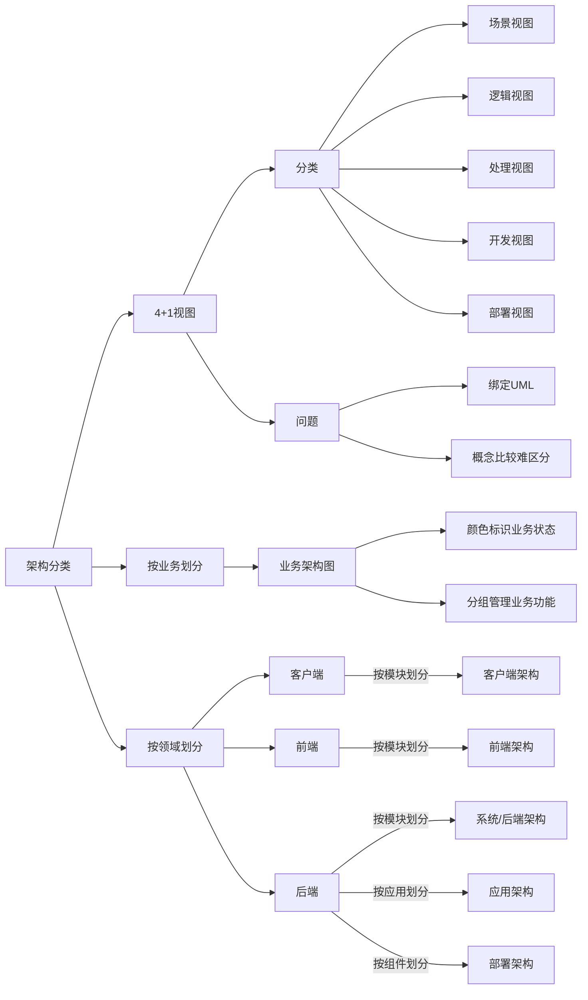
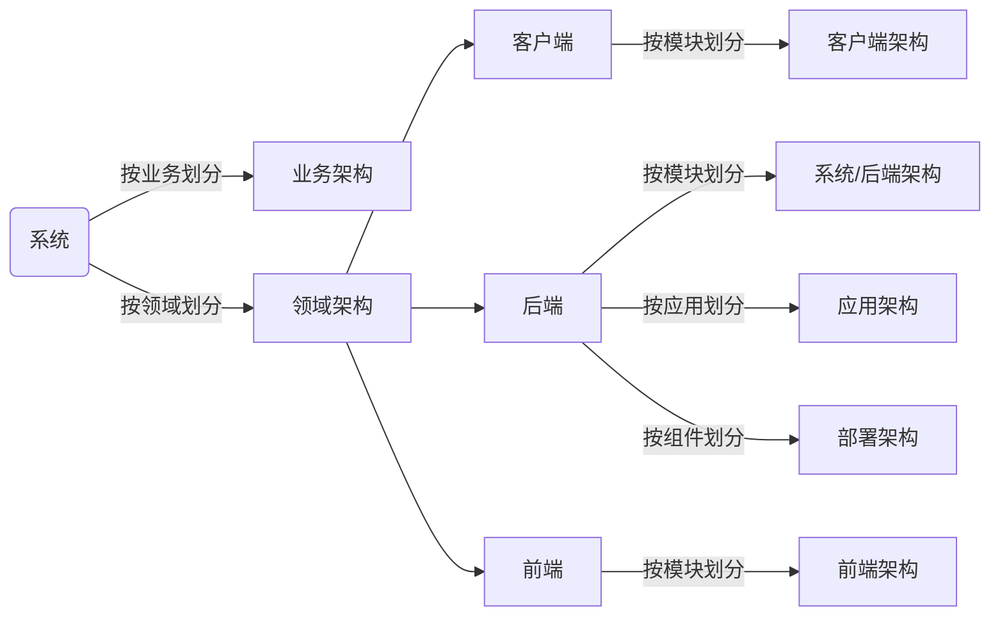

## 思维导图

## 4+1 架构视图

### 定义

**逻辑视图**：系统提供给用户的功能，对应UML的class和state diagrams

**处理视图**：系统的处理过程，对应UML的sequence和activity diagrams

**开发视图**：程序员角度看系统的逻辑组成，对应UML的package diagrams

**物理视图**：系统工程师角度看系统的物理组成，对应UML的deployment diagrams

**场景视图**：用户角度看系统需要实现的需求，对应UML的use case diagrams

### 现状

**国内企业很少使用4+1视图来描述架构**。原因是：

- 架构复杂度增加：在1995年的系统大部分还是单体系统，现在大部分是分布式系统
- 绑定UML图：UML图画架构存在问题
- 理解困难：逻辑视图、开发视图、处理视图比较容易混淆

## 大厂常见架构图介绍和画法

### 架构图分类

## 系统序列图

系统序列图使用**UML**序列图来画，核心功能需要画序列图