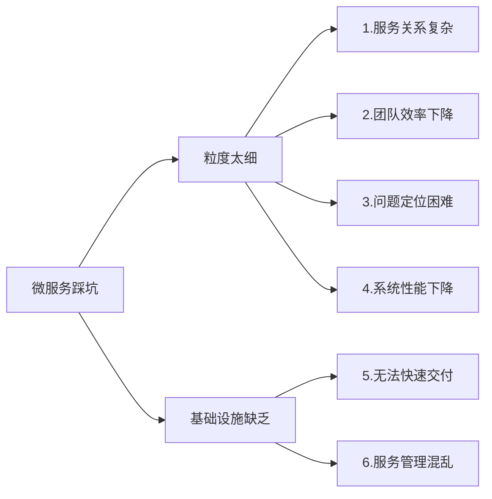
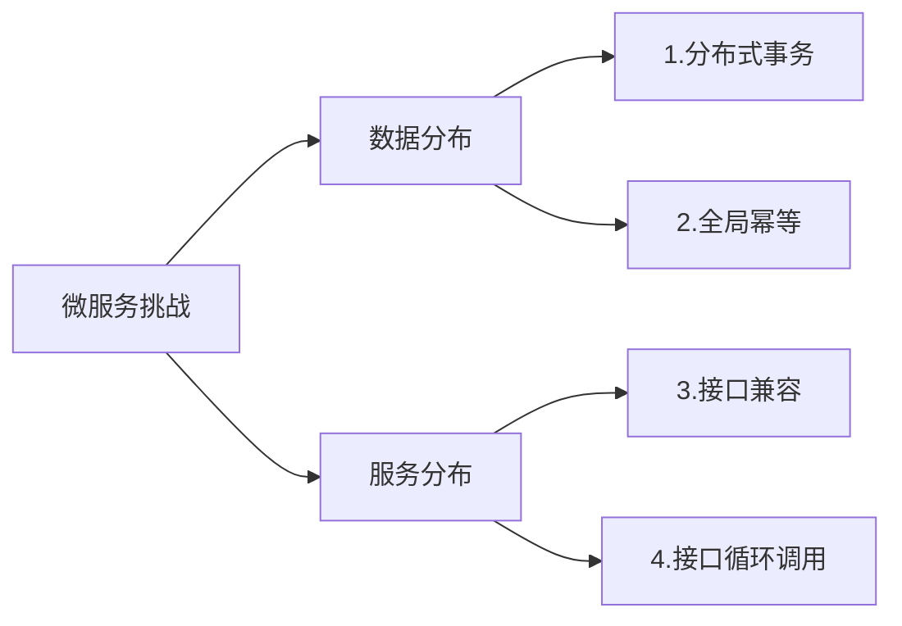
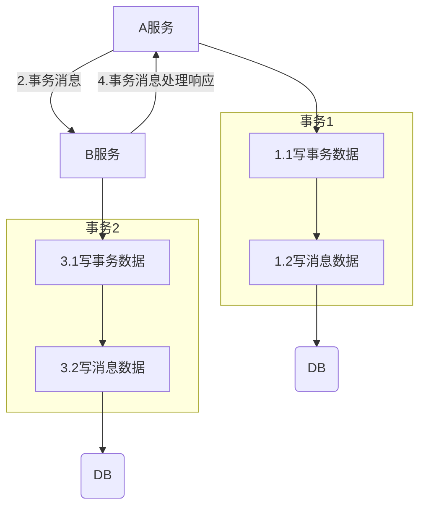
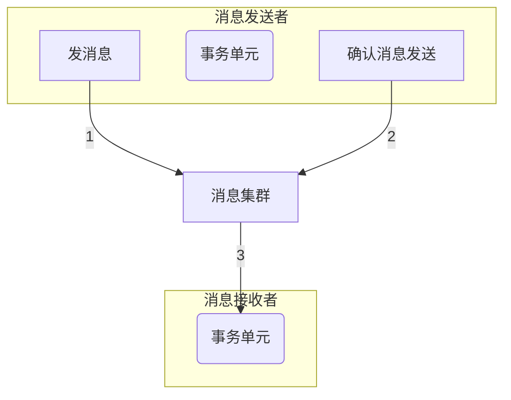
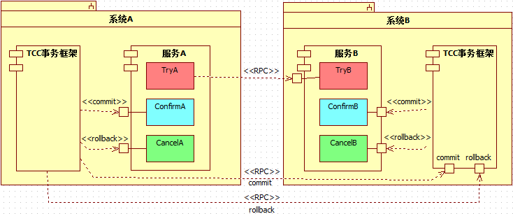

# 微服务架构陷阱与挑战

## 微服务架构的 6 大陷阱

### 拆分粒度太细

拆的太细，会降低单个服务的内部复杂度，但是增加了系统外部复杂度。

需求分析、方案设计、测试、部署等难度都会增加。

#### 服务关系复杂

如：

- 分布式服务如何保证数据一致性
- 分析设计的时候需要考虑的影响点变多

#### 团队效率下降

如：

- 接口设计数量，1 次请求由两个服务处理，接口数量 1 个，5个服务处理，接口数量 4 个；接口设计、联调、测试等工作量都会大大增加。
- 某个业务功能上线，需要升级的系统数量会增加。

#### 问题定位困难

故障扩散：单个微服务的故障，会导致多个微服务异常，监控系统一片红，到处都在告警，但是不知道根因。

#### 系统性能下降

调用链越长，单次请求耗时会更长。

### 基础设施缺乏

#### 无法快速交付

- 没有自动化测试支撑，每次测试时需要测试大量接口
- 没有自动化部署支撑，人肉运维，手都敲麻了
- 没有自动化监控，每次故障定位都需要人工查几十台机器几百个微服务的各种状态和日志文件。

#### 服务管理混乱

- 服务路由：假设某个微服务节点有 60 个节点，部署在 20 台机器上，那么其他依赖的微服务如何知道这个部署情况呢？
- 服务故障隔离：假设上述例子中的 60 个节点中有 5 个节点发生故障了，依赖的微服务如何处理这种情况？
- 服务注册和发现，同样是上述例子，现在我们决定从 60 个节点扩容到 80 个节点，或者将 60 个节点缩减为 40 个节点，新增或者减少的节点如何让依赖的服务知道呢？

服务发现和治理 如 https://github.com/polarismesh/polaris 

## 微服务架构的 4 大挑战

只拆分代码不拆分数据库，不算微服务。这只能算是单体服务拆分到微服务的一个中间状态。

### BASE 理论之最终一致性

定义：Basically Available（基本可用）、Soft state（软状态）和 Eventually consistent（最终一致性）

核心思想：分布式系统由于 CAP 理论限制，无法做到强一致性，但每个应用都可以根据自身业务特点，采用适当的方式来使系统达到最终一致性。

设计关键：

- 适当的方式：通过消息，区别只是传递消息的方式和消息内容不同，例如消息队列、接口调用、Zookeeper 事件等
- 最终一致性：存在从不一致到一致的持续时间延迟，但最终一致

### 业务级分布式事务 - 本地事务消息

1. 如果 “2.事务消息” 丢失，A 服务会不断重试
2. 如果 “4.处理响应” 丢失，A 服务会不断重试
3. B 服务重复收到 “2.事务消息”，然后检查消息表是否已经处理过，已经处理过就直接返回处理结果，没有处理就正常处理（幂等）

### 业务级分布式事务 - 消息队列事务消息

如使用 RocketMQ 作为消息队列

1. 发送 Prepared 消息时，会拿到消息的地址
2. 执行本地事务
3. 通过 1 拿到的地址去修改消息状态
4. RocketMQ 会定期扫描消息集群中的事务消息，如果发现了 Prepared 消息，它会向消息发送者确认，RocketMQ 会根据发送端设置的策略来决定是回滚还是继续发送确认消息。

### 业务级分布式事务 - TCC

应用层面的 2PC，事务协调器就是业务代码，Confirm 接口和 Cancel 接口要实现幂等（全局 ID + 状态）

go 开源框架 https://github.com/dtm-labs/dtm

dtm go-zero 支持 https://dtm.pub/ref/gozero.html，详细教程 https://github.com/Mikaelemmmm/gozerodtm

### 全局幂等

#### 技术本质

分布式数据只能通过消息来实现最终一致性，而消息可能丢失，因此需要重试，重试就需要保证幂等。

#### 定义

是一个数学与计算机学概念，常见于抽象代数中。在编程中一个幂等操作的特点是其任意多次执行所产生的影响均与一次执行的影响相同。

#### 设计关键

全局范围内的幂等，保证每个幂等操作都是全局唯一的。

设计关键

- 全局唯一 ID
- 状态机

### 接口兼容和接口循环调用

#### 接口兼容

##### 问题

某个微服务的某些接口升级，依赖这些接口的微服务并不一定能够同时全部升级（比如需要采用滚动升级，不中断业务）

##### 解决方案

1. 接口多版本：直接拷贝一份旧的接口代码，在旧接口代码上修改，接口 URL 加上版本标识
2. 接口逻辑兼容：在原代码的基础上修改，兼容旧逻辑，容易相互影响，且旧接口下线时又要修改代码（不推荐）

#### 接口循环调用

##### 问题

某次业务处理过程中，A 调用 B，B 又过来调用 A，A 的处理又进入了之前的处理逻辑，导致循环调用，整个业务进入死循环。

##### 解决方案

几乎没有好的解决方案，运气好靠测试发现，运气不好靠线上发现。

开发在调试阶段、测试阶段可以主动通过全链路追踪发现（但前提是基础设施完备）

##### 案例

1. 用户登录服务调用风控服务进行安全检查
2. 风控服务又来调用登陆服务获取用户登录地址信息
3. 获取登录地址信息的接口又依赖了风控服务进行安全检查
