# 中台深入剖析和实现技巧

## 中台简介

### 发展

- 孕育：2009 年阿里共享事业部成立，整合淘宝天猫共享业务
- 面世：2015 年马云拜访 supercell，提出中台概念，同年 12 月阿里巴巴 CEO 张勇提出 2018 中台战略
- 爆发：滴滴出行中台、京东宣布中台策略、腾讯成立技术委员会打造技术中台等
- 泛滥：2019 年许多公司都在提
- 质疑：2020 年大厂中台翻车
- 迷茫：2021 年阿里拆中台

### 架构

#### 大烟囱

#### Iaas

#### Paas

#### SaaS

#### 中台架构

### 定义

中台是将系统的通用化能力进行打包整合，通过接口的形式赋能到外部系统，从而达到快速支持业务迭代发展的目的。

### 概念

#### 业务中台

是将企业内部多个相似业务的通用业务能力沉淀到平台，以减少重复建设，提升业务开发效率的一种架构模式

- 业务相关：是企业内部业务相关的能力共享，IaaS、PaaS、SaaS 都不是中台。
- 跨业务：业务中台肯定是夸业务的，单个业务不需要中台这个概念。
- 相似业务：相似的业务才可以构建在同一中台上，差异太大的业务，中台没有意义。

#### 数据中台

是将企业所有业务沉淀到同一平台，支持业务间数据打通以及数据复用，提升企业运营效率的一种架构模式。

- 所有业务：数据中台应该是支持所有业务的。
- 数据打通：业务间的数据需要打通。（如：可以统一用户 ID 关联多个业务上的数据）
- 数据复用：不同业务间的数据可以复用，提升整体的运营效率。

但是数据复用是比较困难的！

### 价值

|          | 价值                                               | 关键点                                                       |
| -------- | -------------------------------------------------- | ------------------------------------------------------------ |
| 业务中台 | 相似业务的能力共享，避免大量重复开发，提升开发效率 | 1. 业务相似度越高，业务中台价值越大，建议相似度达到 0.6 以上的多个业务共建中台，例如：“快车 + 专车”，“淘宝 + 天猫 + 咸鱼”，“抖音 + 火山 + 西瓜” 2. 评估业务相似度，需要依赖业务专家，而不是单纯的技术工作 3. 强行将相似度低的业务塞进一个中台，不但不会提升开发效率，还会大大降低效率 |
| 数据中台 | 数据打通和复用，避免数据孤岛，提升运营效率         | 1. 使用数据中台的业务越多，数据中台价值越大 2. 数据中台价值体现在，统一数据平台、跨业务的数据打通、跨业务的数据复用（挖掘） 3. 跨业务的数据复用受限于业务熟悉度和组织结构的相关约束 |

## 中台带来的问题

### 小业务抱中台大腿，中台抱大业务大腿

中台也要吃饭，要完成 KPI

大业务、重点业务优先

### 中台与业务的边界难以明确

中台设计最难的不是领域划分，而是中台和业务的边界划分。

没有任何明确的规则，都是靠人肉讨论；在已有业务基础上比较容易提炼，创新业务几乎无法判断；创新业务对中台 KPI 没有帮助，大部分情况下都会拒掉，由业务自己实现；中台适合做“组合式创新”，没法做“颠覆式创新”

### 中台的全流程效率并不高

1. 每个业务功能都要讨论边界
2. 每个业务功能都要考虑对所有业务的影响

