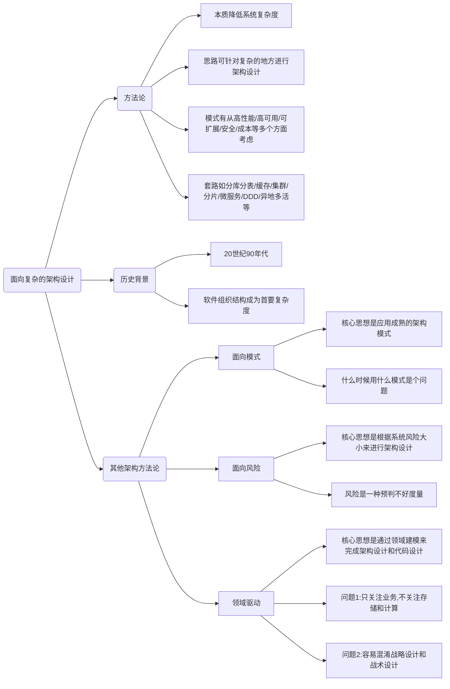
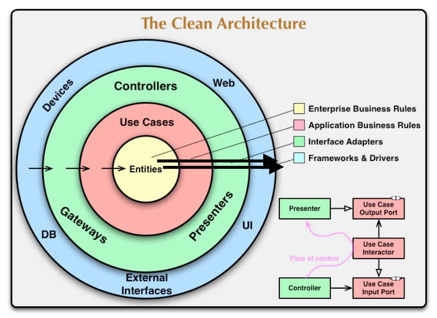
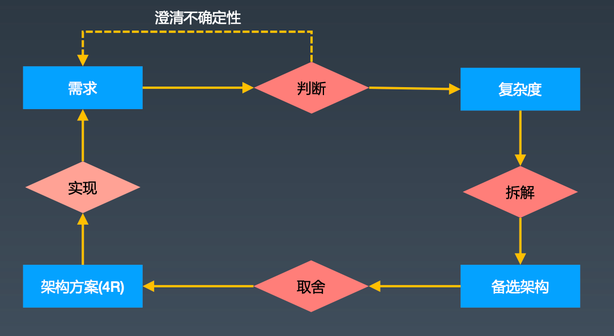

## 思维导图

## 方法论的意义

### 架构设计方法论

**没有方法论的知道，你做架构只不过是在碰运气**

编程领域

- 面向对象
- 面向过程

架构领域

- 面向模式
- 面向风险
- 面向复杂度

## 面向模式

### 概要介绍

书籍：《面向模式软件架构》POSA系列共5卷本

架构领域的“设计模式”

### 思想&问题

核心思想：应用经过验证的成熟**架构模式**，如MVC、Reactor

核心问题：知道模式，但是不知道什么时候使用哪个模式

## 面向风险

### 概要介绍

书籍：《恰如其分的软件架构》

风险驱动的架构设计方法论，业务架构建模的技巧

（还有李运华的《编程的逻辑》）

### 思想&问题

核心思想：根据系统**风险**大小来设计软件架构

核心问题：风险只是一种概率预判

## 领域驱动设计（DDD）

Eric Evans的《领域驱动设计：软件核心复杂性应对之道》

DDD是可扩展架构的设计技巧，不是架构方法论

DDD兼顾架构设计和方案设计

DDD、敏捷架构不关注存储和计算，只关注业务

## 整洁架构

## 面向复杂度

### 为什么做架构设计？

### 软件技术发展史的典型趋势和特征是什么？

### 软件架构诞生的背景

核心原因：软件系统规模增长。

核心特点：数据结构和算法不再是主要问题，整个系统的结构成为首要问题。

### 面向架构复杂度的架构设计

- 本质：为了降低软件系统的复杂度
- 思路：通过分析系统需求找到系统复杂度的地方，然后设计方案
- 模式：可以从“高性能”、“高可用“、”可扩展“、”安全“、”成本“等方面考虑，也是复杂度来源
- 套路：分库分表、缓存、集群、分片、微服务、DDD、异地多活等

### 架构设计环

