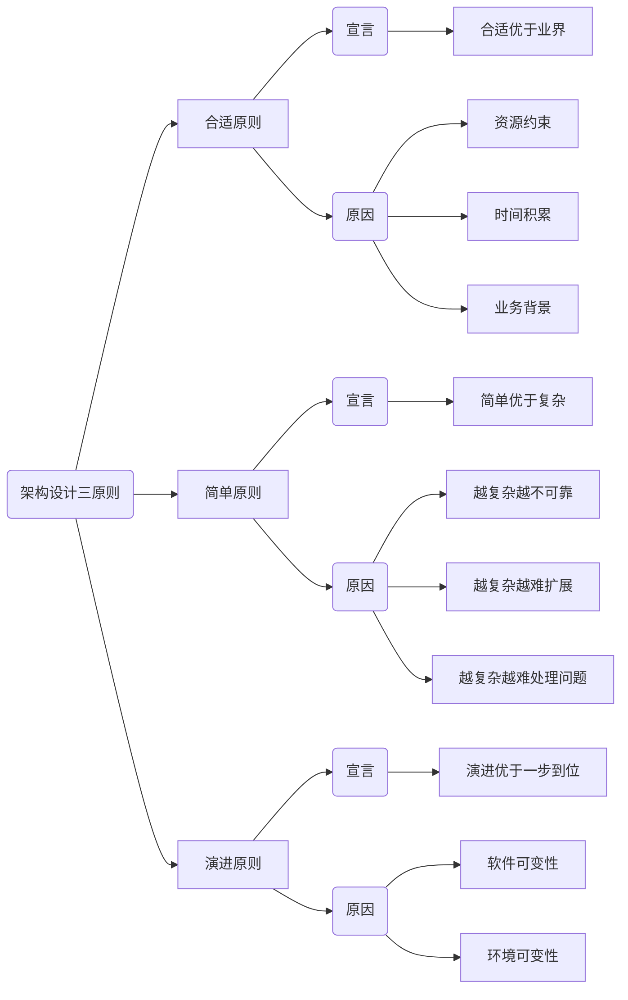

## 思维导图

## 架构设计三原则

### 介绍

#### 架构设计原则的意义

原则的作用是知道我们作更好的设计！

#### 三个原则

- 合适原则：“合适优于业界领先”，从资源、时间、业务等方面结合考虑
- 简单原则：“简单优于复杂”，越是复杂越不可靠、越难扩展以及其故障越难处理
- 演化原则：“演化优于一步到位”，优先满足当前业务需求，在优化迭代中（增、改、删），必要时进行重构甚至重写。（演进的目的：传承基因，适应变化）

### 案例

### 应用

- 设计出来的架构要满足当时的业务需要，符合团队和技术的能力水平（合适原则）
- 先按照简单的方式来设计架构，然后不断地在实际应用过程中迭代优化（简单原则）
- 当业务发生变化时，架构要扩展、重构，甚至重写（演化原则）

## 架构设计环

## 架构设计原则常见判断维度

### 业务维度

- 业务当前的量级
- 业务发展速度
- 业务发展形态

### 团队维度

- 团队规模
- 团队能力水平
- 投入的资源

### 技术维度

- 已有技术体系
- 当前技术能力
- 技术成熟度

