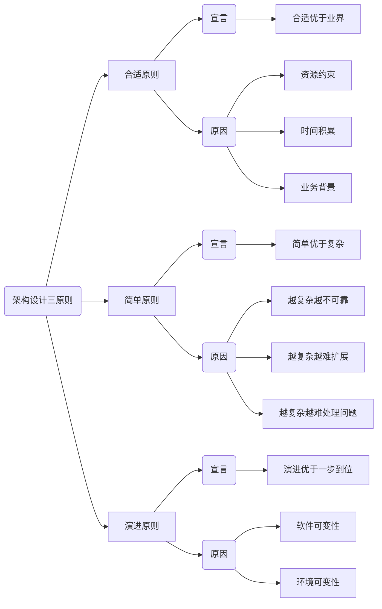
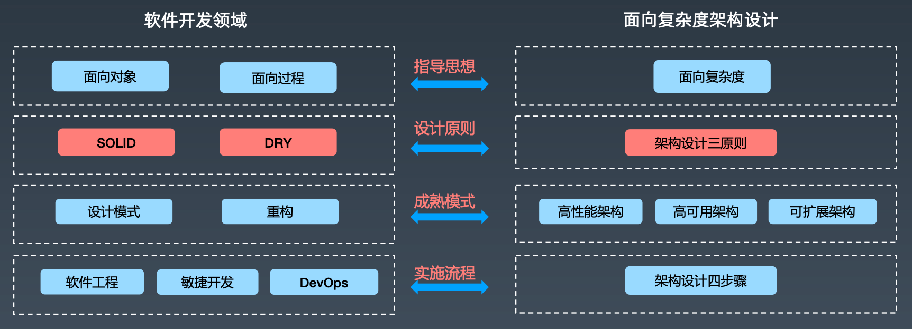
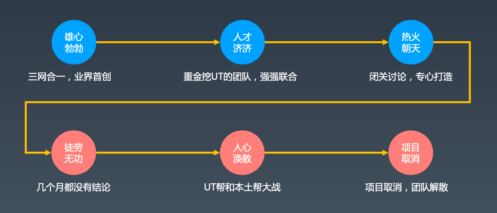
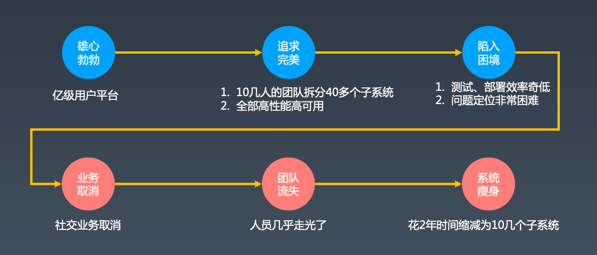
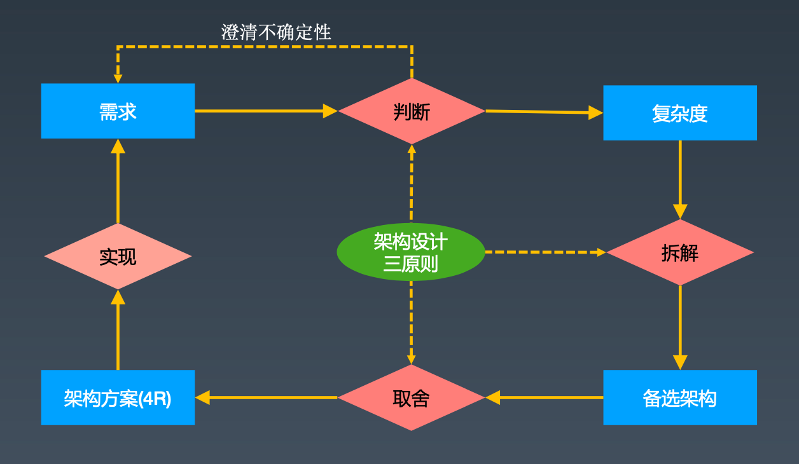

## 思维导图

## 架构设计三原则

### 介绍

#### 架构设计原则的意义

原则的作用是知道我们作更好的设计！

#### 三个原则

- 合适原则：“合适优于业界领先”，从资源、时间、业务等方面结合考虑
- 简单原则：“简单优于复杂”，越是复杂越不可靠、越难扩展以及其故障越难处理
- 演化原则：“演化优于一步到位”，优先满足当前业务需求，在优化迭代中（修复有缺陷的设计，改正不合理的设计，去掉无用的设计，留下优秀的设计），必要时进行重构甚至重写。（演进的目的：传承基因，适应变化）

### 案例

#### 某厂三网合一

- 业务目标：三网合一，一套HLR设备，同时支持GSM、CDMA、IMS（HSS）
- 业务目的：一套设备搞定所有市场，大大降低研发、运维、市场的成本
- 业务主导：PDT经理

**总结&感悟**

- 有资源时也同样需要遵循架构三原则
- 没有落地手段，目标合适也应该及时止损
- 架构本质上是“精英设计”

（项目源于2006年，但却在4G时代都是TD- LTE制式条件下实现了项目目标）

**该架构设计当时违背了简单原则**

### 某厂亿级用户平台

- 业务目标：2年支撑1亿用户
- 业务目的：移动互联网的QQ、中国版的Facebook
- 业务主导：现某鹏汽车创始人

**总结&感悟**

- 几十万活跃用户规模时不需要跨度太大考虑构建亿级用户平台
- 技术选型需要符合团队和业务
- 架构的质量遵循“木桶理论”，最短的短板决定了架构的质量

**该架构违背了合适原则、简单原则、演进原则**

### 应用

- 设计出来的架构要满足当时的业务需要，符合团队和技术的能力水平（合适原则）
- 先按照简单的方式来设计架构，然后不断地在实际应用过程中迭代优化（简单原则）
- 当业务发生变化时，架构要扩展、重构，甚至重写（演化原则）

## 架构设计环

## 架构设计原则常见判断维度

### 业务维度

- 业务当前的量级
- 业务发展速度
- 业务发展形态

### 团队维度

- 团队规模
- 团队能力水平
- 投入的资源

### 技术维度

- 已有技术体系
- 当前技术能力
- 技术成熟度

## Q&A

### 软件系统与建筑本质的差异是什么？

建筑是静态的，而软件系统是动态的，具有运作规则，是不断演进的。

### 架构设计三原则的优先级是？

合适原则 > 简单原则 > 演化原则

