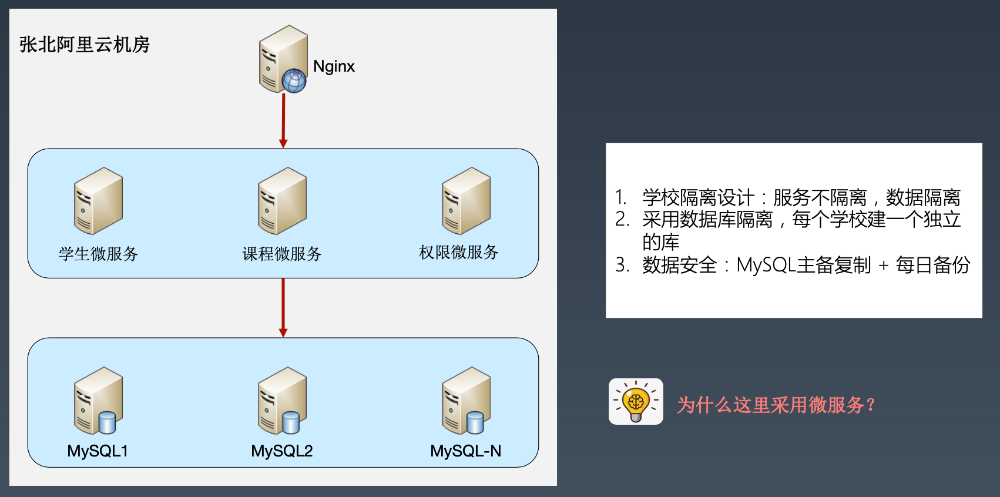
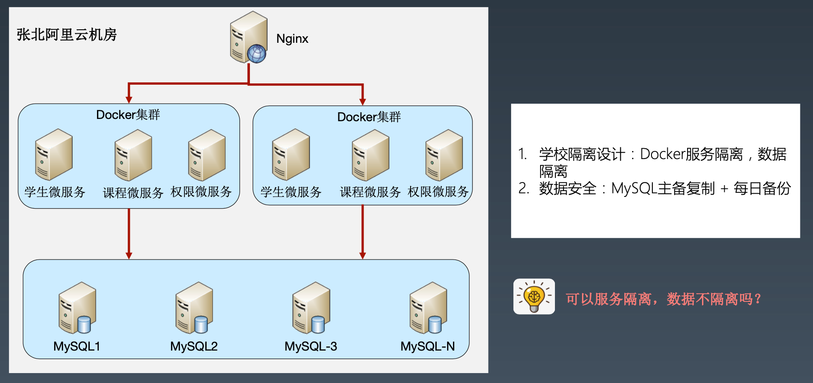
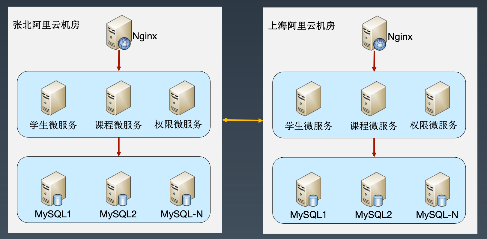
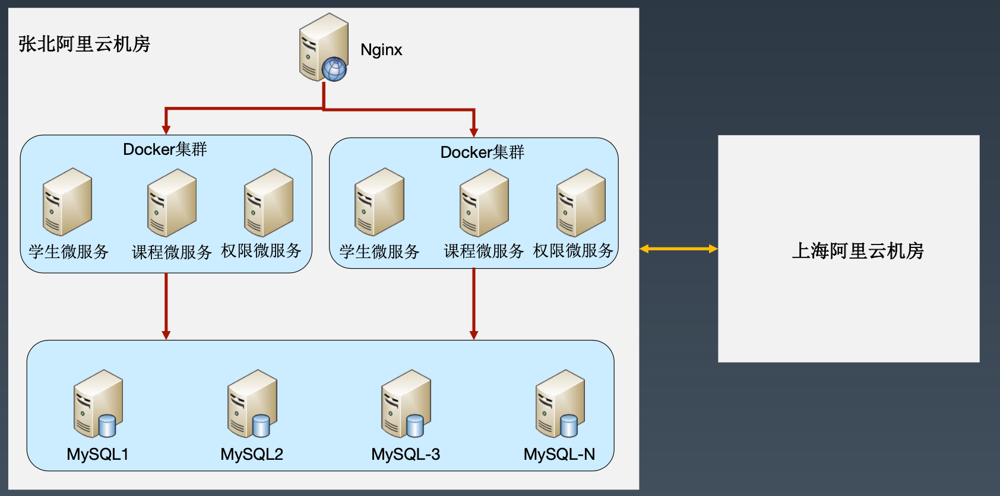

## 需求

### 背景

你们是一家创业公司，公司老板具备丰富的高校人脉资源，老板看到各个高校都在重复建设各自的学校管理系统，建设周期长，功能不完善，老板认为做一个学生管理云平台，既能够减少高校这方面的投入，又可以让高效也“上云”。

### 系统需求

同[外包学生管理系统](5_外包学生管理系统.md)系统需求

### 平台需求

1. 云平台要具备高可用、高性能
2. 云平台要能够隔离各个高校，避免相互影响

## 学生管理云平台架构分析

### 面向复杂度架构设计

#### 判断复杂度

**高性能**？

高校数量 * 在校人数 = 3000 * 10万 = 3亿用户

**高可用**？

高校分布在不同区域，可分东南西北4个大区

**可扩展**？

这么多高校，需求肯定各种变化，可扩展是必须的

**安全性**？

高校之间数据要隔离，保证安全

#### 架构设计三原则

- 判断复杂度中**高性能**考虑不符合演化原则
- 判断复杂度中**高可用**考虑不符合演化原则、简单原则

#### 备选方案1 - 单机房数据隔离

相比之前《外包学生管理系统》考虑了可扩展性，所以采用微服务。

#### 备选方案2 - 单机房服务数据双隔离

如果服务隔离而数据不隔离，各个高校业务会相互影响。

#### 备选方案3 - 双机房数据隔离

#### 备选方案4 - 双机房服务数据双隔离

#### 方案取舍

选择备选方案1。

不选方案2：原因是不符合简单原则，复杂度高。

不选方案3：原因是不符合演进原则，成本大。

不选方案4：不符合简单原则和演进原则。