## 思维导图

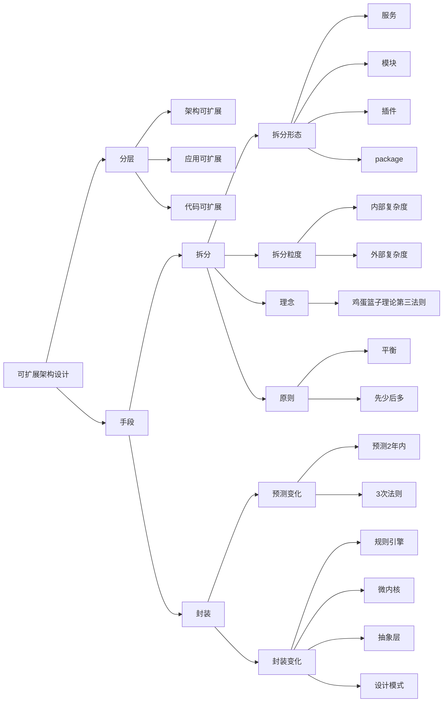

## 架构设计复杂度模型

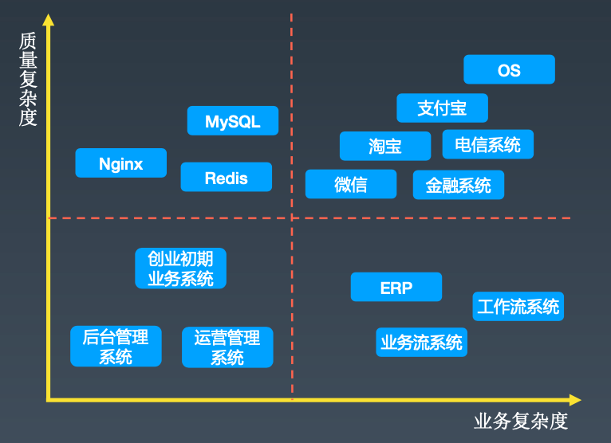

### 业务复杂度

业务固有的复杂度，主要体现为难以理解、难以扩展。如微信业务数量多，如支付宝业务流程长，如ERP业务之间关系复杂。

### 质量复杂度

高性能、高可用、成本、安全等质量属性的要求。

## 架构复杂度应对之道

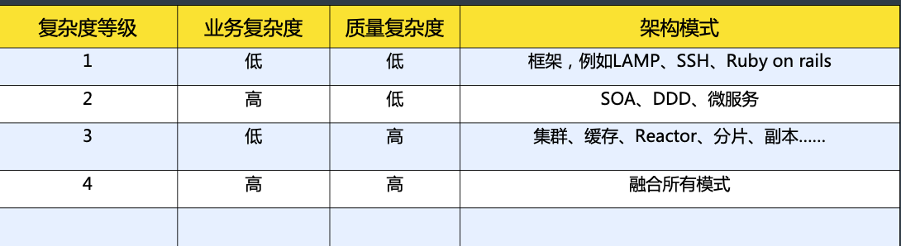

**DDD不能降低质量复杂度**

## 可扩展复杂度模型

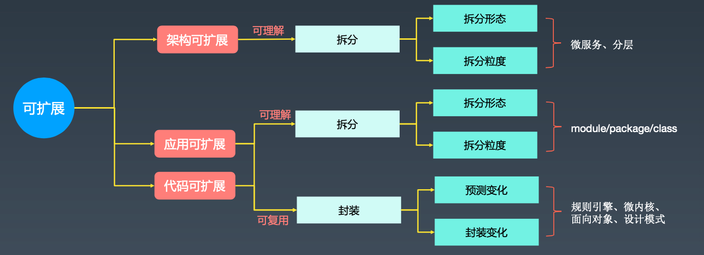

DDD分为**战略设计**和**战术设计**，同时涵盖了可理解和可复用

### 可扩展（extensibility）定义

系统适应变化的能力，包含可理解和可复用两个部分。

### 可伸缩（scalability）定义

系统通过添加更多资源来提升性能的能力。

## 可扩展架构设计

### 拆分

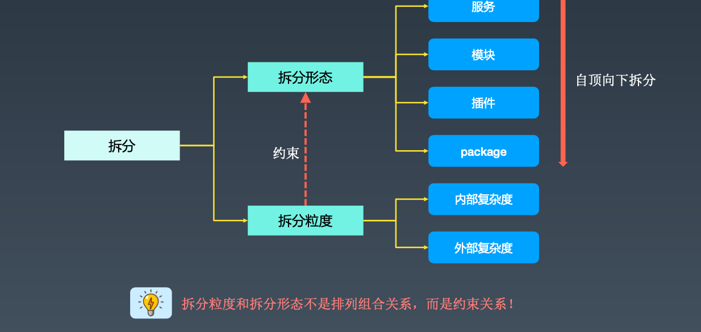

### 拆分粒度

#### 两个复杂度

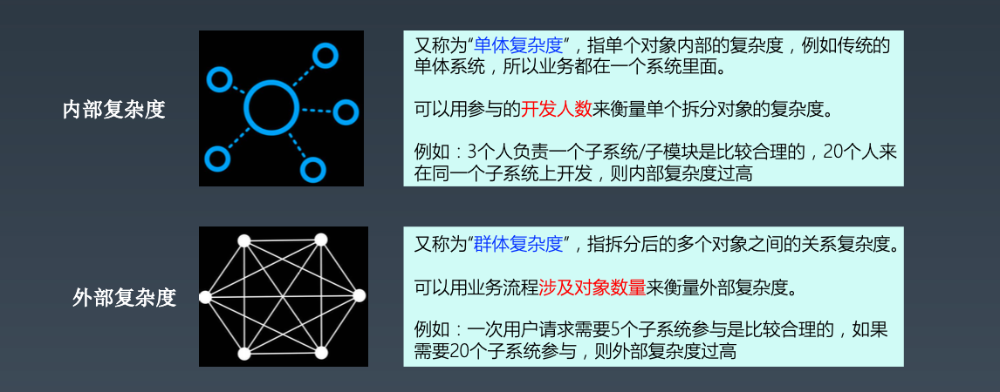

#### 平衡的艺术

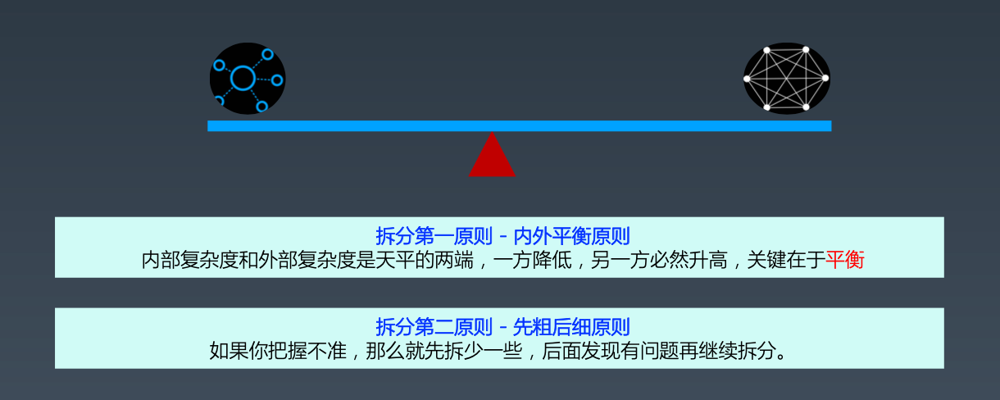

为什么不先多拆一些，然后合并？初期拆分粒度太细，模块间关系复杂度太高，工作量会较大，如果发现有些部分拆分太细再发生合并，那么合并的模块和其他模块的关系又需要重新分析又会额外增加工作量。所以拆分时在粒度把握不准的时候应该先粗后细。

#### 拆分粒度不合理的案例 - UC用户中心

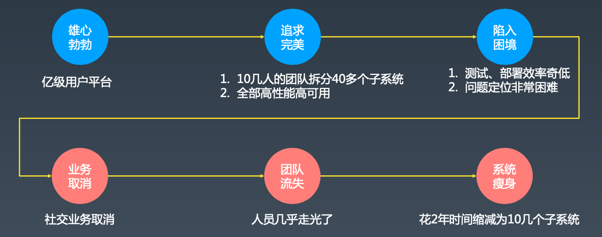

降低了（开发）内部复杂度，增加了（测试、部署）复杂度。

### 封装

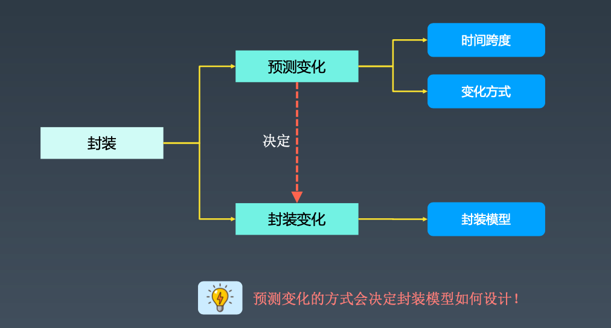

#### 预测的艺术

预测最大的挑战是**一切皆有可能**

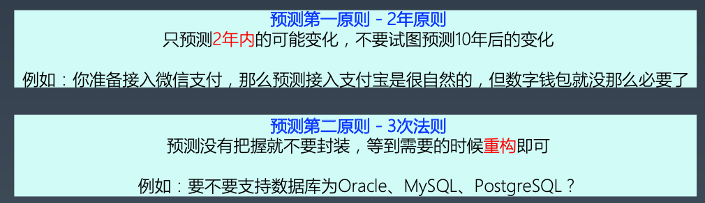

预测第二原则 - 3次法则：1写2抄3封装。

#### 封装的技巧

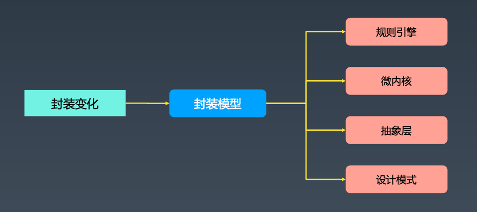

