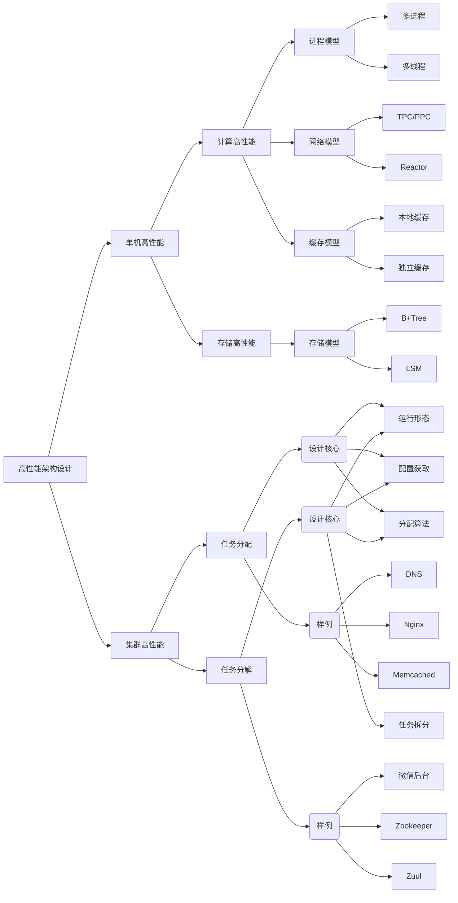

## 思维导图

## 高性能复杂度模型

### 单机高性能复杂度分析

## 集群高性能设计

### 鸡蛋篮子理论第二法则 -- 叠加法则

### 集群高性能

#### 任务分配

#### 任务分配器集群

### 集群高性能任务分配架构设计关键点

### 任务分配案例

#### DNS

#### Nginx

#### Memcached

### 集群高性能任务分解架构设计关键点

### 任务分解案例

#### 微信服务拆分

#### 数据库读写分离

#### 微服务网关Zuul

