## 高性能复杂度模型

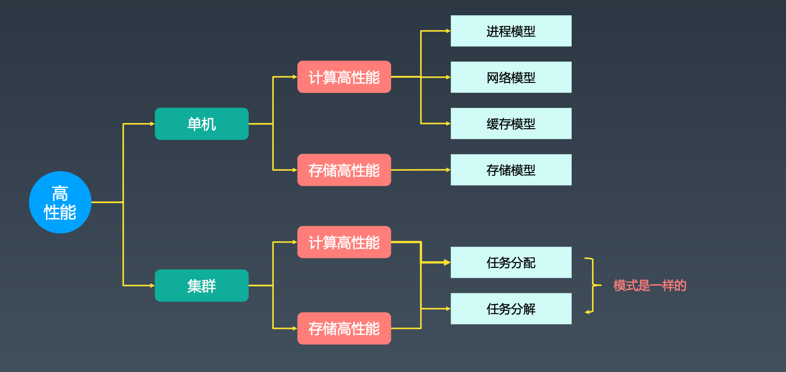

### 单机高性能复杂度分析

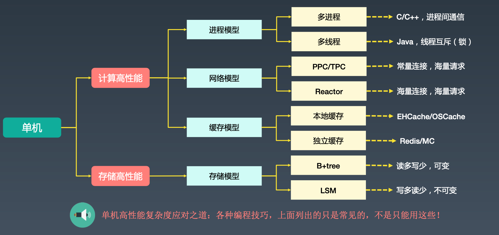

## 集群高性能设计

### 鸡蛋篮子理论第二法则 -- 叠加法则

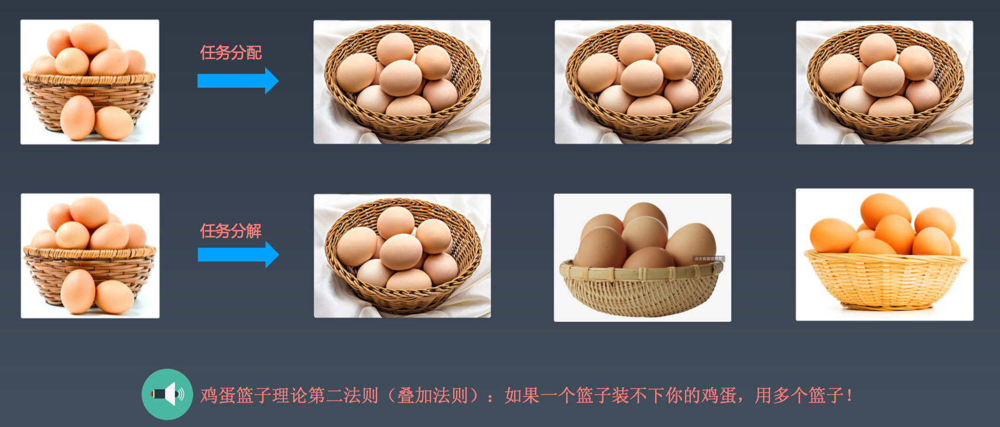

### 集群高性能

#### 任务分配

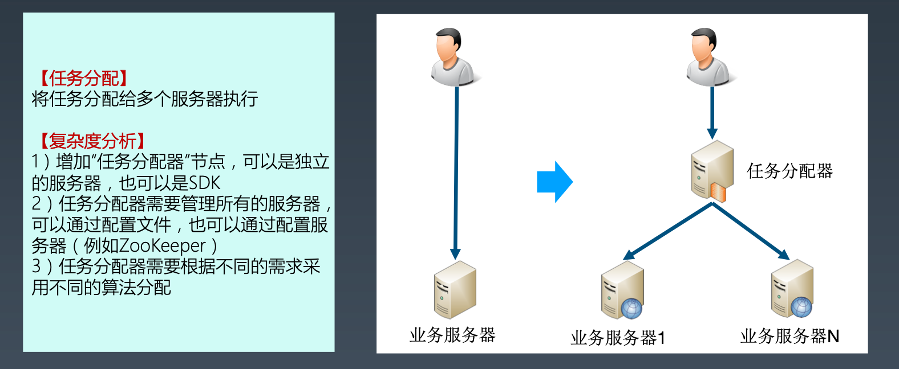

#### 任务分配器集群

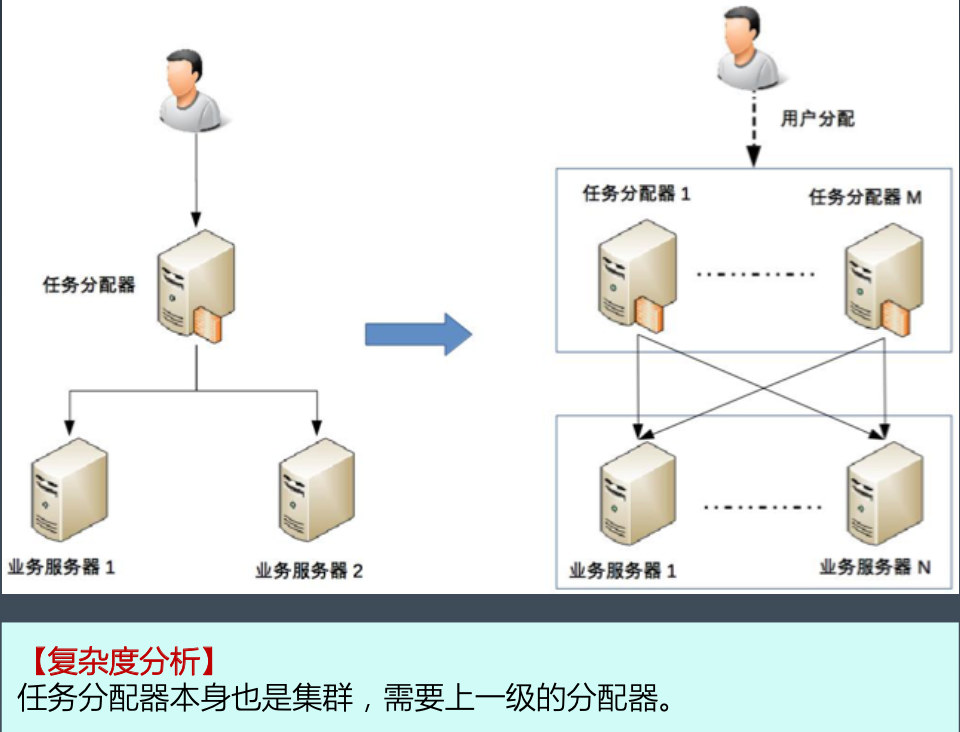

### 集群高性能任务分配架构设计关键点

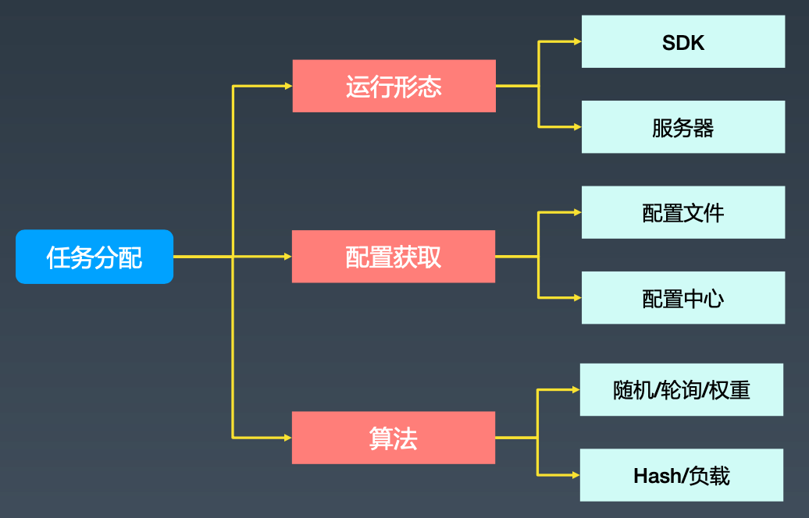

### 任务分配案例

#### DNS

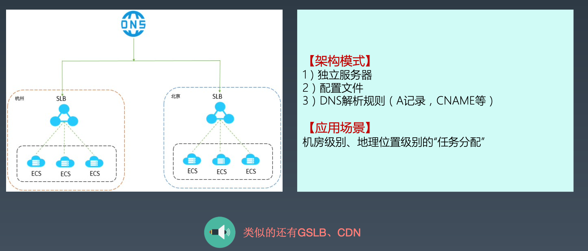

#### Nginx

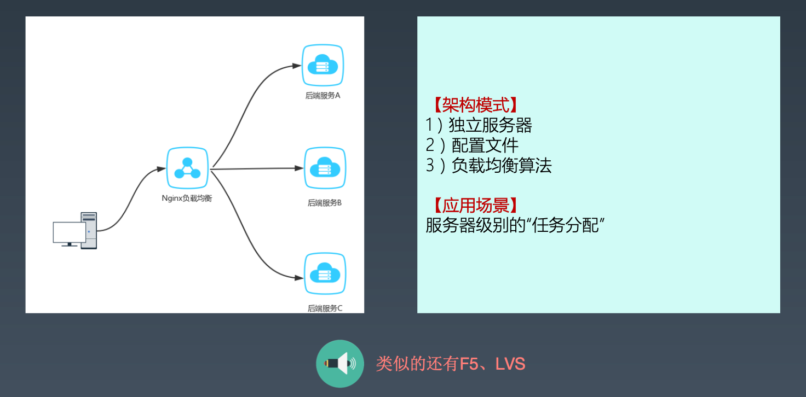

#### Memcached

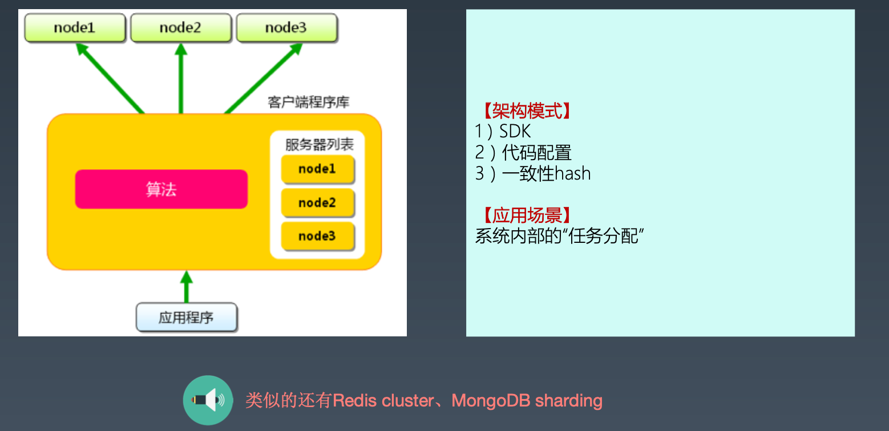

### 集群高性能任务分解架构设计关键点

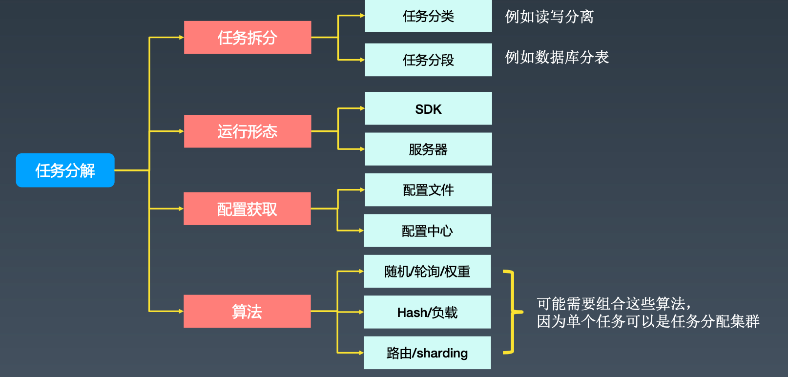

### 任务分解案例

#### 微信服务拆分

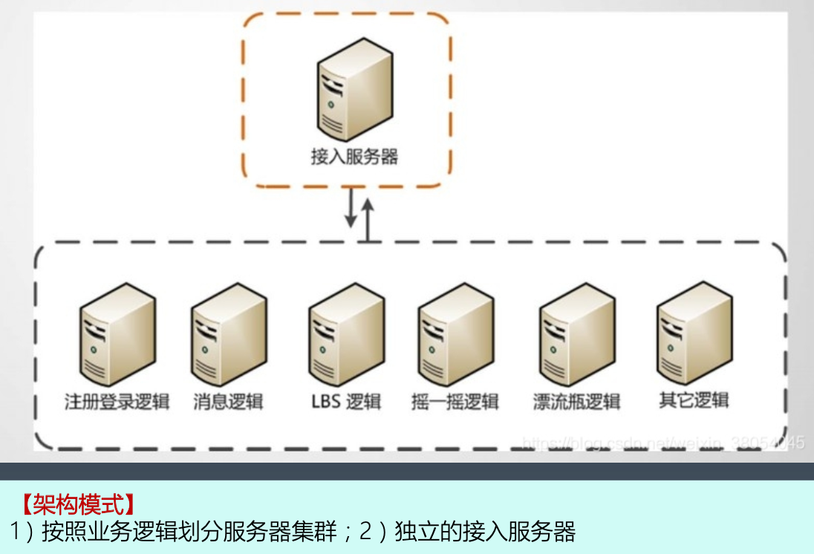

#### 数据库读写分离

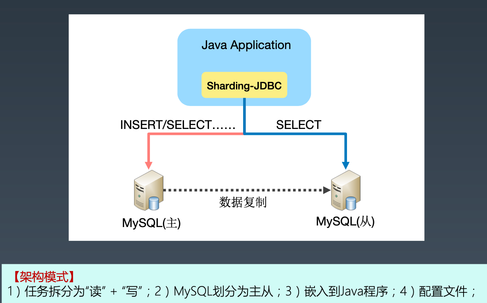

#### 微服务网关Zuul

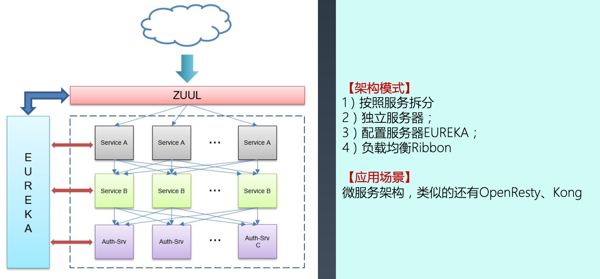