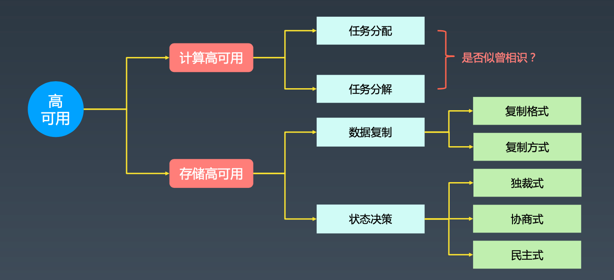
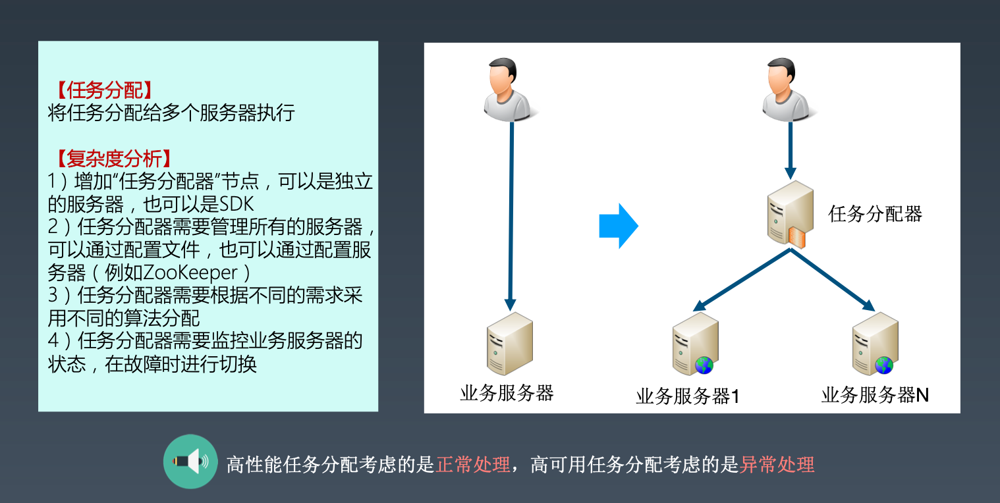
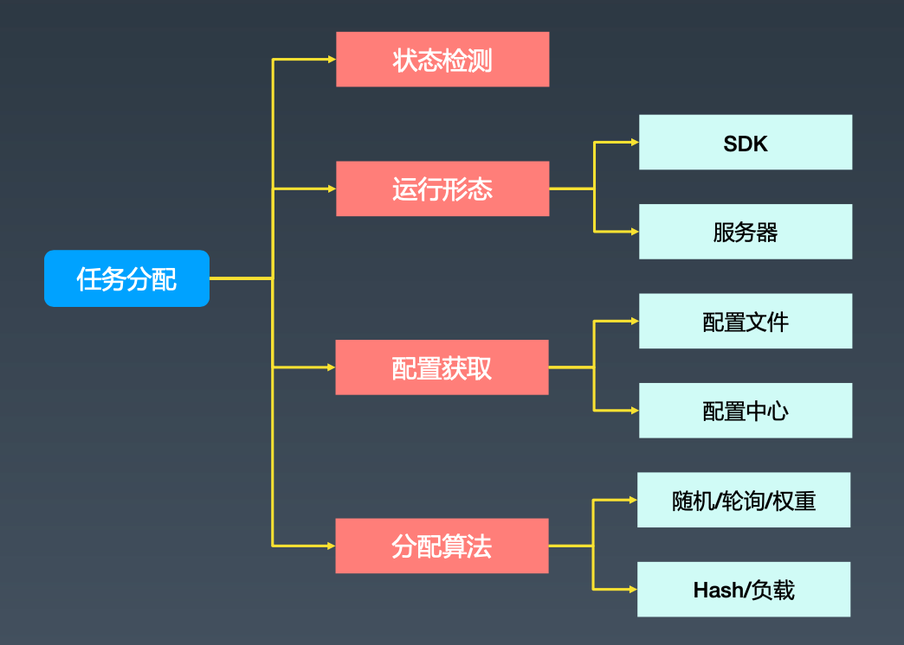
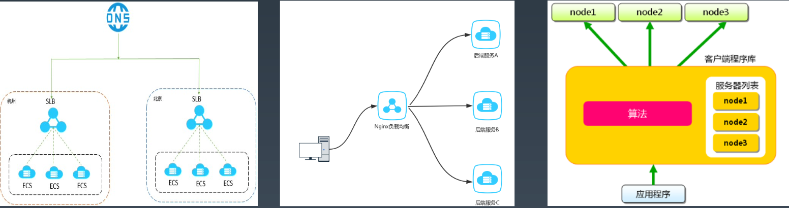
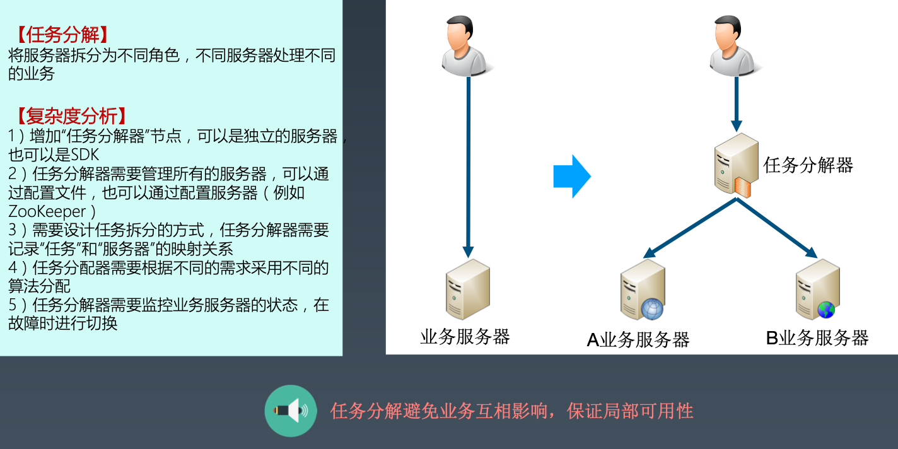
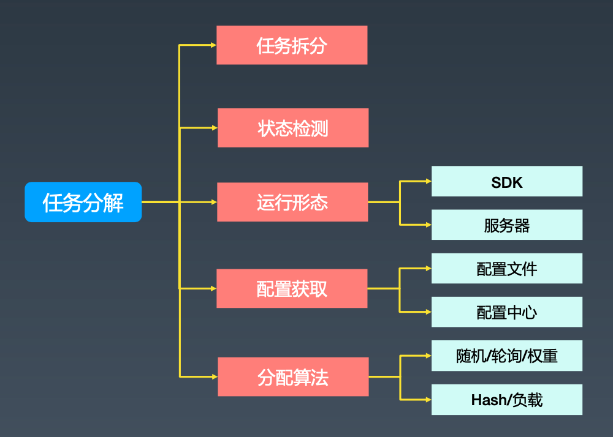
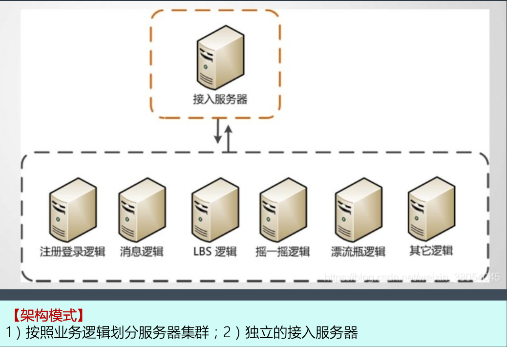

## 高可用复杂度模型

### 鸡蛋篮子理论第三法则 -- 冗余法则

冗余法则：**不要把所有鸡蛋装在一个篮子，放到多个篮子**

## 计算高可用

### 任务分配

#### 计算高可用任务分配架构设计关键点

#### 计算高可用任务分配案例

下图中3个案例都是高性能架构

图2也是高可用架构，nginx内部有状态检测。图1、3不是高可用架构。

### 任务分解

#### 计算高可用任务分解架构设计关键点

#### 计算高可用任务分解案例 -- 微信服务拆分

## Q&A

### 为什么高性能架构分为单机高性能和集群高性能，为何高可用架构没有单机高可用？

高可用需要冗余，普通的PC机、服务器单机无法做到高可用。

### 鸡蛋篮子理论

可扩展 -- 拆分

高性能 -- 叠加

高可用 -- 冗余

